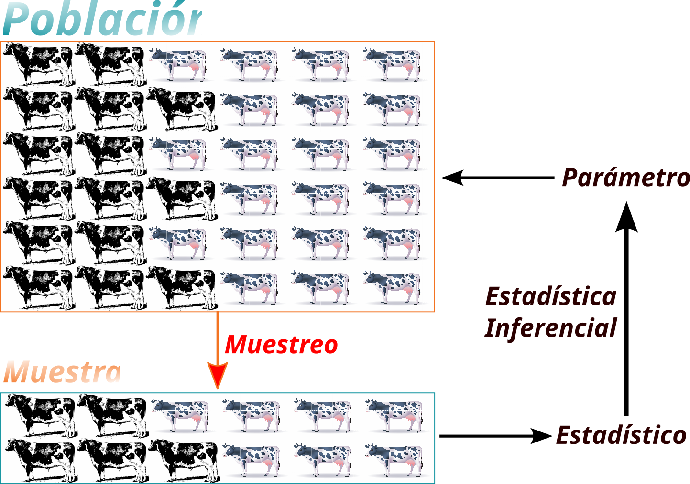

```{r paquetes, echo=FALSE, message=FALSE}
library(knitr)
library(tidyverse)
library(agricolae)
library(jtools)
library(writexl)
library(readxl)
library(webexercises)
```

# Estadística. Conceptos Básicos. {#intro}

El término *estadística* tiene su origen en la palabra alemana *statistik* acuñada por el economista aleman Gottfried Achenwall, la palabra tuvo su génesis en el latín *statisticus* que se podría traducir como *relativo al estado*, pues lo que hoy conocemos como estadística estuvo incialmente relacionado con datos relativos a los gobiernos o estados, dichos datos podían provenir de censos, registros de salud, pago de impuestos, etc. En los siglos XVI y XVII hubo un fuerte interés por las probabilidades, más que nada por el deseo de obtener ventaja en juegos de cartas y otras formas de apuesta.

La ciencia estadística como tal evolucionó al punto que hoy encontramos estadísticas y estadística en muchos aspectos de nuestra vida cotidiana. Cuando hablamos de estadística nos referimos a la ciencia (que definiremos formalmente un poco más adelante), mientras que al usar el termino estadísticas nos referimos a datos, o a la presentación de hechos, gráficas o información. Por ejemplo cuando en una hacienda cacaotera se presenta la información relativa a la producción en kilogramos de los híbridos usados en la plantación estamos hablando de estadísticas, mientras que el problema de analizar, y establecer las diferencias en el rendimiento medido en kilogramos por hectárea para diferentes híbridos con el fin de aumentar las ganancias de la finca puede ser resuelto usando estadística.

Una definición clásica de estadística es **ciencia que se encarga de la recolección, clasificación, resumen, organización, presentación, análisis e interpretación de información numérica** (@cleff2013). En @agresti2023, de manera corta definen a la estadística como **el arte y la ciencia de aprender de los datos**.

::: callout-important
**Definición de Estadística** ciencia que trata de la recolección, presentación y análisis de datos para resolver problemas, tomar decisiones y diseñar productos y procesos.
:::

## Etapas del proceso estadístico.

El proceso estadístico tiene como principal entrada a los datos. Sin embargo, el proceso estadístico no empieza en los datos. De manera general las etapas del proceso estadístico son:

1.  **Identificación y delimitación del problema**: Un problema en investigación debe ser entendido como una pregunta o cuestión sobre un tema o aspecto que no se conoce. Ejemplos de problema en agronomía pueden ser: comparación de producción lechera en vacas sometidas a diferentes dietas, la identificación de características fenotípicas de variedades de banano resistentes a determinada enfermedad, evaluación del rendimiento de un cultivar utilizando biocarbón en diferentes concentaciones, etc. La delimitación implica recortar el tema dentro de los límites de espacio, tiempo y área de estudio que caracteriza al problema. Por ejemplo, en el problema de la comparación de la producción lechera en vacas sometidas a diferentes dietas la delimitación puede incluir aspectos como, la época del año en que se va a recoger la información, las razas de animales a ser incluidas en el estudio, el lugar dónde se llevará a cabo el estudio. Dentro de esta fase se incluye la definición de los objetivos del estudio.
2.  **Planificación**: Definir bien los objetivos ayuda a realizar una planificación adecuada. A partir de los objetivos se puede identificar los datos que se necesitan, el tipo de datos, la fuente de los datos, la frecuencia de recolección de los datos, la forma de recolección y almacenamiento de los datos y los programas o paquetes estadísticos que serán usados en el análisis.
3.  **Recolección de datos**: la recolección puede ser realizada de fuentes existentes como bases de datos de organismos como la FAO, ministerios de agricultura, cámaras de productores, etc. O los datos pueden provenir de experimentos diseñados para el propósito específico de cumplir con los objetivos planteados.
4.  **Revisión de los datos**: una vez que los datos son recogidos, es necesario revisarlos para verificar inconsistencias o problemas potenciales. Por ejemplo, al registrar las longitudes de hojas de cacao de ciertas accesiones es posible que ocurran cosas como valores mal ingresados. En estudios donde los datos son obtenidos de organismos como la FAO es probable que los datos hayan sido ingresados con un formato no apropiado.
5.  **Tabulación** la tabulación permite dar una primera mirada a los datos y ayuda a obtener información sobre los datos. Esta tabulación puede ser presentada ya sea como tablas o como gráficos, lo que será discutido más adelante.
6.  **Análisis estadístico**: en este paso se obtienen medidas de tendencia central, dispersión, posición, o asociación. Se hacen pruebas de hipótesis, o se realizan modelos con el fin de contestar las preguntas o cumplir los objetivos del estudio.
7.  **Inferencia**: Basados en los resultados del análisis estadístico se hacen inferencias acerca de los objetivos del estudio. Aunque los datos provengan de una muestra, utilizando teorías estadísticas se puede llegar a conclusiones sobre la población de la que fueron tomadas las muestras.

## Definiciones importantes

-   **Población**: una población es el conjunto de todos los sujetos u objetos de interés en una investigación o análisis. Por ejemplo, en un estudio que tenga como objetivo determinar características fenotípicas de variedades de banano resistentes a cierta enfermedad en el trópico húmedo, la poblacion son todas las plantas de banano sembradas en el trópico húmedo.
-   **Muestra**: es la parte de la población que es analizada, dicho de otra forma una muestra es un subconjunto de la población. Sigamos con el ejemplo de las características fenotípicas de variedades de banano resistentes a cierta enfermedad en el trópico húmedo, el investigador no va a tomar todas las plantas sino que va a escoger un grupo de plantas de las variedades de interés. La muestra debe representar lo mejor posible a la población. La parte de la estadística que comprende los métodos estadísticos para obtener muestras representativas de una población se llama *muestreo*
-   **Parámetro**: un parámetro es una cantidad numérica que caracteriza a una población.
-   **Estadístico**: un estadístico es una cantidad numérica que caracteriza a una muestra.

## Clasificación de la estadística. {#sec-estypes}

De manera general, la estadística se clasifica en dos grandes ramas : estadística descriptiva y estadística inferencial.

::: callout-important
**Estadística Descriptiva** se refiere a los métodos para resumir los datos recogidos, estos datos pueden provenir de una muestra o de una población. Los resumenes de los datos pueden ser tablas, gráficos, y números como promedios o porcentajes.
:::

::: callout-important
**Estadística Inferencial** se refiere a los métodos para sacar conclusiones, hacer predicciones o tomar decisiones sobre una población, basándose en datos de una muestra perteneciente a una población.
:::

En la @fig-popsample se muestra la relación entre algunos conceptos revisados hasta ahora. Supongamos que en una finca lechera se desea hacer un estudio sobre el efecto de una dieta en la producción de leche en una determinada raza de vacas lecheras. El conjunto de todas las vacas representa a toda la **población**. El objetivo de estudio es determinar el rendimiento promedio de todas las vacas, esta medida de toda la población es un **parámetro**. Debido a ser un producto de prueba el estudio no es aplicado a toda la población, por lo que se utiliza técnicas de **muestreo** para escoger una **muestra** representativa, con **estadística descriptiva** se determina el rendimiento promedio de la muestra, este valor es un **estadístico**. Con técnicas de **estadística inferencial** se estima el valor del parámetro de interés.

{#fig-popsample}

## Tipos de estudio

Supongamos que un investigador desea analizar las tendencias de las exportaciones de maíz durante la última década en Latinoamérica y el Caribe, puede obtener esta información de la página FAOSTAT <https://www.fao.org/faostat/en/#home>. En este caso los datos no son recogidos directamente por el investigador sino que usa una fuente de información secundaria. Ahora supongamos que el mismo investigador quiere conocer la impresión de las medidas tomadas por el gobierno para ayudar a los pequeños productores de maíz, para registrar esto puede realizar una encuesta a una muestra de pequeños productores de maíz. Tanto al tomar datos de una fuente secundaria o al realizar una encuesta el investigador está observando los datos como aparecen y no está interviniendo en el problema que se investiga. Este tipo de estudios recibe el nombre de **observacional**

::: callout-important
**Estudio observacional** se observan los datos como aparecen y no se interviene en el problema o fenómeno investigado. Un estudio observacional puede ser *analítico* o *descriptivo*
:::

Ahora imaginemos que se desea evaluar los parámetros nutricionales y fermentativos de un tipo de pasto, así como la inclusión de diferentes niveles de maíz molido en el proceso de ensilaje. El investigador diseña un experimento utilizando microsilos experimentales para evaluar el efecto de incluir diferentes porcentajes de maíz molido en el ensilaje del pasto, el diseño de este experimento incluye la determinación del número de tratamientos y repeticiones. En este caso el investigador está manipulando los porcentajes de maíz molido para evaluar el efecto sobre los parámetros nutricionales y fermentativos del pasto. Este tipo de estudios recibe el nombre de **experimental**

::: callout-important
**Estudio experimental** se interviene de manera intencionada y programada para manipular una o más variables con el fin de analizar los efectos de estas manipulaciones en otras variables
:::

## Variables, clasificación y niveles de medición.

En un estudio sobre características fenotípicas de girasoles cultivadas en el trópico húmedo se registra información sobre el número de planta, el número de parcela donde se encuentra la planta, la variedad de girasol observada, el número de fila, la altura de las plantas, la circunferencia del tallo, el color de las flores, el número de pétalos de las flores y número de hojas. Estas características, medidas o valores de interés para la persona que investiga reciben el nombre de **variables**.

En la variable **Variedad de Girasol** se puede almacenar respuestas como Almonte, Ariadna, Candela, etc. Mientras que en la variable **Color de las flores** se puede registrar valores como Marfil, Amarillo pálido, Naranja, Púrpura, Rojo o Multicolor. Estas dos variables son **variables cualitativas**, pues describen una cualidad o categoría.

En las variables **altura de las plantas**, **circunferencia del tallo**, **número de pétalos de las flores** y **número de hojas** se almacenan respuestas numéricas. Estas variables son ejemplo de **variables cuantitativas**. Para la altura de las plantas en centímetros ejemplos de respuestas son $75.23$, $92.15$, etc. Mientras que para el número de pétalos o para el número de hojas las respuestas pueden ser, por ejemplo, $10$, $5$, $20$, etc. Para el caso de la altura, como se observa, aceptamos respuestas con decimales, en este caso la variable es **cuantitativa continua**. La variable número de hojas es un ejemplo de variable **cuantitativa discreta** pues es una variable que solo acepta números enteros. En la @fig-clasvars se presenta un resumen de la clasificación de las variables.

Las variables además presentan **niveles de medición**, estos pueden ser:

1.  Ordinal: toman valores que se ordenan o clasifican de forma lógica, ejemplos de variables con este nivel de medición pueden ser **fila en que se encuentra una planta**, **nivel de aceptación de un producto (muy alto, alto, medio, bajo, muy bajo)**
2.  Nominal: toman valores que no se ordenan o clasifican de forma lógica, ejemplos de variables con este nivel de medición pueden ser **variedad de semilla de maíz sembrada**, **raza de ganado sometida a una dieta**.
3.  Intervalo: existe diferencia significativa entre valores pero el cero no representa la ausencia de la característica, es decir que el cero no es significativo, ejemplos de este nivel de medición son **número de cajas de papaya exportadas en una semana**, **calificación obtenida en un examen**.
4.  Razón: el 0 es significativo y la razón entre dos números es significativa, ejemplos de este nivel de medición son **edad**, **altura de una planta**, **circunferencia del tallo de una planta**.

```{r fig-clasvars, engine = 'tikz', echo=FALSE, out.width="80%", fig.cap="Clasificación de las variables"}
#| fig-pos: 'H'

\usetikzlibrary{mindmap}
\begin{tikzpicture}[scale=0.80]
\path[mindmap,concept color=orange,text=white]
node[concept] {Variables}
[clockwise from=0]
child[concept color=green!50!black] {
node[concept] {Cuantitativas}
[clockwise from=0]
child { node[concept] {Discretas} }
child { node[concept] {Continuas} }
}  
child[concept color=blue] {
node[concept] {Cualitativas}
};
\end{tikzpicture}
```

## Ejercicios {.unnumbered}


::: {#exr-first}
**Clasifique las siguientes variables en cuantitativas o cualitativas**
:::

a.  Diámetro del tallo de una planta de banano.
b.  Número de pétalos de una flor de girasol.
c.  Altura de una planta de tomate.
d.  Perímetro toráxico de un bovino
e.  Razas de ganado existentes en una finca lechera.
f.  Variedad de semillas usadas en un cultivo de banano.
g.  Cantidad de fertilizante utilizado en una plantación.
h.  Cajas de banano vendidas por semana.
i.  Precipitación en milímetros de una región por año.
j.  Región en la que se siembra cierta variedad de piña.
k.  Fila en la que se encuetra una planta dentro de una parcela.
l.  Temperatura medida en grados Celsius
m.  Temperatura medida en grados Kelvin

::: {#exr-second}
**Clasifique las variables cuantitativas del @exr-first como continuas o discretas.**
:::

::: {#exr-third}
**Determine el nivel de medición de las variables cuantitativas del @exr-first.**
:::

::: {#exr-fourth}

::: {.webex-check .webex-box}


```{r}
#| echo: false
#| results: asis

# Pregunta 1
q1 <- "¿Cuál es el origen etimológico de la palabra 'estadística'?"
q1_choices <- c("Del griego 'statikos'", 
                "Del latín 'statisticus'", 
                answer = "Del alemán 'statistik'")

# Pregunta 2
q2 <- "¿Quién acuñó el término 'statistik'?"
q2_choices <- c("Karl Pearson", 
                "Ronald Fisher", 
                answer = "Gottfried Achenwall")

# Pregunta 3
q3 <- "¿Qué estudia la estadística?"
q3_choices <- c("La recolección de datos únicamente", 
                "La organización y presentación de datos únicamente", 
                answer = "La recolección, clasificación, resumen, organización, presentación, análisis e interpretación de información numérica", 
                "La interpretación de datos únicamente")

# Pregunta 4
q4 <- "¿Cuál de las siguientes NO es una etapa del proceso estadístico?"
q4_choices <- c("Identificación y delimitación del problema", 
                "Planificación", 
                "Recolección de datos", 
                answer = "Publicación de resultados")

# Pregunta 5
q5 <- "¿Qué implica la delimitación del problema en estadística?"
q5_choices <- c("Definir los objetivos del estudio", 
                answer = "Recortar el tema dentro de los límites de espacio, tiempo y área de estudio", 
                "Identificar las fuentes de datos", 
                "Analizar los datos recolectados")

# Pregunta 6
q6 <- "¿Qué se debe hacer después de recolectar los datos en el proceso estadístico?"
q6_choices <- c("Publicar los datos inmediatamente", 
                answer = "Revisar los datos para verificar inconsistencias o problemas potenciales", 
                "Analizar los datos sin revisión previa", 
                "Almacenar los datos sin analizarlos")

# Pregunta 7
q7 <- "¿Qué es una variable en estadística?"
q7_choices <- c("Un conjunto de datos sin relación", 
                answer = "Una característica de los elementos u objetos que se estudian", 
                "Un valor constante en un estudio", 
                "Un método de recolección de datos")

# Pregunta 8
q8 <- "¿Qué tipo de datos representan etiquetas o nominaciones que identifican atributos?"
q8_choices <- c("Datos cuantitativos", 
                answer = "Datos cualitativos", 
                "Datos continuos", 
                "Datos discretos")

# Pregunta 9
q9 <- "¿Qué tipo de datos son aquellos que pueden ser contados y no admiten valores intermedios?"
q9_choices <- c("Datos cualitativos", 
                "Datos continuos", 
                answer = "Datos discretos", 
                "Datos nominales")

# Pregunta 10
q10 <- "¿Qué tipo de variable es el 'número de hijos en una familia'?"
q10_choices <- c("Variable cualitativa", 
                 "Variable cuantitativa continua", 
                 answer = "Variable cuantitativa discreta", 
                 "Variable ordinal")

# Mostrar todas las preguntas
preguntas <- list(
  list(pregunta = q1, opciones = q1_choices),
  list(pregunta = q2, opciones = q2_choices),
  list(pregunta = q3, opciones = q3_choices),
  list(pregunta = q4, opciones = q4_choices),
  list(pregunta = q5, opciones = q5_choices),
  list(pregunta = q6, opciones = q6_choices),
  list(pregunta = q7, opciones = q7_choices),
  list(pregunta = q8, opciones = q8_choices),
  list(pregunta = q9, opciones = q9_choices),
  list(pregunta = q10, opciones = q10_choices)
)

for (p in preguntas) {
  cat(p$pregunta, longmcq(p$opciones), "\n\n")
}

```

:::

:::