```{r paquetes, echo=FALSE, message=FALSE}
library(knitr)
library(tidyverse)
library(agricolae)
library(jtools)
library(writexl)
library(readxl)
library(DescTools)
library(cowplot)
library(docxtools)
library(formatdown)
library(webexercises)
```

# Estadística Descriptiva {#estdesc}

## Objetivos del capítulo {#obj-estdesc}

Al finalizar este capítulo, el lector será capaz de:

- Comprender el propósito de la **estadística descriptiva** como primera etapa del análisis de datos.
- Construir e interpretar **tablas de frecuencia** para variables cualitativas y cuantitativas.
- Seleccionar y elaborar **gráficos adecuados** según el tipo de variable (barras, histogramas, densidad, cajas y líneas).
- Calcular e interpretar **medidas numéricas de resumen**: tendencia central, dispersión y posición.
- Relacionar tablas, gráficos y medidas numéricas para **describir conjuntos de datos reales**.
- Utilizar R y RStudio para realizar análisis descriptivos reproducibles.
- Preparar los datos y los resultados descriptivos como base para **análisis inferencial y modelos estadísticos** posteriores.

## Tablas y gráficos para resumir datos

Un primer paso en el análisis de datos es resumir los datos. En esta sección exploraremos dos formas de resumir la información usando tablas o gráficos.

Las tablas y los gráficos se escogen de acuerdo al tipo de variable que está siendo analizada. Empezaremos por revisar las tablas para variables cualitativas y cuantitativas.

### Tablas para variables cualitativas

Una tabla o tabla de frecuencias para variables cualitativas o categóricas generalmente tiene 3 columnas:

1.  **Categoría**: muestra el nombre de cada categoría. Vamos a suponer que en el conjunto de datos para nuestra variable de interés existen $k$ categorías.
2.  **Frecuencia**: ($f_i$) la frecuencia o frecuencia absoluta corresponde al número de observaciones correspondientes a la categoría, la suma de todas las frecuencias absolutas debe ser igual al número de observaciones $n$. $\sum_{i=1}^{k} f_i=n$

::: callout-important
El símbolo $\sum$ se utiliza para representar la sumatoria de un conjunto de elementos. En este caso $\sum_{i=1}^{k} f_i$ se lee sumatoría desde $i$ igual a $1$ hasta $k$ de $f_i$.
:::

3.  **Porcentaje**: el porcentaje se lo obtiene multiplicando la frecuencia relativa $h_i$ por $100$. La frecuencia relativa es igual a la frecuencia absoluta $f_i$ dividida por el número $n$ de observaciones. La frecuencia relativa también recibe el nombre de proporción. $h_i = \dfrac{f_i}{n}$

Supongamos que en un estudio se utilizaron 50 semillas de 3 variedades de tomate. En la @tbl-cars se muestra un resumen del número de semillas usadas de cada variedad, esta tabla es un ejemplo de una tabla para variables cualitativas. De la tabla se deduce que la menor proporción de semillas utilizadas corresponde a la variedad 2, mientras que la mayor proporción de semillas corresponde a la variedad 1.

```{r}
#| label: tbl-cars
#| tbl-cap: "Ejemplo de tabla para variables cualitativas"
#| echo: false
#| message: false
#| warning: false

tbl1 <- data.frame(
  Categoría  = c("Variedad 1", "Variedad 2", "Variedad 3"),
  Frecuencia = c(20,14,16),
  Porcentaje = c(40,28,32)
)

kable(tbl1,booktabs = TRUE,format = "pandoc")
```

::: callout-tip
**Con tidyverse**, el flujo típico para tablas cualitativas es:  
`count()` → calcular proporciones → ordenar → presentar.
:::

```{r}
#| label: tbl-cualitativas-count
#| tbl-cap: "La misma tabla usando count()"
tbl1b <- tibble(
  Variedad = c(rep("Variedad 1", 20), rep("Variedad 2", 14), rep("Variedad 3", 16))
) |>
  count(Variedad, name = "Frecuencia") |>
  mutate(
    Frec_rel = Frecuencia / sum(Frecuencia),
    Porcentaje = 100 * Frec_rel
  )

kable(tbl1b, booktabs = TRUE, digits = 3)
```


### Tablas para variables cuantitativas

```{r,echo = FALSE}


girasoles <- read.csv("data/girasoles.csv", sep =";", dec =",")
girasoles <- girasoles |>
  filter(Semana == 8)

h2<-with(girasoles,graph.freq(Altura,plot=FALSE));

h3 = table.freq(h2)

h4 <- h3 %>%
  mutate(Clase = paste0("[",Lower,",",Upper,")"),	
        "Marca de Clase"  =  Main,
        Frec. = Frequency,
        "Frec. Rel." = round(Percentage/100,3),
        "Frec. Acu." = CF,
        "Rel. Acu." = round(CPF/100,3) )  %>%
  select(-c(1:7))
write_xlsx(h4,"resultados/tablafrec1.xlsx")
```

```{r, echo=FALSE}
#| label: tbl-girasoles
#| tbl-cap: "Ejemplo de tabla de frecuencia para variables cuantitativas"

knitr::kable(
  h4, 
  booktabs = TRUE,format = "pandoc") 
```

Como se observa en la @tbl-girasoles Una tabla de frecuencias para variables cuantitativas tiene 6 columnas:

1.  Clase: una clase es un intervalo semi abierto o semicerrado con la forma $$\left[ \text{Límite Inferior}, \text{Límite Superior} \right)$$
2.  Marca de Clase $X_i$: es un valor igual al promedio de los dos límites de la clase. $$X_i = \dfrac{\text{Límite Superior} + \text{Límite inferior}}{2} $$ {#eq-mc}
3.  Frecuencia $f_i$: la frecuencia es igual al número de observaciones de la variable que están dentro del intervalo o clase. También se la conoce como frecuencia absoluta.
4.  Frecuencia relativa $h_i$: la frecuencia relativa se la calcula como la frecuencia dividida para el total de valores de la variable. $$h_i = \frac{f_i}{n}$$ {#eq-frtab}
5.  Frecuencia acumulada $F_i$: se la calcula sumando las frecuencias desde la primera clase hasta la clase en consideración. $$F_i = \sum_{j=1}^{i}f_j $$ {#eq-facum}
6.  Frecuencia Relativa acumulada $H_i$: se la calcula sumando las frecuencias relativas desde la primera clase hasta la clase en consideración. $$F_i = \sum_{j=1}^{i}h_j $$ {#eq-fracum}

Exiten expresiones matemáticas que nos permiten conocer el número de clases necesarias y la amplitud de las clases sin embargo, por el enfoque de este texto en algunas ocasiones dejaremos eso a criterio del investigador o trabajaremos con las clases que por defecto obtengamos de las funciones que aprenderemos a usar de R.

El ingeniero Yorky Gil realizó un experimento con el fin de estimar una curva fenológica para el cultivo de girasol en condiciones del trópico humedo. Recogió datos durante 8 semanas de la altura en centímetros y el número de hojas de las plantas de girasol de determinada variedad. En la @tbl-girasoles se muestra la distribución de frecuencias de la altura para la semana 8. Este es un ejemplo de una tabla de frecuencias para variables cuantitativas. En secciones posteriores discutiremos paso a paso la elaboración de esta tabla.

De la interpretación de esta tabla se obtienen datos importantes. Si nos fijamos en la sexta clase podemos afirmar que en la semana $8$, $78$ observaciones es decir el $32.4\%$ de las plantas tenían una altura entre $130$ y $154$ centímetros. De la misma clase podemos decir que $196$ plantas o el $81.3 \%$ tienen una altura menor a $154$ centímetros. En la última clase se observa que la frecuencia absoluta acumulada es de $241$, este número corresponde al $100\%$ de las observaciones.

Una forma sencilla en tidyverse es construir clases con `cut()` y luego contar.

```{r}
#| label: tbl-girasoles2
#| tbl-cap: "Tabla de frecuencias (Altura) - Semana 8 (girasoles)"
#| message: false
#| warning: false

library(tidyverse)
library(agricolae)

girasoles <- read.csv("data/girasoles.csv", sep = ";", dec = ",") |>
  filter(Semana == 8)

# cortes sugeridos por hist() (regla automática)
breaks_alt <- with(girasoles,graph.freq(Altura,plot=FALSE))$breaks

tbl_alt <- tibble(Altura = girasoles$Altura) |>
  mutate(Clase = cut(Altura, breaks = breaks_alt, right = FALSE)) |>
  count(Clase, name = "Frec") |>
  mutate(
    Marca_clase = map_dbl(str_split(as.character(Clase), ","), ~ {
      # extraer límites de "[a,b)" o "[a,b]"
      li <- readr::parse_number(.x[1])
      ls <- readr::parse_number(.x[2])
      (li + ls) / 2
    }),
    Frec_rel = Frec / sum(Frec),
    Frec_acum = cumsum(Frec),
    Rel_acum = cumsum(Frec_rel)
  )

kable(tbl_alt, booktabs = TRUE, digits = 3)
```


### Gráficos

#### Diagrama de barras

Un gráfico de barras es la representación visual de una tabla de distribución de frecuencias. En el eje de las $x$ se colocan los niveles de la variable cualitativa y en el eje de las $y$ los valores de las frecuencias o de los porcentajes. En la @fig-grafico1 se presenta el gráfico de barras para la @tbl-cars. Mientras que en la @fig-tablabar se muestra la relación entre estos dos objetos. En general cuando se tiene una variable categórica **única** que se quiere desglosar y cuantificar por cada categoría este es el tipo de gráfico adecuado.

```{r fig-grafico1, echo=FALSE, message=FALSE}
#| fig-cap: "Gráfico de Barras para la @tbl-cars"
#| fig-pos: 'H'

g1 <- ggplot(tbl1, aes(x = Categoría, y = Frecuencia, fill = Categoría)) +
  geom_bar(stat = "identity") +
  theme_apa() +
  theme(
    axis.text = element_text(size = 12, face = "bold"),
    legend.position = "none",
    axis.title = element_text(size = 14, face = "bold")
  )
ggsave("imagenes/barplot.png",g1)
g1
```

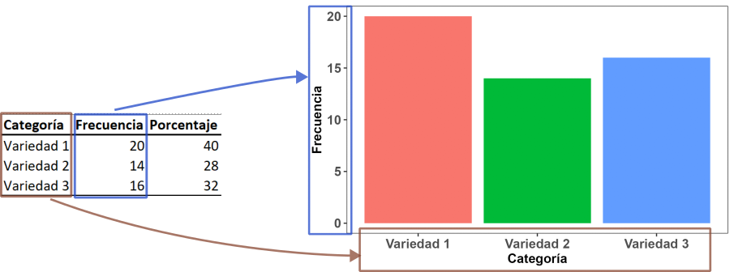{#fig-tablabar}

#### Diagrama de barras agrupadas

En un diagrama de barras agrupadas, al igual que en un diagrama de barras, se muestran los conteos para un grupo, pero además se desglosa para una variable cuantitativa adicional. Por ejemplo en la @fig-grafico2 se muestran los porcentajes de nitrógeno (N), fósforo (P) y potasio (K) para cuatro variedades diferentes de maíz.

```{r fig-grafico2, echo=FALSE, message=FALSE}
#| fig-cap: Diagrama de Barras Agrupadas
#| fig-pos: 'H'
datos <- read.csv("data/FOLIARES_COSECHA.csv")

datos <- datos |>
  select(c(1,3,4,5))

datos <- datos |>
  pivot_longer(
    2:4,
    names_to = "Elemento",
    values_to = "Valor"
  )

datos$Elemento <- factor(datos$Elemento, levels = c("N","P","K"))

g1 <- ggplot(datos, aes(x = VARIEDAD, y = Valor, fill = Elemento)) +
  geom_bar(position = "dodge",  stat = "summary", fun = "mean" ) +
  theme_apa() +
  labs(x = "Variedad", y = "Porcentaje (%)") 
g1
```

#### Diagrama de barras apiladas

Una variación muy útil de los diagramas de barras son los diagramas de barras apiladas. A diferencia de los diagramas de barras agrupadas en este caso se apilan las barras una sobre otra. Esto es útil cuando las barras suman $100 \%$, o la suma de los porcentajes o frecuencias es constante. En la @fig-grafico3 se muestra la relación Humedad, Materia Seca para cuatro variedades de maíz.

```{r fig-grafico3, echo=FALSE, message=FALSE}
#| fig-cap: Diagrama de Barras Apiladas
#| fig-pos: 'H'
ms <- read.csv("data/HUMEDAD.csv")

ms <- ms |>
  select(c(1,2,3)) |>
  pivot_longer(
    2:3,
    names_to = "Característica",
    values_to = "Porcentaje"
  ) |>
  mutate(
    Característica = case_when(Característica == "HUMEDAD" ~ "Humedad",
                               Característica == "MATERIA_SECA" ~ "Materia Seca"))
ggplot(ms, aes(fill=Característica, y=Porcentaje, x=VARIEDAD)) + 
  geom_bar(position="stack", stat="summary", fun = "mean" ) +
  labs(
    x = "Variedad", y = "Porcentaje (%)"
  ) + 
  theme_apa()

```

#### Histograma

Un histograma es un gráfico que utiliza barras para representar las frecuencias absolutas o las frecuencias relativas de los posibles resultados de una variable cuantitativa y ayuda a entender los valores que se tienen en un conjunto de datos, cuando hablamos de un histograma o histograma de frecuencias nos referimos a las frecuencias absolutas. Con un histograma se puede conocer la forma, el centro y la variabilidad de la distribución. La altura de las barras corresponde a las frecuencias absolutas.

Es importante tener en cuenta que un histograma no debe ser usado para hacer inferencias ya que nos dan una rápida visión de la distribución de los datos y solo sugieren información sobre ciertas características. En la @fig-histograma1 se aprecia el histograma de la altura de los girasoles. En la figura @fig-tablahist se esquematiza la relación entre la tabla de frecuencias y el histograma de frecuencias absolutas.

```{r fig-histograma1, echo=FALSE, message=FALSE}
#| fig-cap: Histograma de la altura de girasoles
#| fig-pos: 'H'
g2 <- ggplot(girasoles, aes(x = Altura )) + 
  geom_histogram(breaks = h2$breaks-1,col = "black", fill = "white" ) + 
  theme_apa() +
  scale_x_continuous(
    breaks = h2$breaks
  ) +
  scale_y_continuous(
    limits = c(0,80)
  ) +
  labs(
    x = "Altura (cm)",
    y = "Frecuencia"
  )

g3 <- ggplot(girasoles,aes(x=Altura)) + 
  stat_bin(breaks = h2$breaks-1,col = "black", fill = "white" ) +
  stat_bin(breaks = h2$breaks-1, geom="text", aes(label=after_stat(count)), vjust=0)  + 
  theme_apa() +
  scale_x_continuous(
    breaks = h2$breaks
  ) +
  scale_y_continuous(
    limits = c(0,80)
  ) +
  labs(
    x = "Altura (cm)",
    y = "Frecuencia"
  ) 

g2
```

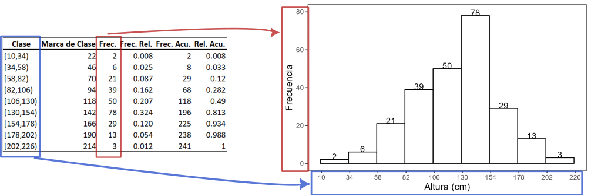{#fig-tablahist}

En algunas ocasiones es de interés graficar las frecuencias relativas. El histograma de las frecuencias relativas tiene la misma forma que el histograma de las frecuencias absolutas, pero las alturas ahora corresponden a las frecuencias relativas. En la @fig-histfr se muestra el histograma de frecuencias relativas para las alturas de los girasoles. Se puede apreciar que este histograma tiene la misma forma que el histograma de la @fig-histograma1.

```{r fig-histfr, echo=FALSE, message=FALSE}
#| fig-cap: Histograma de frecuencias relativas para las alturas de los girasoles
#| fig-pos: 'H'
g4 <- ggplot(girasoles, aes(x = Altura)) + 
  geom_histogram(aes(y = after_stat(count / sum(count))),breaks = h2$breaks-1, col = "black", fill = "white") +
  theme_apa() +
  scale_x_continuous(
    breaks = h2$breaks
  )  +
  labs(
    x = "Altura (cm)",
    y = "Frecuencia Relativa"
  )
g5 <- ggplot(girasoles,aes(x=Altura)) + 
  stat_bin(aes(y = after_stat(count / sum(count))),breaks = h2$breaks-1,col = "black", fill = "white" ) +
  stat_bin(breaks = h2$breaks-1, geom="text", aes(y = after_stat(count / sum(count)),label=round(after_stat(count / sum(count)),3)), vjust=0)  + 
  theme_apa() +
  scale_x_continuous(
    breaks = h2$breaks
  ) +
  labs(
    x = "Altura (cm)",
    y = "Frecuencia"
  ) 
ggsave("imagenes/relativa.png",g5)
g4
```

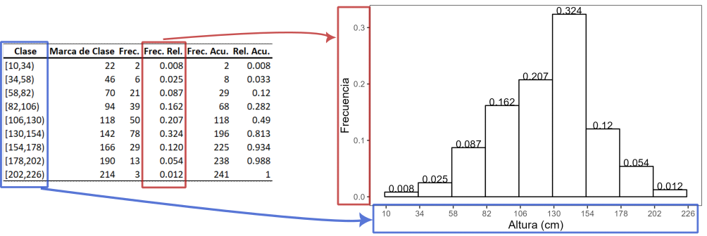{#fig-tablahistfr}

#### Gráficos de densidad

Un gráfico de densidad es una representación de la distribución de una variable numérica. Es una versión suavizada del histograma. Los gráficos de densidad son usados para estudiar la distribución de una variable. Los picos de un gráfico de densidad muestran donde se concentran los valores en el rango de la variable. Una ventaja que tienen los gráficos de densidad sobre los histogramas es que son mejores para determinar la forma de la distribución de los datos porque no se ven afectados por el número de barras usadas.

```{r fig-density, echo=F, message=F}
#| fig-cap: Gráfico de Densidad para la altura de los girasoles
#| fig-pos: 'H'

ggplot(girasoles, aes(x = Altura)) + 
  geom_histogram(aes(y =after_stat(density)) ,breaks = h2$breaks-1, col = "white", fill = "white") + 
  geom_density() + 
  theme_apa() + 
  labs(x = "Altura (cm)", y = "Densidad")
```

#### Diagramas de caja {#sec-cajas}

Un diagrama de caja resume los valores numéricos de una variable categórica, pero no se limitan solamente a la comparación de los valores sino que además ofrece una idea del rango de valores que puede tomar cada categoría dentro de la variable. En la @fig-boxplot se muestra el diagrama de caja para la altura de plantas de caña de azúcar que fueron sometidas a 3 tratamientos diferentes de riego y fertilización, estas mediciones corresponden a los 149 días después de la siembra.

Para la interpretación de un diagrama de caja principalmente hay que fijarse en la línea central de la caja. Este valor corresponde a la mediana, en secciones posteriores desarrollaremos este concepto, por el momento podemos decir que el $50 \%$ de los valores son menores a esta cantidad. Cuando la distribución de los datos es simétrica, la mediana se ubicará justo en el centro de la caja. Cuando la distribución de los datos es sesgada, la mediana estará posicionada más cerca de la parte superior o inferior de la caja. Los puntos que se ven sobre o bajo la caja son considerados valores atípicos. En secciones subsiguientes se desarrollarán en detalle los conceptos de sesgo, simetría y valores atípicos.

```{r fig-boxplot, echo=FALSE, warning=FALSE}
#| fig-cap: Diagrama de Caja para la Altura de plantas de caña de azúcar 149 días después del día de siembra
#| fig-pos: 'H'
#| out-width: 70%

atoc <- read_excel("data/Datos_AT_OC.xlsx", sheet = "Mediciones")

atoc_149 <- atoc |>
  filter(DDS == 149)

ggplot(atoc_149, aes(x = Tratamiento, y = Altura)) +
  geom_boxplot() +
  theme_apa() +
  labs(y = "Altura (cm)") +
  theme(
    axis.title   = element_text(size = 14, face = "bold"),
    axis.text.x  = element_text(size = 12, face = "bold"),
    axis.text.y  = element_text(size = 12, face = "bold")
  )
```

#### Gráficos de líneas {#sec-gralin}

Estos gráficos son útiles para mostrar la tendencia de una variable cuantitativa en el tiempo. En la @fig-lineas se muestra la evolución de la altura de las plantas de caña separadas por tratamiento.

```{r fig-lineas,  echo=FALSE, warning=FALSE, message=FALSE}
#| fig-cap: Evolución de la altura de las plantas de caña de azúcar
#| fig-pos: 'H'
#| out-width: 70%

atoc_summary <- atoc |>
  group_by(DDS, Tratamiento) |>
  summarise(
    Media = mean(Altura)
  )

ggplot(atoc_summary, aes(x = DDS, y = Media)) +
  geom_point(aes(col = Tratamiento)) +
  geom_line(aes(col = Tratamiento)) + 
  labs(
    y = "Días después de siembra", 
    x = "Altura (cm)"
  ) +
  theme_apa() +
  theme(
    legend.position = "bottom",
    axis.title   = element_text(size = 14, face = "bold"),
    axis.text.x  = element_text(size = 12, face = "bold"),
    axis.text.y  = element_text(size = 12, face = "bold")
  ) +
  scale_x_continuous(breaks = atoc_summary$DDS)

```

## Medidas numéricas de resumen

Una medida numérica de resumen es un número único que se calcula a partir de una muestra que transmite una característica específica de toda la muestra. Las medidas numéricas sirven para medir la tendencia central, la dispersión o la posición de los datos.

### Medidas de tendencia central

Las medidas de tendencia central indican alrededor de qué valor se centra, agrupa o aglutina la mayoría de datos. Existen algunas medidas de tendencia central. Como se mencionó antes, en todas se combina la información de una muestra en un único número y cada medida tiene ventajas y desventajas en su uso.

#### Media

::: {#def-mean}
La media o media aritmética es simplemente el promedio de los valores observados. Es decir, para los $n$ valores de una muestra $x_1,\,x_2, \ldots,\,x_n$ la media muestral $\bar{x}$ se define como la suma de todos los valores dividida para el número de valores:

$$
\bar{x}= \dfrac{\sum_{i=1}^nx_i}{n}
$$ {#eq-mean}

La media poblacional es denotada por la letra griega $\mu$, en este caso se divide para $N$ que representa el tamaño poblacional.

$$
\mu = \dfrac{\sum_{i=1}^Nx_i}{N}
$$ {#eq-mu}
:::

::: callout-important
**Propiedades de la media**

1.  Si a todos los valores $\left\{x_1, x_2, \ldots,x_n \right\}$ de una variable $x$ con media $\bar{x}$ se les suma una constante $k$, la nueva media es $\bar{x}+k$
2.  Si todos los valores $\left\{x_1, x_2, \ldots,x_n \right\}$ de una variable $x$ con media $\bar{x}$ se los multiplica por una constante $k$, la nueva media es $\bar{x}k$
3.  Si todos los valores $\left\{x_1, x_2, \ldots,x_n \right\}$ de una variable $x$ con media $\bar{x}$ se los divide por una constante $k$ diferente de $0$, la nueva media es $\dfrac{\bar{x}}{k}$
:::

::: callout-tip
**Ventajas de la media**

1.  Es fácil de entender y calcular.
2.  Depende de todos los valores.
3.  Es susceptible de cálculos aritméticos posteriores.
4.  No se ve afectada por las fluctuaciones producto del muestreo

**Desventajas de la media**

1.  Es susceptible a valores extremos.
2.  Al depender de todos los valores de un conjunto de datos, si existe uno o varios valores perdidos no es posible calcularla.
3.  No se usa para variables cualitativas.
:::

#### Media geométrica

::: {#def-mg}
La media geométrica $MG$ de un conjunto de $n$ observaciones $\left\{x_1, x_2, \ldots,x_n \right\}$ se define como la raíz enésima del producto de todas las observaciones. Entonces la media geométrica $MG$ viene dada por:

$$ 
MG = \sqrt[n]{x_1 \, x_2\, \ldots \,x_n} = \sqrt[n]{\Pi_{i=1}^{n} x_i}
$$ {#eq-mg}
:::

::: callout-important
**Propiedades de la media geométrica**

1.  La media geométrica es menor que la media aritmética.
2.  El producto de los valores de un conjunto de datos se mantiene si cada término es reemplazado por la media geométrica. $$x_1 \times x_2 \times \ldots \times x_n = \overbrace{GM_x \times \cdots \times GM_x}^{n\,veces} $$ {#eq-propgm2}
3.  La media geométrica del cociente de las observaciones correspondientes en dos series es igual a los cocientes de sus medias geométricas.
4.  La media geométrica del producto de las observaciones correspondientes en dos series es igual a los productos de sus medias geométricas.
:::

::: callout-tip
**¿Cuándo usar la media aritmética o la media geométrica?** La media $\bar{x}$ es usada en la mayoría de las situaciones, sin embargo, la media geométrica $GM$ es preferida cuando los cambios en los valores de una distribución ocurren de forma multiplicativa. Es decir que se la puede usar para promediar datos que siguen progresiones geométricas, por ejemplo razones, interés compuesto, tasas de depreciación, crecimientos de bacterias en microbiología. La media geométrica es muy útil para construir índices
:::

Los **valores atípicos** son valores que están muy lejos del resto de los datos. Cuando un conjunto de datos tiene valores atípicos la media podría no ser la mejor medida de tendencia central para describirlo. Los valores atípicos tienen mucha influencia sobre la media y tienden a arrastrar la media en dirección hacia ellos.

#### Mediana

::: {#def-median}
La mediana muestral denotada con $\tilde{x}$ de $n$ observaciones $x_1,\,x_2,\,\ldots,x_n$ es el valor central cuando las observaciones están ordenadas en forma ascendente. Cuando el número de observaciones es impar, la mediana es el único valor que está en la mitad de los datos. Mientras que cuando el número de observaciones es par, la mediana es el promedio de los dos valores centrales. En términos matemáticos, supongamos que $\left\{X\right\}$ denota al conjunto de datos $X$ ordenado de forma ascendente y ${X}_i$ representa el i-ésimo elemento del conjunto ordenado. La mediana $\tilde{x}$ es:

$$
\tilde{x} = \begin{cases} 
      \left \{ X \right\}_{\frac{n+1}{2}} & ; n \quad \textrm{impar}  \\
      \dfrac{\left \{ X  \right \}_{\frac{n}{2}} + \left \{ X  \right \}_{\frac{n}{2}+1} }{2} & ; n \quad \textrm{par}
   \end{cases}
$$ {#eq-median}
:::

::: callout-tip
**Ventajas de usar la mediana**

1.  Es fácil de calcular y comprender
2.  Solo existe una mediana para un conjunto de datos.
3.  No se ve afectada por valores extremos
4.  Se puede determinar para escalas ordinales, nominales, de razón e intervalo

**Desventajas de usar la mediana**

1.  No toma en cuenta el valor exacto de cada dato y por tanto no usa toda la información disponible.
2.  Si se agrupan los valores de dos grupos, la mediana de cada grupo no puede ser expresada en términos del grupo agrupado. Dicho de otra forma si se calculan las medianas de subconjuntos de un conjunto de datos, estas medianas no pueden ser combinadas para calcular la mediana de todo el conjunto.
:::

#### Moda

::: {#def-mode}
La moda denotada por $Mo$ es el valor que tiene la mayor frecuencia absoluta. Hay conjuntos de datos que no tienen moda, también existen conjuntos de datos con más de una moda. A un conjunto de datos con 2 modas se los llama bimodal, cuando existen más de 2 modas un conjunto recibe el nombre de multimodal.
:::

::: callout-tip
**Ventajas de usar la moda**

1.  Fácil de determinar.
2.  Se puede usar para datos con escala nominal u ordinal.

**Desventajas de usar la moda**

1.  Debido a que la moda no está definida algebraicamente no se acostumbra a usarla en análisis estadístico.
:::

### ¿Cómo escoger la medida de tendencia central adecuada?

En la mayoría de situaciones se prefiere la media como la medida de tendencia central que se reporta, sin embargo, en algunas situaciones se recomienda usar la mediana por ejemplo:

1.  Hay algunos valores extremos en la distribución.
2.  Algunas observaciones tienen valores no determinados.
3.  Los datos se miden en una escala ordinal

Cuando los datos se encuentran en una escala nominal, se prefiere a la moda.

### Simetría y sesgo

La forma de una distribución unimodal, puede ser simétrica o sesgada. Una distribución es **simétrica** si hacia la derecha y la izquierda de un valor central tiene la misma forma como se observa en el histograma de la @fig-simetria, además en esta figura se muestra un diagrama de caja y un gráfico de densidad para una distribución simétrica.

Una distribución es **sesgada a la derecha** si la cola derecha es más larga que la izquierda, en la @fig-derecha se muestran el histograma, el diagrama de caja y el gráfico de densidad para una distribución sesgada a la derecha. Finalmente, cuando la cola izquierda es más larga que la derecha la distribución es **sesgada a la izquierda** en la @fig-izquierda se aprecia una distribución sesgada a la izquierda.

Entre el sesgo y las medidas de tendencia central existen las siguientes relaciones.

1.  Cuando la distribución es sesgada a la derecha se cumple $Mo< \tilde{x}< \bar{x}$. En el gráfico de densidad de la @fig-derecha la línea vertical de color azul representa la moda, la línea vertical de color rojo representa a la mediana y la línea vertical de color naranja representa la media\
2.  Cuando la distribución es sesgada a la izquierda se cumple que $\bar{x} < \tilde{x} < Mo$. Con los mismos códigos de colores anteriores podemos observar la ubicación de estos valores en la @fig-izquierda.
3.  Cuando la distribución es simétrica se cumple que $\bar{x} = \tilde{x} = Mo$.

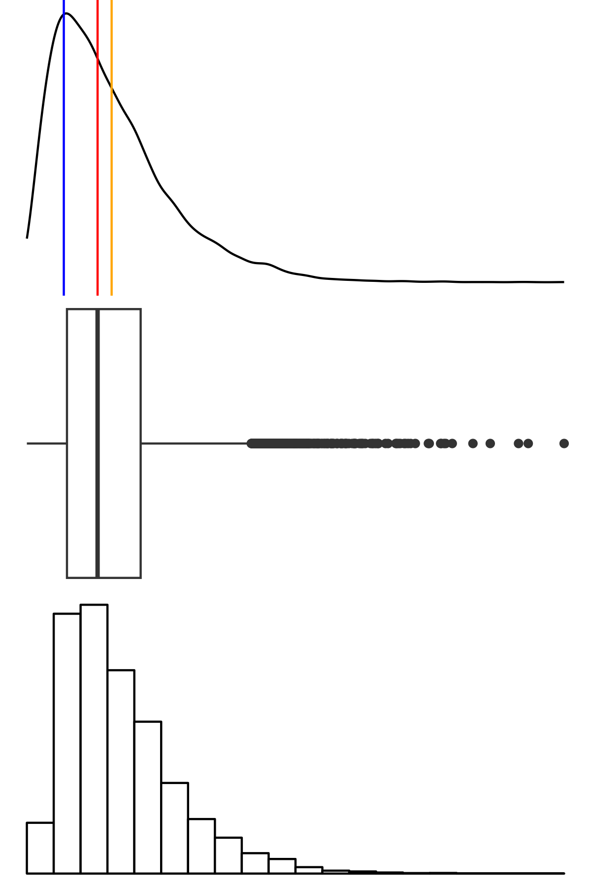{#fig-derecha}

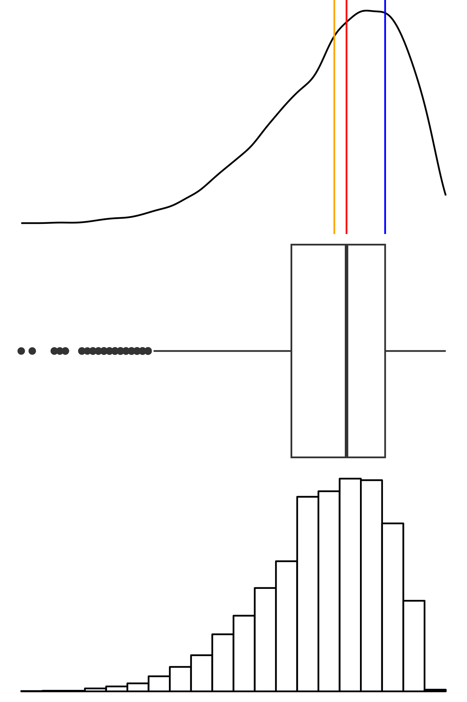{#fig-izquierda}

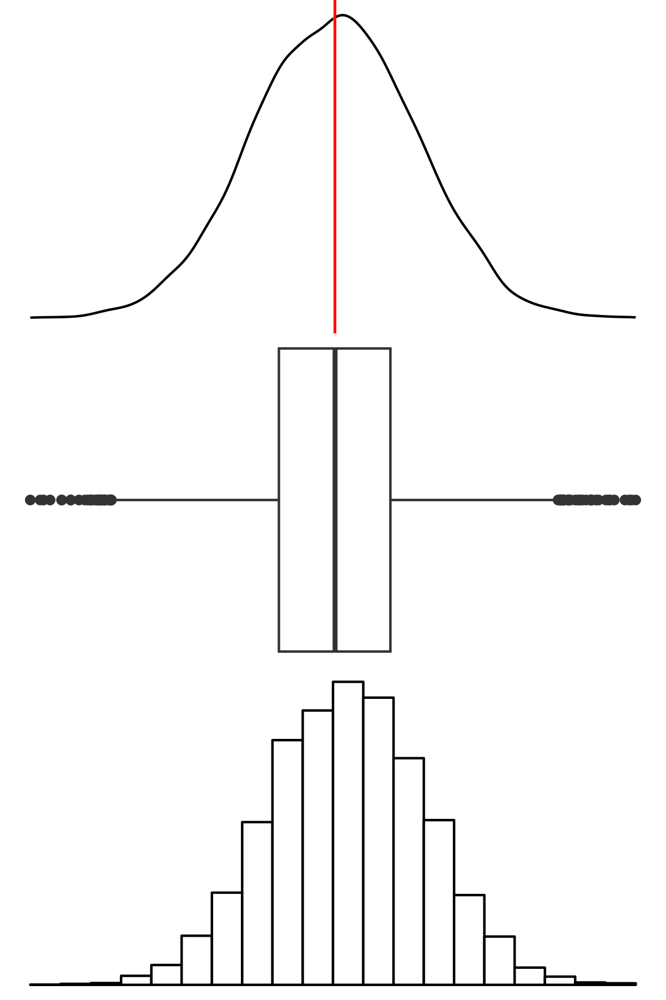{#fig-simetria}



### Medidas de dispersión {#sec-disp}

Supongamos que en una empresa distribuidora de agroquímicos se forman dos equipos de ventas, la empresa ofrece un bono al equipo que tiene el mejor desempeño en las ventas mensuales promedio. En la @tbl-ventas se muestra el mínimo, la media, la mediana, el máximo y el total para las ventas mensuales de ambos equipos. Se observa que ambos equipos vendieron la misma cantidad total durante el mes por lo que tuvieron la misma media para las ventas mensuales. Es decir, que si se quisiera escoger al mejor equipo por el total de ventas mensuales o por el promedio de ventas mensuales no hay un equipo que haya tenido un mejor desempeño. Por otro lado el equipo 2 tiene un valor mínimo menor que el equipo 1 y en cuanto al máximo el equipo 2 tiene un valor máximo mayor al del equipo 1, esto nos llevaría a pensar que aunque ambos equipos tienen la misma media mensual la distribución de los datos para ambos equipos es diferente.

En la @fig-puntosventas se muestra un gráfico de puntos de las ventas por equipo, se ha incluido una línea punteada de color negro en la media de ambos conjuntos ($20000.00$), con este gráfico se puede notar que las ventas del equipo 2 están más *dispersas* que las ventas del equipo 1. El histograma que se muestra en la @fig-histventas permite visualizar la distribución de las ventas, y finalmente en el diagrama de caja de la @fig-cajaventas se aprecia que el equipo 2 tuvo valores atípicos en sus ventas.

```{r ventas, echo=F, message=F, warning=F}

ventas = read_excel("data/VENTAS.xlsx", sheet = "VENTAS1")

g6 <- ggplot(ventas, aes(x=Ventas,y=Equipo)) + 
  geom_point(aes(col=Equipo,size=2)) +
  scale_x_continuous(breaks=seq(16000,23000,1000)) +
  geom_vline(xintercept=20000, linetype="dashed") +
  theme_apa() +
  theme(legend.position = "none")+
  ylab("") + xlab("") 

tbl2 <- ventas |>
  group_by(Equipo) |>
  summarise(
    Mínimo = min(Ventas),
    Media = format(mean(Ventas), nsmall=2),
    Mediana = median(Ventas),
    Máximo = max(Ventas),
    Total = format(sum(Ventas), scientific = F, nsmall = 2)
  )

g7 <- ggplot(ventas, aes(x = Ventas/1000)) +
  geom_histogram(breaks = seq(16,23,1.4), 
                 col = "black", fill = "white") +
  facet_grid(~Equipo) +
  theme_apa() +
  labs(x = "Ventas (miles de dólares)", y = "Frecuencia") + 
  scale_x_continuous(breaks =  seq(16,23,1.4)) 

g8 <- ggplot(ventas, aes(x = Equipo, y = Ventas/1000)) +
  geom_boxplot() +
  labs(x = "Equipo", y = "Ventas (miles de dólares)") +
  theme_apa() 
```

```{r}
#| label: tbl-ventas
#| tbl-cap: Estadística descriptiva de las ventas por Equipo
#| echo: false
#| message: false
#| warning: false
kable(tbl2,booktabs = TRUE,format = "pandoc", digits = 2)
```

```{r fig-puntosventas,  echo=FALSE, warning=FALSE, message=FALSE}
#| fig-cap: Gráfica de puntos de las ventas por equipo
#| fig-pos: 'H'
#| out-width: 60%
g6
```

```{r fig-histventas,  echo=FALSE, warning=FALSE, message=FALSE}
#| fig-cap: Histograma de las ventas por equipo
#| fig-pos: 'H'
#| out-width: 70%

g7
```

```{r fig-cajaventas,  echo=FALSE, warning=FALSE, message=FALSE}
#| fig-cap: Diagrama de caja de las ventas por equipo
#| fig-pos: 'H'
#| out-width: 70%

g8
```

Regresando a nuestra pregunta inicial ¿qué equipo tiene un mayor desempeño en sus ventas mensuales? Para contestar esta pregunta podemos calcular la **dispersión** de los datos, esta cuantificación la haremos con las tres medidas de dispersión más usadas.

#### Rango

El rango es la medida de dispersión más fácil de calcular, resulta de la diferencia entre el máximo y el mínimo de un conjunto de datos.

$$ 
Rango = \text{Máximo} - \text{Mínimo}
$$

#### Varianza poblacional y muestral

Una forma de definir la dispersión es "la desviación de los datos respecto a la media". La desviación de una observación respecto a la media se la calcula como la diferencia entre la observación y la media, supongamos un conjunto $x$ de $n$ observaciones $x_1,\, x_2,\, \ldots, x_n$ la desviación i-ésima respecto a la media es igual a $x_i-\bar{x}$. La media puede ser interpretada como un punto de balance por lo que en un conjunto cualquiera de $n$ observaciones las desviaciones respecto a la media positivas ($x_i-\bar{x}>0$) hacen contrapeso a las desviaciones respecto a la media negativas ($x_i-\bar{x}<0$), es decir que $\sum_{i=1}^n(x_i-\bar{x})=0$. Por esta razón las medidas de dispersión respecto a la media utilizan las desviaciones cuadráticas o el valor absoluto de estas.

::: {#def-varp}
La **varianza poblacional** que se denota con $\sigma^2$ se la calcula como el promedio de las desviaciones cuadráticas respecto a la media:

$$
\sigma^2 = \dfrac{\sum_{i=1}^N(x_i-\mu)^2}{N}
$$ {#eq-varp}
:::

::: {#def-varm}
La **varianza muestral** que se denota con $s^2$ se la calcula con la expresión: $$
s^2 = \dfrac{\sum_{i=1}^n(x_i-\bar{x})^2}{n-1}
$$ {#eq-varm}
:::

#### Desviación poblacional y muestral

::: {#def-desv}
La varianza poblacional o muestral está expresada en unidades cuadráticas, para nuestro ejemplo de las ventas la varianza se expresaría en dólares al cuadrado. Es más fácil interpretar la raíz cuadrada de la varianza. Esta raíz cuadrada se llama **desviación estándar**. La desviación estándar poblacional se la calcula con:

$$
\sigma = \sqrt{\sigma^2} = \sqrt{\dfrac{\sum_{i=1}^N(x_i-\mu)^2}{N}}
$$ {#eq-desvp}

La desviación estándar muestral se la calcula con:

$$ 
s = \sqrt{s^2} = \sqrt{\dfrac{\sum_{i=1}^n(x_i-\bar{x})^2}{n-1}}
$$ {#eq-desvm}
:::

Finalmente, en la @tbl-dispventas podemos apreciar que el equipo 1 tiene un rango menor que el equipo 2, lo mismo ocurre con las otras dos medidas de dispersión. El hecho de que las medidas de dispersión del equipo 1 sean menores a las del equipo 2 nos da a entender que aunque ambos equipos tienen el mismo promedio de ventas, en el equipo 1 las ventas son más homogéneas.

```{r}
#| label: tbl-dispventas
#| tbl-cap: Medidas de Dispersión de las ventas por Equipo
#| echo: false
#| message: false
#| warning: false

tbl3 <- ventas |>
  group_by(Equipo) |>
  summarise(
    Rango = max(Ventas)- min(Ventas),
    Varianza = format(var(Ventas), scientific = F, nsmall=2),
    Desviación = sd(Ventas)
  )
kable(tbl3,booktabs = TRUE,format = "pandoc", digits = 2)
```

### Medidas de posición

Las medidas de posición no central permiten conocer otros puntos característicos de la distribución que no son los valores centrales. Entre las medidas de posición no central más importantes están los cuantiles. El término cuantil fue usado por primera vez por Kendall en 1940.

El cuantil de orden $p$ de una distribución con $0<p<1$ es el valor $x_{i}$ de la variable $X$ que marca un corte de modo que una proporción $p$ o un porcentaje $100p$% de valores de la población es menor o igual que $x_{i}$ Por ejemplo el cuantil de orden $0.35$ dejaría un 35% de valores por debajo de él.

#### Tipos de Cuantiles

-   *Cuartiles*: son 3 valores ($Q_{1}, Q_{2}, Q_{3}$) que dividen a la distribución en 4 partes iguales.
-   *Quintiles*: son 4 valores ($K_{1}, K_{2}, K_{3}, K_{4}$) que dividen a la distribución en 5 partes iguales.
-   *Deciles*: son 9 valores ($D_1, D_2, D_3, D_4, D_5, D_6, D_7, D_8, D_9$) que dividen a la distribución en 10 partes iguales.
-   *Percentiles*, son 99 valores ($P_1, P_2, \ldots P_{99}$) que dividen a la distribución en 100 partes iguales.

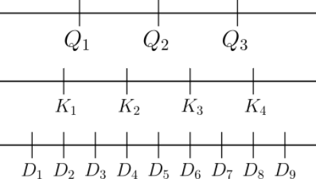{#fig-cuantiles}

#### Cálculo de cuantiles

Es fácil darse cuenta que existen equivalencias importantes entre los cuantiles, algunos ejemplos de estas equivalencias:

-   $D_5=Q_2=P_{50}$
-   $D_4=K_2=P_{40}$
-   $D_3=P_{30}$

Se deduce entonces que no es necesario tener una expresión para cada tipo de cuantiles, basta con conocer una expresión para calcular percentiles. Para esto debemos conocer dos cosas:

1.  La posición del percentil en nuestro conjunto de datos.
2.  El valor del percentil tomando en cuenta su posición.

Para calcular la posición del percentil $i$ que acumula el 100$p$% en un conjunto de datos no agrupado $X$, de tamaño $n$ y ordenado en forma ascendente primero determinamos la posición del percentil con la expresión:

$$ 
  \text{Posición} = p(n-1)+1
$$ {#eq-posperc)}

Para determinar el valor $X_{i.a}$ utilizamos la expresión:

$$
  X_{i.a}=X_{i}+0.a(X_{i+1}-X_{i})
$$ {#eq-valperc}

Estas expresiones matemáticas no serán usadas para el cálculo de percentiles en este texto. Más adelante aprenderemos una función en R que nos permite calcular cualquier percentil.

#### Relación entre los cuartiles y el diagrama de caja.

En la @sec-cajas se dijo que la línea central de la caja corresponde a la mediana de los datos, ahora que conocemos a los cuartiles es útil saber cuál es la relación entre los cuartiles y los diagramas de caja. En la @fig-boxparts se muestran las partes del diagrama de cajas. El límite inferior y el límite superior se calculan en función del **rango intercuartílico** ($IQR$ por sus siglas en inglés) que es igual a la diferencia entre el tercer y primer cuartil.

$$
IQR = Q_3 - Q_1
$$ {#eq-iqr}

El límite superior ($LS$) y el límite inferior ($LI$) se calculan con las siguientes expresiones, respectivamente:

$$
LS = Q_3 + 1.5IQR
$$ {#eq-lsdc}

$$
LI = Q_1 - 1.5IQR
$$ {#eq-lidc}

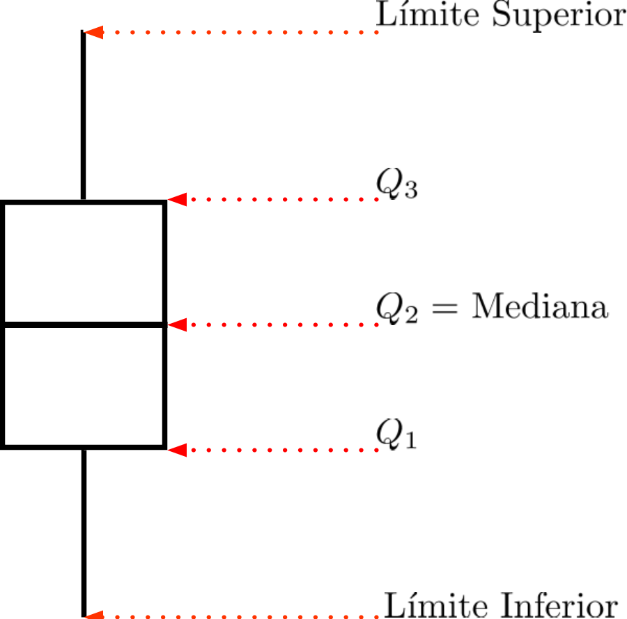{#fig-boxparts width="50%"}

##### Valores atípicos

Los valores atípicos son puntos de datos que se sitúan fuera de la mayoría de los datos de un conjunto concreto. Estos valores pueden ser muy superiores o inferiores a los de otros puntos y pueden influir en los resultados del análisis de datos de forma que falseen la muestra de datos. Aprender a identificar y tratar los valores atípicos, 
puede aumentar la probabilidad de que sus análisis reflejen con exactitud la validez y fiabilidad de sus resultados.

Los valores atípicos desempeñan un papel importante en el análisis de datos, que varía en función del origen y el impacto del análisis. Por ejemplo, en algunos campos, los valores atípicos pueden proporcionar información sobre sucesos raros, indicando la necesidad de un análisis más profundo.  

Los valores atípicos pueden representar fuentes de errores. Las imprecisiones en las mediciones, los errores tipográficos u otros factores pueden introducir ruido en el conjunto de datos que no represente los datos reales. La presencia de valores atípicos en los conjuntos de datos también puede indicar una baja calidad de los datos e introducir sesgos en su análisis. Si hubiera errores sistemáticos durante la recogida de datos, tendría que tomar una decisión informada sobre la mejor manera de proceder.


## Primeros pasos en RStudio. Elaboración de gráficos y obtención de medidas de resumen. {#sec-pprs}

En el proceso de análisis de datos, adicional a los scripts, la mayoría de ocasiones es necesario tener los datos almacenados en algún directorio de la computadora (en algunas ocasiones los datos se leen desde internet). Las tablas y los gráficos que se generen, también pueden ser almacenados en la computadora. Una forma de manejar esto de forma eficiente es trabajando con *directorios de trabajo*, un directorio de trabajo es una ruta dentro de la computadora que especifica la ubicación predeterminada de los archivos que leamos en R o que guardemos desde R.

::: callout-tip
-   Para conocer el directorio de trabajo actual se usa la función `getwd()`.
-   Para fijar el directorio de trabajo se usa la función `setwd(dir = "directorio")`
:::

### Creación de proyectos en RStudio {#sec-projectR}

RStudio tiene una forma más eficiente de manejar los directorios de trabajo, utilizando **proyectos**. Un proyecto es simplemente un directorio de trabajo designado con un archivo de extensión `.Rproj`. Al momento de abrir un proyecto, se configura automáticamente el directorio de trabajo como el directorio donde se encuentra el archivo `.Rproj`.

Una buena práctica es crear un proyecto en RStudio por cada investigación, tarea o proyecto de análisis que se desee trabajar. Dentro de la carpeta del proyecto es recomendable tener subcarpetas que permitan almacenar los datos que van a ser leídos y producidos como parte de nuestro análisis. Una sugerencia es tener cuatro carpetas como mínimo:

1.  `datos`: en esta carpeta se encuentran los datos que van a ser analizados.
2.  `graficos`: para guardar los gráficos producidos.
3.  `resultados`: para guardar las tablas resultado del análisis de datos.
4.  `scripts`: en esta carpeta se guardan todos los scripts utilizados en el análisis.

En este texto se utilizará un solo proyecto al que llamaremos **r4agro**. En cualquier ubicación de nuestra computadora vamos a crear la carpeta llamada **r4agro** y dentro de esta carpeta las carpetas **datos**, **graficos**, **resultados** y **scripts** como se muestra en la @fig-project1.

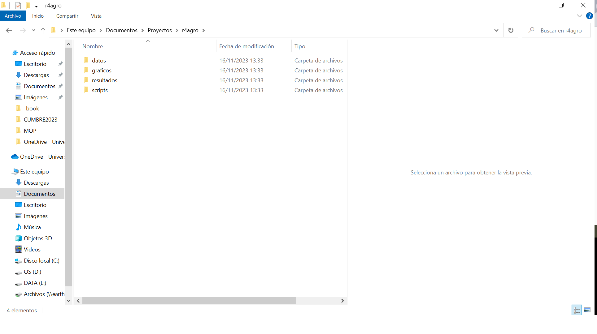{#fig-project1 width="50%"}

Para crear un proyecto, se debe dar clic en `File -> New Project` y aparecerá la ventana mostrada en la @fig-project2.

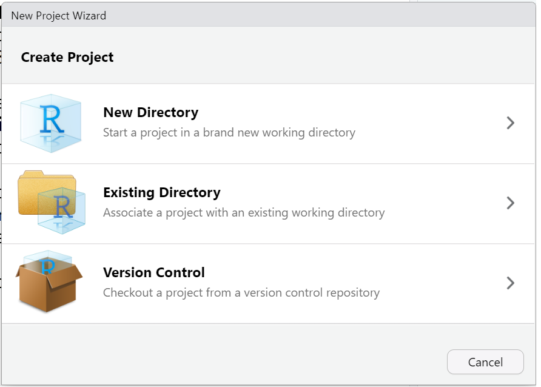{#fig-project2 width="50%"}

Escogemos la opción de acuerdo a nuestras necesidades:

::: callout-tip
-   **New Directory**: escogemos esta opción si vamos a crear un nuevo directorio desde 0. Cuando se da clic, aparece una nueva ventana como se muestra en la @fig-project3

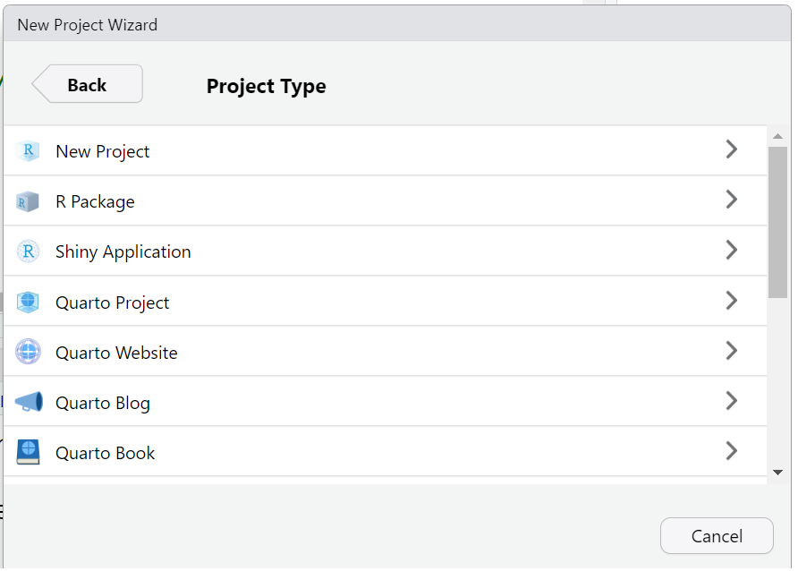{#fig-project3 width="50%"}

-   **Existing Directory**: escogemos esta opción si ya tenemos creada la carpeta de nuestro proyecto. En este libro vamos a trabajar siempre escogiendo esta opción. Más adelante explicaremos en detalle como crear un proyecto escogiendo esta opción.

-   **Version Control**: El control de versiones ayuda a los equipos de desarrollo de software a controlar y gestionar los cambios en el código fuente a lo largo del tiempo. Los programas y plataformas de control de versiones mantienen un registro de las modificaciones hechas al código. Si se comete un error, los desarrolladores pueden comparar versiones anteriores del código para ayudar a corregir el error al tiempo que se minimizan las molestias para todos los miembros del equipo. RStudio trabaja con dos sistemas de código abierto para el control de versiones: **Git** y **Subversion**.
:::

#### Creación de proyectos (Existing Directory)

::: callout-tip
-   `File -> New Project`
-   `Existing Directory`
-   Se abre una ventana como la de la @fig-project4 y damos clic en `Browse`.
-   Se abre una ventana en la que buscamos la ubicación de la carpeta de nuestro proyecto y damos clic en `Open` (@fig-project5).
-   Posteriormente, escogemos la opción `Create New Project` (@fig-project6).
-   Finalmente, el proyecto se crea. Identificamos que el proyecto ha sido creado porque ahora aparece el nombre del proyecto en las esquinas superior izquierda y derecha de nuestra ventana de RStudio (@fig-project7).
:::

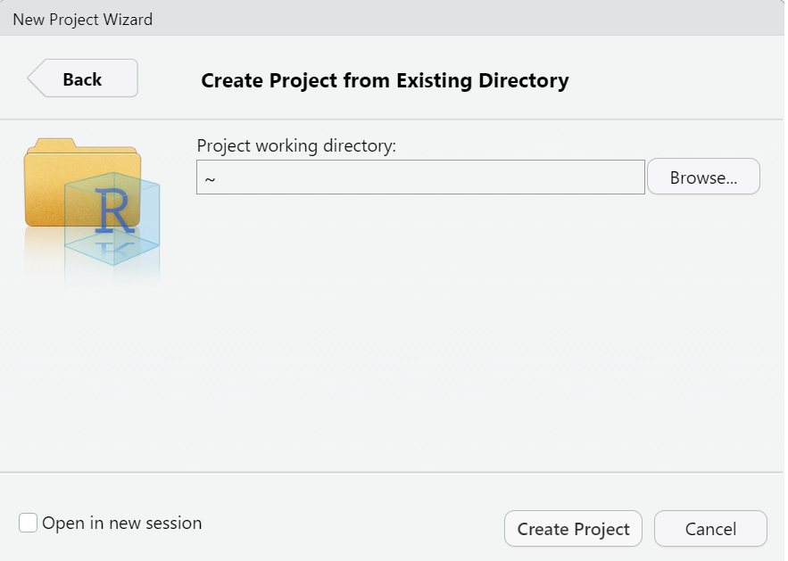{#fig-project4 width="50%"}

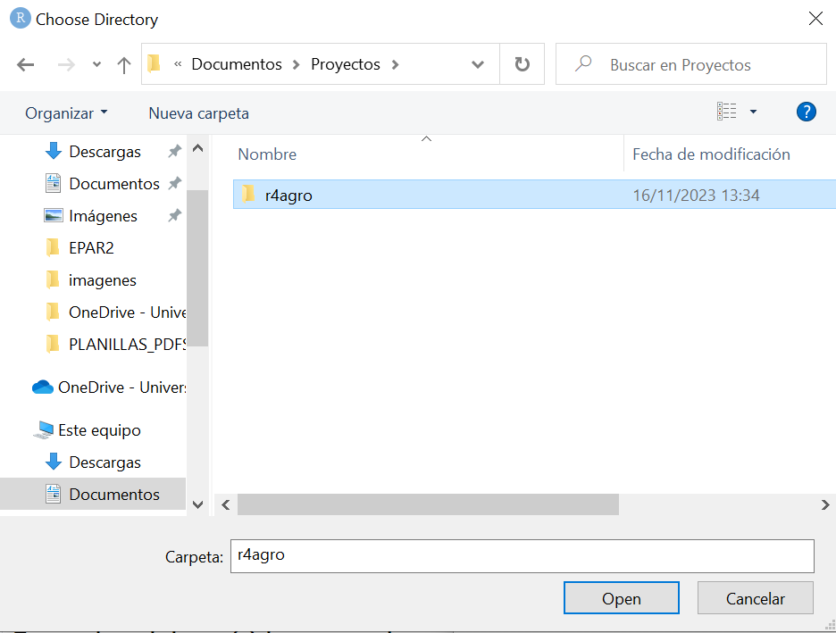{#fig-project5 width="50%"}

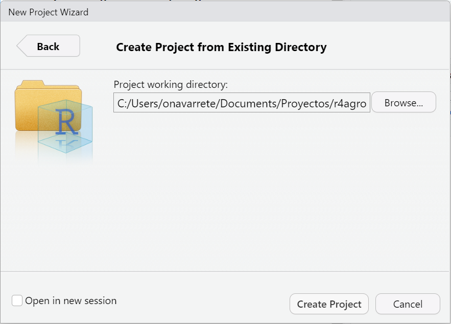{#fig-project6 width="50%"}

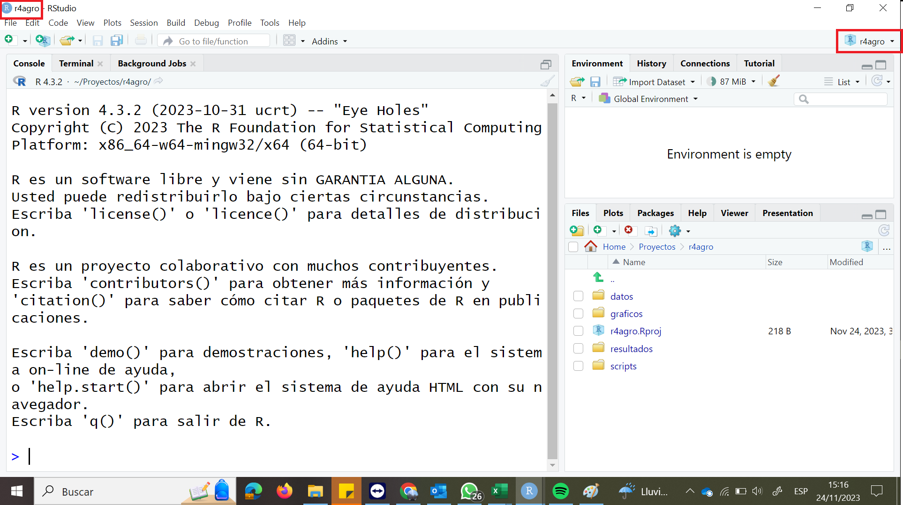{#fig-project7 width="50%"}

## Creando visualizaciones con `ggplot2`.

### Los datos

En esta sección trabajaremos con el conjunto de datos `alt_almacigo.csv`, este conjunto de datos corresponde a las alturas de 105 plantas de tomate de 5 variedades, 20 días después de la siembra en los almácigos. Las variables presentes en el archivo son:

1.  **Planta**: número de planta estudiada.
2.  **Variedad**: variedad de la planta.
3.  **DDS**: días después de siembra.
4.  **Altura**: altura de la planta en centímetros.
5.  **NHV**: Número de hojas verdaderas.

En la @sec-bars1, explicaremos paso a paso como obtener el gráfico mostrado en la figura @fig-bars1:

```{r fig-bars1,  echo=FALSE, warning=FALSE, message=FALSE}
#| fig-cap: Diagrama de barras de las variedades de tomate
#| fig-pos: 'H'
#| out-width: 60%

library(dplyr)
library(ggplot2)

datos <- read.csv("datos/alt_almacigo.csv",sep = ";", dec = ",")

ggplot(data = datos, mapping = aes(x = Variedad)) + 
  geom_bar() +
  ylab("Frecuencia")
```

### Cargar paquetes y leer datos {#sec-datos}

El primer paso es guardar nuestros datos en la carpeta `datos` de nuestro proyecto, creado anteriormente, `r4agro`. Posteriormente creamos un script, en esta oportunidad guardaremos nuestro script en la carpeta `scripts` con el nombre `01_visualizacion.R`.

Existen muchas formas de trabajar en un script, sin embargo, se recomienda seguir el siguiente flujo:

::: callout-tip
1.  Cargar los paquetes que sean necesarios para el análisis que se va a trabajar.
2.  Cargar los datos que se van a utilizar en el análisis.
3.  Trabajar con los datos, esto incluye realizar gráficos, analizar los datos o crear modelos.
:::

En este primer script trabajaremos solamente con los paquetes **dplyr** y **ggplot2** descritos en la @sec-packs. En las primeras líneas escribiremos las siguientes líneas de código.

```{r echo=TRUE}
library(dplyr)
library(ggplot2)
```

Una vez cargados los paquetes procedemos a leer los datos. El archivo con el que vamos a trabajar es un archivo de valores separados por comas (**c**omma ¨**s**eparated **v**alues). Existen muchas funciones que podemos usar para leer este tipo de archivos, sin embargo, vamos a trabajar con la función `read.csv`. Para no cometer errores al momento de la lectura de los datos es importante identificar si nuestros valores efectivamente están separados por coma (,) y si el archivo utiliza el punto (.) como separador de decimales. El archivo de nuestros datos tiene como separador de los valores el punto y coma, y como separador de decimales la coma.

::: callout-important
1.  Un archivo `csv` no necesariamente, tiene sus valores separados por coma. Dependiendo del sistema operativo o la región geográfica, los valores se guardan separados por coma (,) o por punto y coma (;).
2.  Si los valores están separados por coma, generalmente el separador de decimales es el punto (.).
3.  Cuando los valores están separados por punto y coma, el separador de decimales es la coma.
:::

Para leer los datos escribimos la siguiente línea de código.

```{r}
datos <- read.csv("datos/alt_almacigo.csv",sep = ";", dec = ",")
```

::: {.callout-important title="Entendiendo el código"}
{#fig-codigo1 width="90%"}
:::

Una vez cargados los datos podemos empezar por ver las variables y los tipos de datos en nuestro conjunto leído, para esto podemos usar la función `str()` o la función `glimpse()`.

::: callout-tip
1.  `str()` permite ver la estructura interna de un objeto. Pertenece al R base.
2.  `glimpse()` se utiliza para ver las columnas del conjunto de datos y mostrar una parte de los datos con respecto a cada atributo que pueda caber en una sola línea.
:::

```{r}
str(datos)
glimpse(datos)
```

La salida de la función `str()` nos muestra que nuestro objeto datos es un *data frame* de 105 observaciones y 5 variables. Las variables **Planta** y **DDS** son reconocidas como entero (**int**, *integer*), las variables **Altura** y **NHV** son reconocidas como número (**num**, *numeric*) esta clase de objetos hace referencia a los números que admiten decimales. Finalmente, la variable **Variedad** es reconocida como carácter (**chr**, *character*). Por otro lado la salida de la función `glimpse()` se diferencia en que las observaciones las reconoce como filas (**Rows**) y las variables como columnas (**Columns**), además las variables **Altura** y **NHV** son reconocidas de tipo *doble precisión* (**dbl**, *double precision*)

::: callout-tip
R tiene dos nombres para los vectores de coma flotante: **dbl** y **num**. Por un lado **double** es el nombre del *tipo* de datos, mientras que **numeric** es el nombre del *modo* de datos y además de la *clase* implícita.

Aunque no es el objeto de este texto una discusión más profunda de este tema puede ser encontrada en el [enlace](https://stat.ethz.ch/R-manual/R-devel/doc/manual/R-lang.html#Objects)
:::

El tipo de datos para la variable **Variedad** que ha sido reconocido quizás no es el adecuado para análisis posteriores, puesto que la variable es una variable categórica y se recomienda cambiar el tipo de datos a **factor**. Más adelante realizaremos esta modificación.

### La gramática del paquete `ggplot2` para la construcción de gráficos {#sec-bars1}

En R encontramos muchos sistemas para hacer gráficos, sin embargo el paquete `ggplot2` implementa la **gramática de gráficos** que es un sistema coherente para construir gráficos.

De manera general la grámatica para construir un gráfico es:

```{r eval=FALSE, include=TRUE}
ggplot(data = ... , mapping = ... ) +
  GEOM()
```

Para construir un gráfico se comienza usando la función `ggplot()`, esto nos permite definir un objeto gráfico al que le vamos a añadir **capas** hasta obtener el gráfico deseado. El primer argumento que se debe ingresar es el conjunto de datos, el comando `ggplot(data = datos)` crea un gráfico vacío en el que vamos a presentar algo de nuestros datos. Por el momento nuestro gráfico luce vacío porque no hemos indicado qué y cómo vamos a presentar.

```{r}
ggplot(data = datos)
```

Ahora debemos indicar qué variables van a ser representadas. En el argumento `mapping` se indica como las variables del conjunto de datos son mapeadas a las propiedades visuales (estéticas, **aesthetics**) del gráfico. Las variables a ser mapeadas se definen en la función `aes()` en la que se señalan las variables que van a ser presentadas en el eje $x$ y en el eje de las $y$. En nuestro caso solo vamos a representar el conteo de las variedades en un diagrama de barras por lo que en la función `aes()` vamos a incluir el argumento `x = Variedad`.

```{r}
ggplot(data = datos, mapping = aes(x = Variedad)) 
```

Después de indicar los datos y las variables para nuestro gráfico, debemos indicar **cómo** se van a representar nuestros datos. En la gramática de **ggplot2** el objeto visual usado para representar datos de forma gráfica se lo conoce como **geom**. En nuestro caso deseamos realizar un diagrama de barras, para esto usaremos `geom_bar()`.

```{r}
ggplot(data = datos, mapping = aes(x = Variedad)) +
  geom_bar()
```

Si comparamos este último gráfico con el de la @fig-bars1, podemos notar que el eje de las $y$ aparece la palabra "Frecuencia". Para lograr esto, podemos usar la función `ylab()` y añadir una capa donde establecemos la etiqueta del eje $y$.

```{r}
ggplot(data = datos, mapping = aes(x = Variedad)) +
  geom_bar() +
  ylab("Frecuencia")
```

Supongamos que se desea añadir color a las barras. Hay dos opciones, la primera es que todas las barras tengan un único color, la segunda opción es que cada barra tenga un color de acuerdo a la variedad

Existen dos argumentos que nos pueden ayudar a lograr el objetivo: `fill` y `col`, es importante entender la diferencia de ellos cuando se trabajan con gráficos de barras.

::: callout-tip
-   El argumento `fill` indica el relleno que se desea dar a las barras.
-   El argumento `col` indica el color que rodea a las barras
:::

Para dar color a las barras usamos el argumento `fill`, si es un color único dentro del objeto geométrico escribimos `fill = color_deseado`. Por otro lado, si queremos que cada barra tenga un color diferente, dentro de `aes` incluimos el argumento `fill = Variable`. El nombre del color puede ser escrito de algunas formas posibles.

::: callout-important
1.  R tiene 657 colores integrados, los nombres pueden ser obtenidos con la función `colors()`. Una guía detallada se puede encontrar en el [enlace](http://www.stat.columbia.edu/~tzheng/files/Rcolor.pdf)
2.  Se puede usar también códigos hexadecimales de colores.
3.  En el [enlace](https://www.nceas.ucsb.edu/sites/default/files/2020-04/colorPaletteCheatsheet.pdf) se puede encontrar más información de manejo de colores y paletas de colores en R.
:::

```{r}
ggplot(data = datos, mapping = aes(x = Variedad )) +
  geom_bar(fill = "lightblue") +
  ylab("Frecuencia")
```

```{r}
ggplot(data = datos, mapping = aes(x = Variedad, fill = Variedad )) +
  geom_bar() +
  ylab("Frecuencia")
```

### Diagrama de cajas

En la @sec-cajas, explicamos qué es un diagrama de cajas. A continuación vamos a elaborar un diagrama de cajas para la altura por variedad. El objeto geométrico para elaborar un diagrama de cajas es `geom_boxplot`.

```{r}
ggplot(data = datos, mapping = aes(x = Variedad, y = Altura, fill = Variedad )) +
  geom_boxplot() +
  ylab("Altura (cm)") 
```

El gráfico presentado tiene dos aspectos que van a ser modificados, primero la leyenda es redundante porque es evidente qué caja representa a cada variedad. Segundo el fondo del gráfico debe ser blanco. Para lograr esto último usamos la opción `theme_classic()` y para eliminar la leyenda usamos la opción `theme( legend.position = "none" )`.

```{r}
ggplot(data = datos, mapping = aes(x = Variedad, y = Altura, fill = Variedad )) +
  geom_boxplot() +
  ylab("Altura (cm)") +
  theme_classic() +
  theme(
    legend.position = "none"
  )
```

### Histogramas y facetas

La variable **Altura** es una variable cuantitativa continua por lo que para representarla es conveniente utilizar un histograma. El objeto geométrico que nos permite obtener un histograma es `geom_histogram()`.

```{r}
ggplot(data = datos, mapping = aes(x = Altura )) +
  geom_histogram() +
  ylab("Frecuencia")
```

Al ejecutar el código, además del gráfico, en la consola obtenemos un mensaje que nos sugiere que se están usando 30 barras y nos recomienda trabajar con un argumento para cambiar el resultado. La función `geom_histogram()` por defecto trabaja con este valor de barras, otra opción adicional a la sugerencia dada por el programa es dentro del objeto indicar cuántas barras se desea incluir con la opción `bins =`. Además para notar las barras vamos a usar las opciones `fill` y `col`.

```{r}
ggplot(data = datos, mapping = aes(x = Altura )) +
  geom_histogram(bins = 7, fill = "white", col = "black" ) +
  ylab("Frecuencia")
```

Debemos recordar que nuestro conjunto de datos tiene la información de 5 variedades. El histograma presentado corresponde a la altura de todas las variedades, por lo que sería conveniente separar el histograma por variedad. Para obtener un subgráfico para cada variedad, podemos usar la función `facet_wrap()` o `facet_grid()`. La función más usada es `facet_wrap()`.

::: callout-tip
1.  `facet_wrap()` es recomendada para separar en subgráficos por una sola variable categórica, mientras que `facet_grid()` es recomendada cuando se desea separar en subgráficos por dos variables categóricas.
2.  `facet_grid()` produce una cuadrícula de gráficos para cada combinación de variables que se especifican, aún cuando algunos gráficos aparezcan vacíos.
3.  `facet_wrap()` solo produce gráficos para las combinaciones de variables que tengan datos, es decir que no produce gráficos vacíos.
:::

El primer argumento de la función es una fórmula que consiste basicamente del símbolo `~` seguido por el nombre de la variable categórica.

```{r}
ggplot(data = datos, mapping = aes(x = Altura )) +
  geom_histogram(bins = 7, fill = "white", col = "black" ) +
  ylab("Frecuencia") + 
  facet_wrap(~Variedad)
```

::: {.callout-important title="Cómo guardar un gráfico desde R con `ggplot2`"}
-   Para guardar un gráfico usamos la función `ggsave()`
-   La forma básica de usar la funcion es `ggsave(nombre_del_archivo, gráfico, width = ancho, height = altura, units = unidades )`
-   Para evitar confusiones al momento de guardar se recomienda asignar al gráfico que se desea almacenar a una variable.
-   Por defecto las unidades para guardar el gráfico son pulgadas. Si deseamos mantener las unidades en pulgadas, no es necesario especificarlas.
:::

Supongamos que deseamos guardar el último gráfico creado con el nombre `hist_alt_fac.png` en la carpeta gráficos. Primero guardaremos el gráfico en una variable llamada `g1`.

```{r}
g1 <- ggplot(data = datos, mapping = aes(x = Altura )) +
  geom_histogram(bins = 7, fill = "white", col = "black" ) +
  ylab("Frecuencia") + 
  facet_wrap(~Variedad)
```

Posteriormente, usamos la función `ggsave()` para guardar el gráfico.

```{r}
ggsave("graficos/hist_alt_fac.png", g1, width = 10, height = 6)
```

## Cálculo de medidas numéricas de resumen.

### Ingresando los datos (pequeños conjuntos de datos). {#sec-res1}

En esta sección vamos a presentar cómo calcular medidas númericas de resumen ingresando los datos directamente en la consola, es decir que crearemos una variable que contenga los datos.

El ingeniero Yorky Gil, con la finalidad de elaborar la curva fenológica para el cultivo de girasol en condiciones del trópico húmedo, realizó una siembra de girasoles. Periódicamente realizó mediciones del número de hojas y la altura de las plantas. De los datos obtenidos por Yorky de la semana 8 se extrajo una muestra de las alturas de 20 observaciones las cuales se muestran en la @tbl-altgir. Con estos datos calcular la media, la mediana, la desviación estándar, el rango. Adicionalmente calcular los 3 cuartiles, y los 9 deciles.

|     |     |     |     |     |
|:---:|:---:|:---:|:---:|:---:|
| 140 | 123 | 110 | 100 | 137 |
| 117 | 120 | 112 | 168 | 109 |
| 165 | 133 | 178 | 81  | 135 |
| 145 | 109 | 78  | 169 | 132 |

: Altura de girasoles en centímetros. Semana 8 {#tbl-altgir}

Este ejercicio lo resolveremos en un script llamado `02_numrespeq.R`, no es necesario cargar paquetes por lo que el primer paso para resolver este ejercicio es ingresar los datos en R. En este caso es unicámente un vector con 20 datos, vamos a llamar **alt_gir** a la variable.

```{r}
alt_gir <- c(140, 123, 110, 100, 137, 117, 120, 112, 168, 109, 
             165, 133, 178, 81, 135, 145, 109, 78, 169, 132)
```

Una vez ingresados los datos, podemos calcular la media con la función `mean()`, la mediana con la función `median()` y la desviación estándar con la función `sd()`. Estas tres funciones reciben el vector del que se quiere calcular el valor. Además en el caso de tener valores perdidos se puede indicar que se los remueva con la opción `na.rm = TRUE`.

```{r}
mean(alt_gir)
median(alt_gir)
sd(alt_gir)
```

En el paquete `base` de R no existe una función que nos permita calcular el rango directamente, sin embargo podemos usar la definición dada en la @sec-disp y utilizar las funciones `max()` y `min()` para calcular el rango como la diferencia entre el máximo y el mínimo del conjunto.

```{r}
max(alt_gir) - min(alt_gir)
```

Finalmente para calcular los percentiles utilizamos la función `quantile()`, los argumentos que recibe esta función son los datos y el percentil o percentiles que se desean calcular escritos en números decimales . Recordemos que los tres cuartiles acumulan el 25%, el 50% y el 75% respectivamente. Si solo quisieramos calcular el primer cuartil, lo podemos obtener escribiendo.

```{r}
quantile(alt_gir, 0.25)
```

Para calcular los tres cuartiles de una sola vez, se puede escribir una lista de los cuartiles.

```{r}
quantile(alt_gir, c(0.25, 0.50, 0.75))
```

En el caso de los deciles podemos escribir como antes o utilizar la función `seq()`

```{r}
quantile(alt_gir, c(0.10, 0.20, 0.30, 0.40, 0.50, 0.60, 0.70, 0.80, 0.90))
```

::: callout-tip
Para ver la ayuda de una función podemos escribir `?función`, en este caso podemos investigar como usar la función `seq()`, escribiendo `?seq`. En el panel inferior derecho observamos una descripción detallada de como trabaja la función.
:::

```{r}
quantile(alt_gir, seq(from = 0.10, to = 0.90,  by = 0.10))
```

### Leyendo los datos desde un archivo en Excel, usando el pipe (`|>`) (grandes conjuntos de datos). {#sec-res2}

En la @sec-datos, aprendimos a leer datos que se encuentran en un archivo `.csv`. Ahora trabajaremos con datos que se encuentran disponibles en un libro de Excel. El archivo se llama `alt_transp.xlsx` y la información está en la hoja de cálculo llamada `transplante`. Contiene la información de mediciones de altura hechas a plantas de tomate de cinco variedades. Las variables presentes son:

1.  **Planta**: número de planta.
2.  **Fecha_med**: fecha de la medición.
3.  **Fecha_trans**: fecha del transplante de las plantas del almácigo a los potes, en todos los casos esta variable tiene el mismo valor (27 de mayo de 2023).
4.  **Variedad**: variedad de las plantas.
5.  **Altura**: altura de las plantas en centímetros.

Existen algunos paquetes para leer información desde archivos Excel, sin embargo vamos a utilizar el paquete `readxl`. Adicionalmente usaremos el paquete `writexl` que nos permitirá guardar más adelante nuestros resultados en un archivo de Excel. Vamos a crear un script llamado `03_numresgra.R`. Recordemos que primero cargamos los paquetes.

```{r}
library(dplyr)
library(ggplot2)
library(readxl)
library(writexl)
```

Ahora leamos los datos con la función `read_excel()` del paquete `readxl()`.

```{r}
transplante <- read_excel("datos/alt_transp.xlsx", sheet = "transplante")
glimpse(transplante)
```

::: {.callout-important title="Entendiendo el código"}
{#fig-codigo2 width="90%"}
:::

Al usar la función `glimpse()` notamos que las variables `Fecha_med` y `Fecha_trans` son reconocidas como del tipo `dttm` (**date-time**) que es un tipo de dato asociados a datos de fecha y tiempo.

Deseamos conocer la media y la desviación estándar de la altura de las plantas por cada fecha de medición y variedad. En R base existe la familia de funciones `apply` que permite hacer esto de forma rápida, sin embargo el paquete `dplyr` tiene una serie de funciones que permiten realizar esto de forma mucho más eficiente, estas funciones son combinadas con el `pipe |>`.

::: callout-important
1.  El **pipe** `|>` permite concatenar funciones del paquete `dplyr()`
2.  La forma recomendada para pronunciar el **pipe** es "entonces".
:::

Si calculáramos a mano la media y la desviación estándar de la altura por variedad y fecha de medición, primero agruparíamos los datos por variedad y fecha y luego calcularíamos para cada grupo estas medidas numéricas. Para resolver esto con las funciones de `dplyr()` usamos el siguiente código:

```{r}
transplante |>
  group_by(Variedad, Fecha_med) |>
  summarise(
    Media = mean(Altura),
    Desv = sd(Altura)
  )
```

::: {.callout-important title="Entendiendo el código"}
{#fig-codigo3 width="90%"}
:::

De la tabla generada, unicámente se muestran 10 columnas en la consola. Para poder ver toda la tabla se debe guardar toda la tabla en una variable, en este caso la almacenaremos en una variable llamada `tbl_alt_var_fec`.

```{r}
tbl_alt_var_fec <- transplante |>
  group_by(Variedad, Fecha_med) |>
  summarise(
    Media = mean(Altura),
    Desv = sd(Altura)
  )
```

Posteriormente, podemos visualizar la tabla completa con cualquiera de las siguientes opciones.

1.  Dar clic sobre el nombre de la variable en el ambiente.
2.  Ejecutar el código `View(tbl_alt_var_fec)`

Cualquiera de las dos opciones nos permitirá ver nuestra tabla, en una pestaña que se abre junto al script que estamos trabajando.

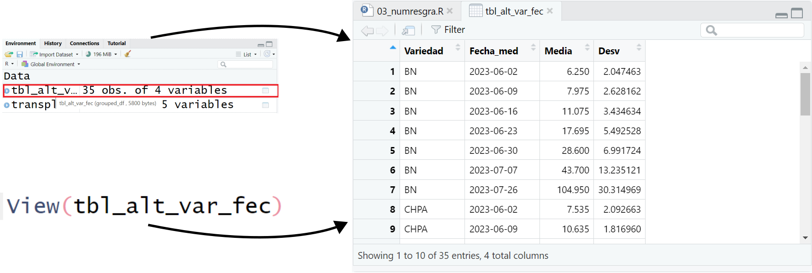{#fig-tabla}

Antes de aprender a guardar la tabla, vamos a crear una variable nueva en el conjunto de datos `transplante`. La variable que crearemos se llama `DDT` (días después de transplante). Esta variable resulta de la diferencia entre la fecha de medición y la fecha de transplante. Para crear nuevas variables en el conjunto de datos podemos usar la función `mutate()` de `dplyr`.

```{r}
transplante <- transplante |>
  mutate(
    DDT = as.numeric(Fecha_med - Fecha_trans)
  )
```

::: callout-important
1.  El código empieza con `transplante <-`, porque el resultado se va a almacenar en el mismo objeto.
2.  El resultado de `Fecha_med - Fecha_trans` contiene las unidades de tiempo en este caso días (days), razón por la que se utiliza la función `as.numeric` con la finalidad de que solo se almacene el número sin unidades
:::

Volvemos a calcular la media y la desviación, pero esta vez agrupamos por variedad y por día después de transplante (DDT). Esta vez el resultado será almacenado en la variable `tbl_alt_var_ddt`. En la @tbl-altvarddt se muestra el resultado final.

```{r}
tbl_alt_var_ddt <- transplante |>
  group_by(Variedad, DDT) |>
  summarise(
    Media = mean(Altura),
    Desv = sd(Altura)
  )
```

```{r}
#| label: tbl-altvarddt
#| tbl-cap: Medidas numéricas de resumen por Variedad y Día después de transplante
#| echo: false
#| message: false
#| warning: false
kable(tbl_alt_var_ddt,booktabs = TRUE,format = "pandoc", digits = 2)
```

Para guardar la tabla podemos usar la función `write_xlsx`. El uso básico de la función es `write_xlsx(x = objeto, ruta_nombre_archivo)`.

```{r}
write_xlsx(x = tbl_alt_var_ddt, "resultados/tabla1.xlsx")
```

## Bono: Haciendo un gráfico de líneas

En la @sec-gralin se presentaron los gráficos de líneas. Para construir un gráfico de líneas debemos tener los datos resumidos como en la @tbl-altvarddt.

```{r}
g2 <- ggplot(tbl_alt_var_ddt, aes(x = DDT, y = Media)) +
  geom_point(aes(col = Variedad)) +
  geom_line(aes(col = Variedad)) +
  labs(
    x = "Días después de transplante",
    y = "Altura (cm)"
  )

g2
```

En el eje de las $x$ del gráfico generado aparecen 3 valores ($20$, $40$ y $60$) que automáticamente han sido asignados tomando en cuenta los valores de la variable `DDT`. Si uno quisiera que aparezcan todos los valores en el eje de las $x$ puede usar la función `scale_x_continuous` y la opción `breaks`. De forma general el uso de la función es `scale_x_continuous(breaks = lista_valores)`. Para la lista de valores podemos usar dos enfoques.

1.  **Escribiendo cada uno de los valores**: escribimos una lista con todos los valores que deseamos aparezcan, en este caso las mediciones fueron hechas los dias 6, 13, 20, 27, 34, 41 y 60.

```{r}
g2 <- ggplot(tbl_alt_var_ddt, aes(x = DDT, y = Media)) +
  geom_point(aes(col = Variedad)) +
  geom_line(aes(col = Variedad)) +
  labs(
    x = "Días después de transplante",
    y = "Altura (cm)"
  ) +
  scale_x_continuous(breaks = c(6,13,20,27,34,41,60))

g2
```

2.  **Almacenando los valores en una variable**: con la función `unique`, obtenemos los valores únicos de la variable `DDT` de la tabla usada. Posteriormente en la opción `breaks` indicamos que en esta variable se encuentran los valores.

```{r}

ddts <- unique(tbl_alt_var_ddt$DDT)

g2 <- ggplot(tbl_alt_var_ddt, aes(x = DDT, y = Media)) +
  geom_point(aes(col = Variedad)) +
  geom_line(aes(col = Variedad)) +
  labs(
    x = "Días después de transplante",
    y = "Altura (cm)"
  ) +
  scale_x_continuous(breaks = ddts)

g2
```

## Ejercicios {.unnumbered}


::: {#exr-grafico-adecuado}

**¿Qué gráfico usarías?**

::: {.webex-check .webex-box}

```{r}
#| echo: false
#| results: asis

q1 <- "Quieres comparar la frecuencia de 6 variedades de frijol (categorías)."
q1c <- c(answer = "Gráfico de barras", "Histograma", "Densidad", "Gráfico de líneas")

q2 <- "Quieres ver la forma de la distribución del peso (g) de 200 frutos (numérica continua)."
q2c <- c("Gráfico de barras", answer = "Histograma o densidad", "Diagrama de dispersión", "Mapa de calor")

q3 <- "Quieres comparar la distribución de altura (cm) entre 4 tratamientos."
q3c <- c("Histograma", answer = "Diagrama de caja", "Gráfico circular", "Gráfico de barras simple")

cat(
  q1, longmcq(q1c), "\n\n",
  q2, longmcq(q2c), "\n\n",
  q3, longmcq(q3c)
)
```

:::
:::


::: {#exr-resumen-conceptual}

**Medidas de tendencia y dispersión**

::: {.webex-check .webex-box}

```{r}
#| echo: false
#| results: asis

q4 <- "Si existen valores atípicos muy grandes, ¿qué medida suele ser más robusta?"
q4c <- c("Media", answer = "Mediana", "Media geométrica", "Varianza")

q5 <- "La desviación estándar se interpreta en las mismas unidades que la variable."
q5c <- c(answer = "Verdadero", "Falso")

q6 <- "El rango intercuartílico (IQR) es:"
q6c <- c("Q1 - Q3", answer = "Q3 - Q1", "Máximo - mínimo", "Media - mediana")

cat(
  q4, longmcq(q4c), "\n\n",
  q5, longmcq(q5c), "\n\n",
  q6, longmcq(q6c)
)
```

:::
:::


::: {#exr-primero}
En la @tbl-ejer1_1 se muestran los datos de la altura de 40 girasoles. Se pide:
:::

|     |     |     |     |     |     |     |     |     |     |
|----:|----:|----:|----:|----:|----:|----:|----:|----:|----:|
| 134 | 140 | 120 | 103 | 140 | 140 | 109 | 111 | 130 | 135 |
| 149 | 157 | 100 | 114 | 169 | 180 | 140 | 110 | 110 | 130 |
| 110 | 160 | 140 | 140 | 143 | 110 | 110 | 110 | 122 |  84 |
|  77 | 140 | 140 |  90 | 102 | 108 |  95 | 125 | 100 |  47 |

: Altura de girasoles en centímetros. Semana 8 {#tbl-ejer1_1}

a.  Determinar la media y la mediana.
b.  Determinar el rango, la varianza muestral y la desviación muestral.
c.  Determinar los 3 cuartiles.
d.  Determinar el valor menor al 10% de los datos.
e.  Determinar el valor mayor al 37% de los datos.

::: {#exr-segundo}
En la @tbl-ejer1_2 se muestran los datos del número de hojas de 40 girasoles. Se pide:
:::

|     |     |     |     |     |     |     |     |     |     |
|----:|----:|----:|----:|----:|----:|----:|----:|----:|----:|
|  28 |  26 |  28 |  23 |  30 |  30 |  16 |  22 |  20 |  24 |
|  32 |  18 |  12 |  16 |  18 |  22 |  25 |  13 |  13 |  12 |
|  12 |  22 |  26 |  20 |  20 |  17 |  17 |  17 |   9 |   5 |
|  14 |  12 |  12 |   8 |   5 |   9 |  11 |   7 |  12 |  11 |

: Número de Hojas de girasoles. Semana 8 {#tbl-ejer1_2}

a.  Determinar las medidas de tendencia central.
b.  Determinar el rango, la varianza muestral y la desviación muestral.
c.  Determinar los 4 quintiles.
d.  Determine el valor que es mayor que el 68% de los datos.
e.  Determine el valor menor al 25% de los datos.

::: {#exr-terc}
Con los datos de la @tbl-ejer1_3, determine:
:::

|     |     |     |     |     |
|----:|----:|----:|----:|----:|
|  20 |  18 |   9 |  15 |  23 |
|  18 |   9 |  21 |  24 |  13 |
|  22 |  28 |  11 |  11 |  19 |
|  20 |  25 |  24 |  32 |  11 |

: Diámetro de plantas de banano en centímetros. {#tbl-ejer1_3}

a.  Los tres cuartiles
b.  Los deciles 2, 4, 5, 7 y 9
c.  Los quintiles 1 y 4.
d.  Los percentiles 33, 47, 65 y 89

::: {#exr-terc2}
El Pepino Africano (*Cucumis metuliferus*) pertenece a la familia Cucurbitácea y tiene potencial comercial y nutricional. A pesar de sus prometedoras cualidades como larga vida útil y beneficios para la salud como propiedades antioxidantes y antidiabéticas, sigue siendo poco cultivado debido a la limitada investigación. En Costa Rica no existía documentación previa de la especie, ni de su uso y por eso, la investigación de Ann Alubiri Khaira y Charles Munga Muiruri tuvo como objetivo establecer la primera accesión de *C. metuliferus* en el país mediante la caracterización fenotípica bajo un sistema de manejo agronómico que proporcione información sobre la diversidad genética del fruto, contribuyendo a futuros trabajos de investigación sobre este cultivo. En la @tbl-ejer1_3_2 se presentan los datos de las alturas de las plantas estudiadas 32 días posteriores al transplante, con estos datos determine:
:::

|      |      |      |      |      |      |
|-----:|-----:|-----:|-----:|-----:|-----:|
|  245 |  214 |  239 |  192 |  215 |  261 |
|  247 |  212 |  177 |  239 |  255 |  249 |
|  221 |  194 |  279 |  196 |  204 |  251 |
|  225 |  245 |  193 |  182 |  239 |  210 |
|  189 |  241 |  257 |  224 |  217 |  231 |
: Altura de plantas de pepino africano. {#tbl-ejer1_3_2}

a. La media, mediana y moda
b. Las medidas de dispersión 
c. Los 3 cuartiles. 
d. Los 9 deciles.
e. Los percentiles 23, 47, 58, 63 y 99.
f. El valor menor al 67% de los datos.
g. El valor mayor al 48% de los datos.


::: {#exr-cuarto}
Para este ejercicio se trabajará con el conjunto de datos *girasoles.csv*. Se recomienda crear un proyecto llamado **Practica01**. Puede revisar la @sec-projectR para revisar los pasos para crear un proyecto. Recuerde que el archivo *girasoles.csv* debe ser guardado en la carpeta *datos* del proyecto.
:::

a.  Crear un script y guardarlo en la carpeta correspondiente con el nombre *01girasoles.R*
b.  Cargar los paquetes *tidyverse*, *readxl* y *writexl*
c.  ¿Cuántas variables tiene el conjunto de datos?
d.  ¿Cuántas observaciones tiene el conjunto de datos?
e.  ¿Cuál es el tipo de dato de cada variable?
f.  ¿Es conveniente el tipo de dato asignado automaticámente para cada variable? En los próximos capítulos aprenderemos a transformar los tipos de datos de acuerdo a las necesidades del investigador.
g.  Calcule por semana la media, la mediana, el rango, la varianza, la desviación y los 3 cuartiles de la altura de las plantas.
h.  Calcule por semana la media, la mediana, el rango, la varianza, la desviación y los 3 cuartiles del número de hojas de las plantas.
i.  Elabore un histograma para la altura de las plantas. Tome en cuenta que es ideal graficar los datos por semana.
j.  Elabore un histograma para la altura de las plantas. Grafique ahora por semana y por fila.
k.  Elabore un histograma para el número de hojas de las plantas. Tome en cuenta que es ideal separar los datos por semana.
l.  Elabore un histograma para el número de hojas de las plantas. Grafique ahora por semana y por fila.
m.  Utilizando diagramas de caja compare la altura por semana.
n.  Utilizando diagramas de caja compare la altura por semana y por fila.
o.  Utilizando diagramas de caja compare el número de hojas por semana.
p.  Utilizando diagramas de caja compare el número de hojas por semana y por fila.

::: {#exr-quin}
En el conjunto de datos *fenologia_camote.xlsx* se presentan datos de un experimento realizado en una plantación de camote en la que se aplicaron 4 tratamientos, dentro de la plantación se escogieron puntos de evaluación y en cada punto se aplicó cada tratamiento a determinado número de tubérculos. Al final a cada tubérculo se le midió el peso en gramos, el grosor en milímetros y la longitud de la guía en centímetros. Utilizando Rstudio realice el análisis estadístico descriptivo de los datos, con medidas de resumen, gráficos y tablas adecuados. **Sugerencias:** puede resolver este ejercicio en el mismo proyecto creado en el @exr-cuarto, además es conveniente crear un nuevo script.
:::

::: {#exr-quin2}
El cacao *(Theobroma cacao L.)* es una fruta de origen tropical utilizada como materia prima en la industria del chocolate. El proyecto desarrolado por Paula Reyes y Osvin Aldana tuvo como objetivo caracterizar fenotípica y genotípicamente 19 accesiones de cacao *(Theobroma cacao L.)*, ubicadas en el Banco de Germoplasma de la Universidad EARTH, además evaluar la susceptibilidad, tolerancia o resistencia a las enfermedades moniliasis *(Moniliophthora roreri Cif y Par)* y mazorca negra *(Phytophthora palmivora Bult)*, y comprobar la efectividad del protocolo de extracción de ADN genómico utilizando buffer CTAB en muestras foliares de cacao. Los resultados de la caracterización fenotípica dieron a conocer una alta variabilidad entre las accesiones formando agrupaciones en cada descriptor evaluado. En el archivo *baseEX2G1.xlsx* se almacenan los datos de 4 de las 19 accesiones. En la tabla @tbl-ejer6 se muestran los descriptores de la variable, junto con el nombre de la variable y su respectiva descripción.
:::

| Descriptores generales y botánicos              | Nombre Variable | Descripción                                                                                                                                                                                                                                                                                                              |
|:-------------------------------------------------|:-----------------|:--------------------------------------------------------------------------------------------------------------------------------------------------------------------------------------------------------------------------------------------------------------------------------------------------------------------------|
| Longitud de lámina foliar (L)                   | Longitud        | Haciendo uso de una regla se midió desde la base de lámina foliar hasta el ápice de la hoja. La medida se expresó en centímetros.                                                                                                                                                                                        |
| Ancho de lámina foliar                          | Ancho           | Haciendo uso de una regla se midió en el punto más ancho. La medida se expresó en centímetros.                                                                                                                                                                                                                           |
| Longitud desde la base hasta el punto más ancho | LBA             | Se determinó usando una regla y se tomó desde la base hasta el punto más ancho de la hoja. La medida se expresó en centímetros.                                                                                                                                                                                          |
| Relación largo-ancho                            | RLA             | Se determinó con la división de la longitud de la lámina foliar entre el ancho de la lámina foliar. La medida se expresó en centímetros.                                                                                                                                                                                 |
| Forma de la hoja                                | FORMA           | Se determinó calculado la relación entre la longitud de la lámina foliar (L) y la longitud de la hoja desde la base hasta la parte más ancha de la misma (LBA). Según el resultado se clasifica en los siguientes criterios:                                    L/LBA <2: ovalada   L/LBA =2: elíptica L/LBA >2: oblonga |
| Forma de la base                                | Base            | Se evaluó de forma visual, clasificándolas de la siguiente manera: 1. aguda, 2. redondeada, 3. cordiforme y 4. obtusa.                                                                                                                                                                                                   |
| Forma del ápice                                 | Apice           | Se evaluó de forma visual, clasificándolas de la siguiente manera: 1. agudo, 2. acuminado corto y 3. acuminado largo.                                                                                                                                                                                                    |
| Accesión                                        | Accesion        | Contiene el código asignado a las accesiones.                                                                                                                                                                                                                                                                            |
| Nombre Accesión                                 | grupos          | Contiene el nombre de las accesiones                                                                                                                                                                                                                                                                                     |
: Descriptores Cacao. {#tbl-ejer6}

a. Crear un proyecto llamado **PG\_PO**.
b. Crear un script llamado *hojas.R*.
c. Cargar los paquetes  *tidyverse*, *writexl* y *readxl*.
d. Cargar los datos almacenados en el archivo de Excel, los datos deben ser guardados en una variable llamada *fenohojas*
e. Identificar cuántas variables y cuántas observaciones tiene el conjunto de datos. 
f. Crear una variable llamada *desclong* que almacene la media, la mediana, la desviación, el primer cuartil y el tercer cuartil de la longitud por accesión. Guarde la tabla *desclong* en una ubicación adecuada de su proyecto con el nombre *lhojas.xlsx*. Con ayuda de la tabla *desclong* conteste ¿qué accesión tiene tiene la mayor longitud promedio?
g. Crear una variable llamada *descancho* que almacene la media, la mediana, la desviación, el primer cuartil y el tercer cuartil del ancho por accesión. Guarde la tabla *descancho* en una ubicación adecuada de su proyecto con el nombre *ahojas.xlsx*. Con ayuda de la tabla creada, conteste ¿qué accesión tiene el valor más bajo para el segundo cuartil del ancho de la hoja?
h. Crear una variable llamada *descLBA* que almacene la media, la mediana, la desviación, el primer cuartil y el tercer cuartil de la LBA por accesión. Guarde la tabla *descLBA* en una ubicación adecuada de su proyecto con el nombre *lbahojas.xlsx*. Con ayuda de la tabla creada, conteste ¿qué accesión tiene la mayor dispersión en la  longitud desde la base hasta el punto más ancho?
i. Crear una variable llamada *descRLA* que almacene la media, la mediana, la desviación, el primer cuartil y el tercer cuartil de la RLA por accesión. Guarde la tabla *descRLA* en una ubicación adecuada de su proyecto con el nombre *rlahojas.xlsx*. Con ayuda de la tabla creada, interprete el tercer cuartil de la accesión que tiene el primer cuartil más alto de la relación largo-ancho.
j. Graficar histogramas para la longitud, el ancho, la LBA y la RLA por accesión. Almacénelos en la carpeta adecuada con los nombres *histlong.png*, *histanch.png*, *histLBA.png* y *histRLA.png*.
k. Graficar diagramas de caja para la longitud, el ancho, la LBA y la RLA por accesión. Almacénelos en la carpeta adecuada con los nombres *boxlong.png*, *boxanch.png*, *boxLBA.png* y *boxRLA.png*.
l. Con los gráficos y tablas creados, ¿cree usted que existen diferencias significativas en la longitud de las hojas por accesión? Justifique su respuesta. En los próximos capítulos aprenderemos a responder esta pregunta de manera formal, por lo pronto su respuesta se debe basar en las tablas y gráficos.

::: {#exr-quin3}
Cuando se generan cambios en la calidad o en la intensidad de la radiación receptada por la planta ocurren cambios que afectan su anatomía y fisiología, así como su crecimiento y desarrollo. En el proyecto de graduación de Gabriela Granda, se evaluó la modificación de la radiación solar para observar los efectos sobre la reflectancia foliar y el desarrollo vegetativo del cultivo de plátano, de la variedad curraré enano en 16 plantas por cada tratamiento durante 11 semanas. El primer tratamiento corresponde al tratamiento de control o $T_1$ en el cual no se aplicó ningún producto con el propósito de comparar los resultados con los demás tratamientos. En el tratamiento dos o $T_2$ se analizó el efecto de la adición de luz mediante nueve lámparas de espectro completo con el fin de utilizar la espectrometría como herramienta que facilite la determinación de algunas características espectrales en las plantas. El tratamiento tres o $T_3$ se realizó la aplicación foliar semanal de un filtro solar (compuesto por $TiO_2$ y $ZnO$) para comparar su efecto en la diferencia de reflectancia, asimilación de pigmentos, y absorción de nutrientes y agua.
:::

En la hoja *datos* del archivo *Datos23035.xlsx* se almacenan los datos del proyecto de  graduación de Gabriela Granda. Las variables presentes en el conjunto de datos son:

- **Semana**: semana en la que se realizó la medición.
- **Tratamiento**: tratamiento observado.
- **Planta**: número de planta dentro del tratamiento. 
- **Altura**: altura de la planta en centímetros.
- **DiametroH**: diámetro horizontal del pseudotallo en centímetros. 
- **DiámetroV**: diámetro vertical del pseudotallo en centímetros. 
- **NúmeroH**: número de hojas.

a. Crear un proyecto llamado **PG\_GAGS**, dentro de la carpeta adecuada guardar un script llamado *analisis.R*. Guardar el archivo *Datos23035.xlsx* en la carpeta apropiada dentro del proyecto. 
b. Cargar los paquetes *tidyverse*, *agricolae*, *readxl*, *writexl* y *jtools*.
c. Cargar y almacenar los datos en una variable llamada *data23035.xlsx* 
d. El diámetro del pseudotallo se calcula como el promedio del diámetro vertical y horizontal. Utilizando la función *mutate*, crear una variable llamada *Diámetro*.
e. Gabriela recogió información de 11 semanas, sin embargo a partir de la semana 9 las plantas sufrieron caídas por acción del viento. Utilice la función **filter** para seleccionar los datos desde la semana 1 a la semana 8. Los datos filtrados se deben mantener en la variable  *data23035*.
f. En el script, crear una sección llamada **Altura y diámetro**. Para crear secciones puede usar la ruta `Code + Insert Section`, o desde el teclado la combinación de teclas `Ctrl + Shift + R` en Windows o `Cmd + Shift + R` en Mac.
g. En una variable llamada **stats\_alt** almacene la media, la mediana, la desviación, el primer cuartil y el tercer cuartil de la altura de las plantas **por semana y tratamiento**. Estos valores se deben almacenar en las columnas *Media*, *Mediana*, *Desv*, *Q1* y *Q3*. Con ayuda de la tabla creada, conteste las siguientes preguntas:

    - En la semana 1 ¿qué tratamiento tiene la menor altura promedio? 
    - En la semana 2 ¿qué tratamiento tiene el valor más alto para el segundo cuartil de la altura?
    - En la semana 3 ¿qué tratamiento tiene la menor dispersión en la altura?
    - En la semana 4, interprete el primer cuartil del tratamiento que tiene el tercer cuartil más alto.
    - En la semana 5 determine el rango intercuartílico para el tratamiento 1.
    
h. En una variable llamada *stats\_diam* almacene la media, la mediana, la desviación, el primer cuartil y el tercer cuartil del diámetro del pseudotallo de las plantas **por semana y tratamiento**. Estos valores se deben almacenar en las variables *Media*, *Mediana*, *Desv*, *Q1* y *Q3*. 
i. Graficar diagramas de caja para la altura de la planta y el diámetro del pseudotallo, recuerde que estos diagramas de caja deben ayudar a comparar por semana y por tratamiento. Almacénelos en la carpeta *graficos* con los nombres *box\_altura.png* y  *box\_diam.png* con un tamaño de 8 pulgadas de ancho por 4 de altura. 
j. Realizar un gráfico de líneas para la altura mostrando la evolución a lo largo de las semanas por tratamiento. Almacénelo en la carpeta *graficos* con el nombre *evol\_altura.png* con un tamaño de 6 pulgadas de ancho por 3 de altura.
k. Utilizando las tablas y gráficos creados, ¿cree usted que existen diferencias significativas en la altura de las plantas por tratamiento a lo largo de las semanas?. Justifique su respuesta. Esta pregunta aprenderemos a responderla de manera formal en las próximas semanas, por ahora la respuesta debe basarse en lo que observa en las tablas y gráficas obtenidas. 
l. En una carpeta apropiada, guardar la tabla *stats\_alt* en una hoja llamada altura y la tabla *stats\_diam* en una hoja llamada diametro, en un archivo *estadisticas.xlsx*. 

::: {#exr-quin4}
El archivo  *datos\_ng\_mg.xlsx* pertenece al proyecto de graduación de Marianela Gamboa y Michael García en el que se evaluó la aplicación de la enmienda agrícola Biosmart Terratop con ácidos húmicos, en el desarrollo y producción del cultivo de maíz para silo, híbrido (HR-960) en el trópico húmedo de Costa Rica. Se estudió el efecto de la aplicación de ácidos húmicos sobre las características químicas del suelo, concentración de nutrientes en el tejido foliar, biometría y rendimiento del cultivo. Se buscó mejorar la capacidad de producción de forraje para ser utilizado en el proceso de ensilaje mediante el uso de ácidos húmicos. Se aplicaron tres dosis de la enmienda orgánica más un testigo:  T1 (Testigo 0 kg de enmienda por ha), T2 (20 kg de enmienda por ha), T3 (60 kg de enmienda por ha) y T4 (120 kg de enmienda por ha). El área en estudio contó con cuatro repeticiones por tratamiento, en una distribución aleatoria, bajo un manejo agronómico igual. El estudio se realizó en la Unidad Académica de Producción Animal (UAPA) del campus Guácimo de la Universidad EARTH, ubicada a una altitud de 36 msnm, con una precipitación acumulada durante el ciclo del cultivo de 653.15 mm. En el archivo se encuentran las hojas *Base* y *Diccionario*. En la primera se almacenan los datos que van a ser analizados y en la segunda hoja se almacena la información sobre las variables
:::

a. Crear un proyecto llamado *Pg\_NG\_MG*, el proyecto debe contener las carpetas necesarias. El conjunto de datos *datos\_ng\_mg.xlsx* debe ser guardado en la carpeta correspongiente
b. Crear un script llamado *Pg\_NG\_MG.R*
c. Cargar los paquetes *agricolae*, *tidyverse*, *jtools*, *readxl* y  *writexl*
d. Leer los datos del archivo *datos\_ng\_mg.xlsx* y almacenarlos en una variable llamada *datos\_ngmg*.
e. Crear la variable *DDS* (Días después de siembra), restando la columna  *Fecha\_med* de la columna *Fecha\_semb*.
f. Para la variable Altura 
    - Crear una sección llamada *Altura*.
    - Calcule por día después de siembra y por tratamiento la media, la mediana, el rango, la varianza, la desviación y los 3 cuartiles de la altura de las plantas. Almacene los resultados en una variable llamada *stats\_dds\_alt*.
    - Elabore un histograma para la altura de las plantas. Tome en cuenta que es ideal separar los histogramas por día después de siembra y por tratamiento. Guarde el histograma, en la carpeta correspondiente, con el nombre *hist\_dds\_alt.png*.
    - Utilizando diagramas de caja compare la altura por variedad y día después de siembra. Guarde este gráfico, en la carpeta correspondiente con el nombre *box\_dds\_alt.png*
    - Realice un gráfico de líneas para la evolución de la altura promedio. Para realizar este gráfico puede usar el conjunto de datos guardado en la variable *stats\_dds\_alt*. Guarde el gráfico en la carpeta correspondiente con el nombre *evol\_alt\_dds.png*
g. Para la variable Diámetro
    - Crear una sección llamada *Diámetro*.
    - Calcule por día después de siembra y por tratamiento la media, la mediana, el rango, la varianza, la desviación y los 3 cuartiles del diámetro de las plantas. Almacene los resultados en una variable llamada *stats\_dds\_diam*.
    - Elabore un histograma para el diámetro de las plantas. Tome en cuenta que es ideal separar los histogramas por día después de siembra y por tratamiento. Guarde el histograma, en la carpeta correspondiente, con el nombre *hist\_dds\_diam.png*.
    - Utilizando diagramas de caja compare el diámetro por variedad y día después de siembra. Guarde este gráfico, en la carpeta correspondiente con el nombre *box\_dds\_diam.png*
    - Realice un gráfico de líneas para la evolución del diámetro promedio. Para realizar este gráfico puede usar el conjunto de datos guardado en la variable *stats\_dds\_diam*. Guarde el gráfico en la carpeta correspondiente con el nombre *evol\_diam\_dds.png*
h. Guardar en la carpeta resultados, un archivo llamado *estadisticas.xlsx*. Este archivo debe tener en una hoja llamada *altura* la información de la variable *stats\_dds\_alt* y en una hoja llamada *diam* la información de la variable *stats\_dds\_diam*

::: {#exr-seis}
En el proyecto de graduación desarrollado por los estudiantes Joshua Quirós y Melvin Ramírez titulado *Evaluación de Cuatro Híbridos Comerciales de Maíz (Zea mays L.) para Ensilaje en el Trópico Húmedo Costarricense.* Se evaluaron cuatro híbridos de maíz con el objetivo de producir materia fresca que se pueda destinar al proceso de ensilaje como alternativa en la alimentación bovina. Se sembraron cuatro parcelas por híbrido para un total de dieciséis parcelas. Las parcelas tenían una distribución aleatoria con la misma densidad de siembra y el mismo manejo agronómico.}

En este ejercicio se trabajará con los archivos *biometricoscosecha.xlsx* y *BIOMETRICOSMAIZ.csv* que contienen datos relativos a este proyecto de graduación. A continuación se describen las variables presentes en los dos conjuntos de datos.

1.  *biometricoscosecha.xlsx*

-   **Planta** Variable que presenta el número de planta observada.
-   **Parcela** Variable que presenta el número de parcela donde se encuentra la planta.
-   **Variedad** Variable que muestra el nombre del híbrido.
-   **Altura** Variable que contiene la altura de la planta de maíz, medida en centímetros.
-   **Diámetro** Variable que contiene el diámetro de la planta de maíz, medido en milímetros.

2.  *BIOMETRICOSMAIZ.csv*

-   **Fecha** en esta variable se almacena la fecha en la que se toma la medición.
-   **Medicion** en esta variable se almacena el número de medición. Se realizaron 3 mediciones. Estas mediciones se hicieron 15, 30 y 45 días después de la siembra.
-   **Planta** en esta variable se almacena el número de planta dentro de la parcela que ha sido observada.
-   **Parcela** en esta variable se almacena el número de parcela.
-   **Variedad** Variable que muestra el nombre del híbrido.
-   **Altura** Variable que contiene la altura de la planta de maíz, medida en centímetros.
-   **Diametro** Variable que contiene el diámetro de la planta de maíz, medido en milímetros.

Crear un proyecto llamado *PgJM*, guardar los datos en la carpeta correspondiente, crear un script llamado *03PgJM.R* y guardarlo en la carpeta adecuada.
:::


1.  Primera parte


  a.  Calcular la media, mediana y desviación estándar de la altura por medición y por variedad de los datos previos a la cosecha. Almacenar el resultado en una variable llamada *deschibralt*.
  b.  Calcular la media, mediana y desviación estándar de la altura por variedad de los datos de la cosecha. Almacenar el resultado en una variable llamada *desccosealt*.
  c.  Guardar las tablas *deschibralt* en una hoja llamada *cultivo* y *desccosealt* en una hoja llamada *cosecha* de un archivo llamado *statsalt.xlsx*.
  d.  Graficar el histograma de la altura para la primera medición por variable. Guardar el gráfico en la carpeta *graficos* con el nombre *histalt_m1.png* con 8 pulgadas de ancho por 5 pulgadas de alto.
  e.  Graficar el histograma de la altura para la segunda y tercera medición por variable. Guardar los gráficos en la carpeta *graficos* con los nombres *histalt_m2.png* y *histalt_m3.png* respectivamente con 8 pulgadas de ancho por 5 pulgadas de alto.
  f.  En el conjunto de datos *deschibralt* crear la variable *DDS* (días después de la siembra) que es igual a 15 si la variable *Medicion* es 1, 30 si la variable *Medicion* es 2 y 45 si la variable *Medicion* es 3.
  g.  En el conjunto de datos *desccosealt* crear las variables *DDS* y *Medicion*, estas variables deben tomar el valor de 91 y 4.
  h.  Unir los conjuntos *deschibralt* y *desccosealt* y crear un conjunto llamado *descalt*.
  i.  Con el conjunto *descalt*, crear un gráfico de líneas que muestre la evolución de la altura promedio. En el eje de las $x$ debe ir la variable *DDS* y en el eje de las $y$ la media de la altura. Guardar el gráfico con el nombre *evolalt.png* con 6 pulgadas de ancho por 5 pulgadas de alto.
  j.  Con el conjunto de datos previos a la cosecha crear diagramas de caja para la altura por variedad y medición. Guardar el gráfico con el nombre *boxalt.png* con 6 pulgadas de ancho por 5 pulgadas de alto.

<!-- -->

2.  Para la variable diámetro

<!-- -->

a.  Calcular la media, mediana y desviación estándar del diámetro por medición y por variedad de los datos previos a la cosecha. Almacenar el resultado en una variable llamada *deschibrdiam*.
b.  Calcular la media, mediana y desviación estándar del diámetro por variedad de los datos de la cosecha. Almacenar el resultado en una variable llamada *desccosediam*.
c.  Graficar el histograma de la altura para la primera medición por variable. Guardar el gráfico en la carpeta *graficos* con el nombre *histdiam_m1.png* con 8 pulgadas de ancho por 5 pulgadas de alto.
d.  Graficar el histograma del diámetro para la segunda y tercera medición por variable. Guardar los gráficos en la carpeta *graficos* con los nombres *histdiam_m2.png* y *histdiam_m3.png* respectivamente con 8 pulgadas de ancho por 5 pulgadas de alto.
e.  En el conjunto de datos *deschibrdiam* crear la variable *DDS* (días después de la siembra) que es igual a 15 si la variable *Medicion* es 1, 30 si la variable *Medicion* es 2 y 45 si la variable *Medicion* es 3.
f.  En el conjunto de datos *desccosediam* crear las variables *DDS* y *Medicion*, estas variables deben tomar el valor de 91 y 4.
g.  Unir los conjuntos *deschibrdiam* y *desccosediam* y crear un conjunto llamado *descdiam*.
h.  Con el conjunto *descdiam*, crear un gráfico de líneas que muestre la evolución del diámetro promedio. En el eje de las $x$ debe ir la variable *DDS* y en el eje de las $y$ la media de la altura. Guardar el gráfico con el nombre *evoldiam.png* con 6 pulgadas de ancho por 5 pulgadas de alto.
i.  Con el conjunto de datos previos a la cosecha crear diagramas de caja para la altura por variedad y medición. Guardar el gráfico con el nombre *boxdiam.png* con 6 pulgadas de ancho por 5 pulgadas de alto.

::: {#exr-siete}
En el proyecto de graduación de Alfredo Aguilar y José C. Flores, se propone un protocolo de investigación para evaluar la eficacia de tratamientos biológicos y químicos para el control del hongo *Fusarium verticillioides* en el cultivo de maíz. El estudio se llevó a cabo utilizando un diseño experimental completo al azar con dos tratamientos de semilla cada uno en tres diferentes dosis de cada uno (control, biológico y químico). Los tratamientos biológicos consistieron en tres diferentes dosis del hongo *Trichoderma harzianum/viride*. (CEPA TR-02) con una formulación de *T. harzianum/viride* $2 \times 10^2$ esporas por gramo, de la empresa TRICHO-ECO. Mientras que los tratamientos químicos fueron del fungicida AMISTAR 50 WG, compuesto por Azoxystrobin. Las dosis del tratamiento biológico fueron en las concentraciones de $1 \times 10^6$ esporas por mL para el primero, para el segundo de $1 \times 10^8$ esporas por mL y para el tercero con $1 \times 10^{10}$ esporas por mL. En cuanto al químico para el primer tratamiento 150 g, para el segundo 225 g y el tercero de 300 g. Durante el desarrollo del maíz, se evaluaron variables como altura de planta, número de hojas, germinación, vigor, presencia de fumonisinas, longitud y peso de raíces y afectación en tallos, peso de mazorca y rendimiento. En la hoja *datos* del archivo *datos24004.xlsx* se encuentran las siguientes variables del proyecto:

- **Tratamiento**: tratamiento al que se sometió la planta.
- **Planta**: número de planta dentro del tratamiento. 
- **Siembra**: fecha de siembra de todas las plantas (en todos los casos esta variable es igual 6/21/2024).
- **Fecha**: fecha en que se tomaron los datos.
- **Altura**: altura en centímetros
- **Vigor**: vigor de la planta en una escala del 1 al 5:
  - **1**: planta con deformación o anormal.
  - **2**: planta con desarrollo deficiente.
  - **3**: planta con desarrollo medio.
  - **4**: planta con desarrollo aceptable.
  - **5**: planta bien desarrollada.
- **Hojas**: número de hojas de la planta.
:::

Crear un proyecto llamado **PG_AA_JCF**, guardar los datos en la carpeta correspondiente, crear un script llamado PGAAJCF.R y guardarlo en la carpeta adecuada.

a. Crear una variable llamada *DDS* que sea el resultado de restar las variables *Siembra* y *Fecha*.
b. Calcular la media, mediana y desviación estándar de la altura por tratamiento y DDS. Almacenar el resultado en una variable llamada *descalt*.
c. Calcular la media, mediana y desviación estándar del número de hojas por tratamiento y DDS. Almacenar el resultado en una variable llamada *deschojas*.
d. Graficar el histograma de la altura a los 56 días después de siembra. Guardar el gráfico con el nombre *histalt56.png*.
e. Graficar el histograma de la altura por tratamiento a los 56 días después de siembra. Guardar el gráfico con el nombre *histalttra56.png*.
f. Graficar el diagrama de caja de la altura por tratamiento y día de siembra. Guardar el gráfico con el nombre *boxalttradds.png*.
g. Elaborar un gráfico de líneas que muestre la evolución de la altura por tratamiento. Guardar el gráfico con el nombre *evolalt.png*
h. Guardar las tablas de las variables *descalt* y *deschojas* en un archivo llamado *biometria.xlsx* en las hojas *altura* y *hojas* respectivamente.

