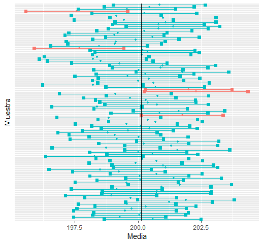
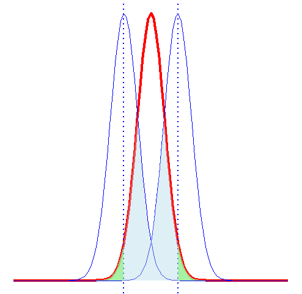
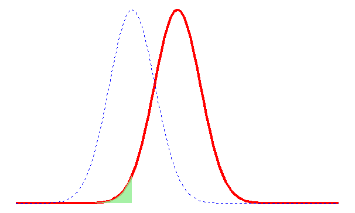
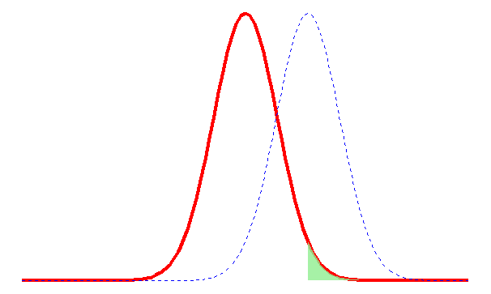
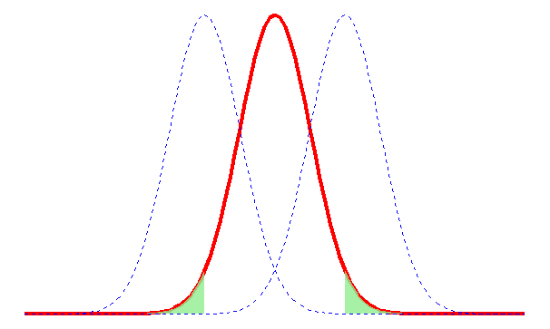
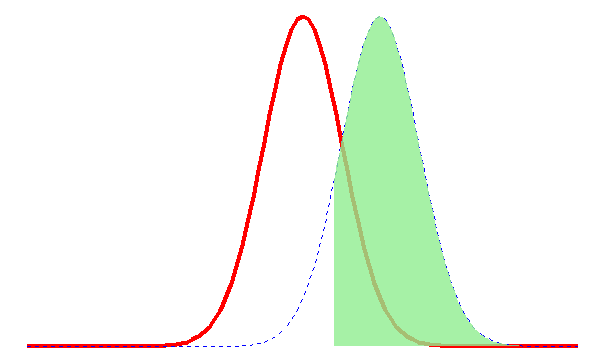

# Estadística Inferencial {#sec-icph}

En la @sec-estypes se habló de los típos de estadística, la estadística inferencial consiste de los métodos por medio de los cuales se  puede hacer inferencias o generalizaciones sobre una población. En la @fig-popsample4 se ilustra la relación entre la estadística descriptiva y la inferencial. La inferencia estadística se puede dívidir en dos grandes áreas: **estimación** y **pruebas de hipótesis**. 


{#fig-popsample4}

Imaginemos que se desea estimar el promedio de producción diaria de una raza lechera en el trópico húmedo, para esto hay que tomar en cuenta que no se tiene acceso a todas las vacas de la raza de interés en el trópico húmedo y resulta díficil estimar el valor exacto del promedio. Por esta razón, proporcionar un intervalo en el que posiblemente se encuentre el valor que deseamos estimar tendría menor riesgo. 

Supongamos que usted como investigador quiere probar que el promedio de la producción diaria de cierta raza es mayor en una  región con temperaturas menores a las del trópico húmedo. Una primera aproximación para resolver este problema es realizar una gráfica que nos muestre la producción promedio de la raza para cada región. Sin embargo, un gráfico no es la forma adecuada para contestar una pregunta de este tipo.  

Los dos problemas citados serán abordados y resueltos en este capítulo. El primero en la @sec-ic y el segundo en la @sec-ph. 

## Intervalos de Confianza {#sec-ic}

Un *estimador puntual* de un parámetro $\theta$ es un número $\bar{\theta}$ de un estadístico $\Theta$ que puede ser considerado un valor que se aproxima a $\theta$. Por ejemplo $\bar{x}$ del estadístico $\bar{X}$, calculado de una muestra de tamaño $n$ es un estimador puntual del parámetro poblacional $\mu$. Debido a que un estimador puntual es un simple número, no da información por si solo sobre la precisión y la confiabilidad de la estimación. 

En cualquier estimación de un parámetro habrá un error asociado, por ejemplo $\bar{X}$ no debe estimar $\mu$ con exactitud, pero se espera que no esté muy lejos del valor real. Lo que se espera de un estimador es que sea insesgado y eficiente.

La forma de un intervalo de confianza es:

$$
  \text{Estimador puntual} \pm \text{Margen de Error}
$$ {#eq-ic}

El estimador es el valor calculado a partir de la muestra para el parámetro desconocido. El *margen de error* es cuán preciso es nuestro cálculo, basados en la variabilidad del estimador, y de la confianza que tengamos en que el procedimiento detectará el valor real del parámetro de la población. 

### Interpretación de un intervalo de confianza

Un intervalo de confianza del $C \%$ indica que si construimos muchos de esos intervalos, entonces el $C \%$ de las veces el intervalo contendrá el valor real del parámetro. 

Por ejemplo en la @fig-ic se muestran 100 intervalos construidos con el $95 \%$ de confianza para el promedio poblacional, para construir cada intervalo se tomaron muestras de 100 elementos. Los intervalos de color celeste son los que contienen el valor real del parámetro, los intervalos de color rojo son los que no contienen el valor real del parámetro. El lector puede verificar que $5$ intervalos o el $5 \%$ no contiene el valor real del parámetro lo que implica que el $95 \%$ de los intervalos sí contiene el valor real del parámetro.

{#fig-ic}

### Intervalo de Confianza para la media $\mu$ {#sec-icmu}

Para construir un intervalo de confianza para $\mu$ existen dos casos, el primero es cuando se conoce la desviación poblacional $\sigma$ y el segundo cuando no se conoce la desviación poblacional $\sigma$. 

El primer caso es hipotético y puede ser considerado un caso para ejemplificar el concepto de intervalo de confianza, en la @sec-jt se explica en detalle por qué consideramos este un caso hipotético. 

Para el primer caso usamos la distribución normal y para el segundo debemos usar la distribución $t$ de Student como lo veremos en la sección @sec-icsd.

#### Intervalo de confianza para $\mu$ cuando se conoce $\sigma$ {#sec-jt}

Si $\bar{x}$ es la media de una muestra aleatoria de tamaño $n$ de una población con desviación conocida $\sigma$, un intervalo con $100\left(1-\alpha\right)\%$ para la media $\mu$ está dado por:

$$
  \left(\bar{x} - Z_{\frac{\alpha}{2}}\dfrac{\sigma}{\sqrt{n}}, \bar{x} + Z_{\frac{\alpha}{2}}\dfrac{\sigma}{\sqrt{n}}  \right)
$$ {#eq-icmusc}

Donde $Z_{\frac{\alpha}{2}}$ es el valor correspondiente a una probabilidad de cola superior de $\frac{\alpha}{2}$ de la distribución normal estándar. El valor de $Z_{\frac{\alpha}{2}}$ que se usa para construir un intervalo de confianza recibe el nombre de *valor crítico*.

Este caso es hipotético porque para utilizar la @eq-icmusc es necesario conocer el valor de $\sigma$. Pero conocer $\sigma$ implica conocer todos los valores de la población. Y si se conocen todos los valores de la población se puede calcular el valor de la media poblacional que es lo que nos interesa estimar. 

En situaciones reales nunca se conoce la desviación estándar de la población y además las poblaciones son muy grandes lo que imposibilita poder examinar todos los valores. En la siguiente sección aprenderemos a abordar esta situación.


#### Intervalo de confianza para $\mu$ cuando no se conoce $\sigma$ {#sec-icsd}

Si $\bar{x}$ es la media de una muestra aleatoria de tamaño $n$ con desviación muestral $s$, un intervalo con $100\left(1-\alpha\right)\%$ para la media $\mu$ está dado por:

$$ 
  \left(\bar{x} - t_{\frac{\alpha}{2}}\dfrac{s}{\sqrt{n}}, \bar{x} + t_{\frac{\alpha}{2}}\dfrac{s}{\sqrt{n}}  \right)
$$ {#eq-icmusd}

donde $t_{\dfrac{\alpha}{2}}$ es el valor crítico correspondiente a una probabilidad de cola superior de $\dfrac{\alpha}{2}$ de la distribución $t$ con $n-1$ grados de libertad.


### Intervalo de Confianza para la proporción 

Los dos intervalos de confianza vistos en las secciones anteriores son usados para variables cuantitativas, también se puede crear intervalos de confianza para variables categóricas. Por ejemplo, es posible que queramos estimar la proporción de elementos en una población que poseen cierta propiedad de interés. 

El parámetro de la proporción poblacional lo representamos con la letra griega $\pi$. El estimador puntual para $\pi$ es la proporción muestral $p=\frac{X}{n}$, donde $n$ es el tamaño muestral y $X$ es el número de elementos de la muestra que poseen la catacterística que interesa. 


$$
  \left(p - Z_{\frac{\alpha}{2}}\sqrt{\dfrac{p\left(1-p\right)}{n}}, p + Z_{\frac{\alpha}{2}}\sqrt{\dfrac{p\left(1-p\right)}{n}}  \right)
$$ {#eq-icprop}

Donde

* $p=\text{proporción muestral}=\dfrac{X}{n} =\dfrac{\text{Número de elementos con la característica}}{\text{Tamaño muestral}}$

* $n= \text{ tamaño muestral}$

### Intervalo de Confianza para la diferencia de medias

Si tenemos dos poblaciones con media $\mu_1$ y $\mu_2$ y desviaciones $\sigma_1$ y $\sigma_2$ respectivamente un estimador puntual de la diferencia entre $\mu_1$ y $\mu_2$ viene dado por el estadístico $\bar{X_1}-\bar{X_2}$. Para obtener un estimador puntual de $\mu_1-\mu_2$ debemos escoger dos muestras independientes, una muestra de cada población, de tamaños $n_1$ y $n_2$. 

De acuerdo al teorema del límite central $\bar{X_1}-\bar{X_2}$ debe estar distribuida normalmente con media $\mu_1 - \mu_2$ y desviación $\sqrt{\dfrac{\sigma_1^2}{n_1} + \dfrac{\sigma_2^2}{n_2}}$.

#### Desviaciones conocidas

Si $\bar{x_1}$ y $\bar{x_2}$ son medias de muestras aleatorias independientes de tamaños $n_1$ y $n_2$ de poblaciones con desviaciones conocidas $\sigma_1$ y $\sigma_2$, respectivamente, un intervalo de confianza al $100\left(1-\alpha\right)\%$ para $\mu_1-\mu_2$ está dado por:

$$
\left( \left( \bar{x}_1 - \bar{x}_2 \right) - z_{\frac{\alpha}{2}}\sqrt{\dfrac{\sigma_1^2}{n_1} + \dfrac{\sigma_2^2}{n_2}} , \left( \bar{x}_1 - \bar{x}_2 \right) + z_{\frac{\alpha}{2}}\sqrt{\dfrac{\sigma_1^2}{n_1} + \dfrac{\sigma_2^2}{n_2}} \right) 
$$ {#eq-ic2msc}


#### Desviaciones desconocidas e iguales

Si $\bar{x}_1$ y $\bar{x}_2$ son las medias de muestras aleatorias independientes, de tamaños muestrales $n_1$ y $n_2$ respectivamente, de poblaciones aproximadamente normales con desviaciones desconocidas pero iguales un intervalo de confianza del $100\left(1-\alpha \right)\%$ para $\mu_1 - \mu_2$ está dado por

$$
\left( \left( \bar{x}_1 - \bar{x}_2 \right) - t_{\frac{\alpha}{2}}s_p\sqrt{\dfrac{1}{n_1} + \dfrac{1}{n_2}} , \left( \bar{x}_1 - \bar{x}_2 \right) + t_{\frac{\alpha}{2}}s_p\sqrt{\dfrac{1}{n_1} + \dfrac{1}{n_2}} \right) 
$$ {#eq-ic2msd}

donde $s_p$ es el estimador de la desviación conjunta y se calcula a partir de la @eq-sp y $t_{\frac{\alpha}{2}}$ es el valor $t$ con $v=n_1+n_2-2$ grados de libertad, con una probabilidad de $\frac{\alpha}{2}$. dejando un área de $\frac{\alpha}{2}$ a la derecha.

$$
s_p^2 = \dfrac{\left(n_1 - 1 \right)s_1^2+\left(n_2 - 1 \right)s_2^2}{n_1 +n_2 -2} 
$$ {#eq-sp}

#### Desviaciones desconocidas y diferentes

Si $\bar{x}_1$, $s_1$, $\bar{x}_2$ y $s_2$ son las medias y desviaciones de muestras aleatorias independientes de tamaños muestrales $n_1$ y $n_2$, respectivamente de poblaciones aproximadamente normales con varianzas desconocidas y diferentes un intervalo de confianza del $100\left(1-\alpha \right)\%$ para $\mu_1 - \mu_2$ está dado por:

$$ 
\left( \left( \bar{x}_1 - \bar{x}_2 \right) - t_{\frac{\alpha}{2}}\sqrt{\dfrac{s_1^2}{n_1} + \dfrac{s_2^2}{n_2}} , \left( \bar{x}_1 - \bar{x}_2 \right) + t_{\frac{\alpha}{2}}\sqrt{\dfrac{s_1^2}{n_1} + \dfrac{s_2^2}{n_2}} \right) 
$$ {#eq-ic2msdd}

donde $t_{\frac{\alpha}{2}}$ es el valor $t$ con 

$$ 
v = \left\lfloor\dfrac{\left(\dfrac{s_1^2}{n_1} + \dfrac{s_2^2}{n_2} \right)^2}{\dfrac{\left( \dfrac{s_1^2}{n_1} \right)^2}{n_1-1}+\dfrac{\left( \dfrac{s_2^2}{n_2} \right)^2}{n_2-1}}\right\rfloor
$$ {#eq-dfsdd}

grados de libertad, con un área de $\frac{\alpha}{2}$ a la derecha.


### Intervalo de Confianza para la diferencia de proporciones

Si $p_1$ y $p_2$ son las proporciones de éxitos en muestras aleatorias de tamaño $n_1$ y $n_2$, respectivamente, $q_1 = 1- p_1$, y $q_2 = 1- p_2$ un intervalo de confianza del $100\left(1- \alpha \right)\%$ para la diferencia de dos proporciones poblacionales $\pi_1-\pi_2$, está dado por 

$$ 
\left( \left( p_1 - p_2 \right) - z_{\frac{\alpha}{2}}\sqrt{\dfrac{p_1q_1}{n_1} + \dfrac{p_2q_2}{n_2}} , \left( p_1 - p_2 \right) + z_{\frac{\alpha}{2}}\sqrt{\dfrac{p_1q_1}{n_1} + \dfrac{p_2q_2}{n_2}}  \right)
$$ {#eq-icprop2}


## Pruebas de hipótesis {#sec-ph}

Los intervalos de confianza pueden ayudar a contestar preguntas tales como "¿es razonable concluir que la media de la producción en climas fríos es mayor que en climas tropicales?" y podríamos verificar si el valor en cuestión está dentro del intervalo de confianza, de ser así podríamos contestar afirmativamente a la pregunta. 

Este procedimiento que acabamos de enunciar tiene mucho sentido pero puede resultar "muy débil" para contestar la pregunta. Preguntas como la mencionada anteriormente se pueden contestar usando pruebas de hipótesis. 

::: callout-important
- Una hipótesis, en términos estadísticos, es una suposición o afirmación sobre un parámetro de la población.
- Una prueba de hipótesis es un procedimiento basado en evidencia de la muestra y la teoría de la probabilidad para determinar si la hipótesis es una afirmación razonable.
:::

Toda prueba de hipótesis parte de un enunciado que se asume verdadero hasta probar lo contrario, esta hipótesis que se asume cierta es conocida como __hipótesis nula__. El nombre de _nula_ proviene de la esperanza de que no exista diferencia significativa entre los grupos de prueba. La __hipótesis alternativa__ es lo opuesto a la hipótesis nula. La hipótesis alternativa en la mayoría de los casos se condidera como una hipótesis de investigación.

La hipótesis nula se denota con $H_0$ y la alternativa con $H_1$ aunque algunos autores utilizan la notación $H_a$. Al final de una prueba de hipótesis se decide si se rechaza o no se rechaza la hipótesis nula, pero debemos tener claro que el procedimiento para probar hipótesis incluye la probabilidad de una conclusión incorrecta. El investigador debe comprender que el rechazo de una hipótesis implica que la evidencia proporcionada por la muestra es la que nos lleva a rechazar la hipótesis, dicho de otra forma rechazar una hipótesis significa que existe una pequeña probabilidad de obtener la información muestral observada cuando, en realidad la hipótesis es verdadera. 

Existen dos tipos de errores posibles en un procedimiento de prueba de hipótesis: rechazar la hipótesis nula cuando esta es verdadera y no rechazarla cuando esta es falsa, en la  @tbl-err se resume la relación entre las decisiones y los errores. 

```{r}
#| label: tbl-err
#| tbl-cap: Errores en las pruebas de hipótesis
#| echo: false
#| warning: false
#| messages: false

library(gt)

# Crear la tabla con expresiones LaTeX
data <- data.frame(
  Realidad = c("$$H_0 \\; \\text{verdadera}$$ ", "$$H_0 \\; falsa$$"),
  No_Rechazar_H0 = c("Decisión correcta", "**Error Tipo II**"),
  Rechazar_H0 = c("**Error Tipo I**", "Decisión correcta")
)

gt_tbl <- data %>%
  gt() %>%
  tab_spanner(
    label = md("**Decisión del investigador**"),
    columns = c(No_Rechazar_H0, Rechazar_H0)
  ) %>%
  cols_label(
    Realidad = md("**Realidad**"),
    No_Rechazar_H0 = md("$$\\text{No rechazar} \\;  H_0$$"),
    Rechazar_H0 = md("$$\\text{Rechazar} \\; H_0$$")
  ) %>%
  fmt_markdown(columns = everything(), rows = everything())

gt_tbl

```

::: callout-tip
- El error de tipo I también se conoce como falso positivo.
- El error de tipo II como falso negativo. 
- La probabilidad de cometer un error de tipo I se denota con $\alpha$.
$$P\left(Error \; Tipo \; I\right)= \alpha$$
- La probabilidad de cometer un error de tipo II se denota con $\beta$.
$$P\left(Error \; Tipo \; II\right)= \beta$$
:::


Existen algunas propiedades importantes que se deben conocer sobre los errores de tipo I y tipo II. 

::: callout-tip
* Los errores de tipo I y de tipo II están relacionados. Si la probabilidad de uno aumenta la probabilidad del otro disminuye. 
* La probabilidad de cometer un error de tipo I se puede reducir ajustando el o los valores críticos.
* Un incremento del tamaño muestral $n$, reducirá $\alpha$ y $\beta$.
* Si la hipótesis nula es falsa, $\beta$ tiene un máximo cuando el verdadero valor de un parámetro se aproxima al valor hipotético. A mayor distancia entre el verdadero valor y el hipotético, el valor de $\beta$ sera menor.
:::

Si se establece una buena regla de decisión, tendríamos una alta oportunidad de tomar una decisión correcta. Desafortunadamente no es posible eliminar completamente la posibilidad de errores, pues como se dijo anteriormente reducir la probabilidad de cometer el error de un tipo implica aumentar el error de otro tipo.

Retomemos la pregunta planteada al inicio de esta sección, tomemos como hipótesis nula que la media es igual a $20$ litros y como alternativa que la media es diferente de $20$ litros, por el momento no entraremos en detalles de como escoger las hipótesis:


$$
\begin{cases} 
H_0: \mu = 20 \\ 
H_1: \mu \neq 20
\end{cases} 
$$

{#fig-pht}

Una *regla de decisión* podría ser escoger un punto o puntos límites en el eje $x$ como en la @fig-pht. La gráfica de color rojo representa $H_0$ y las de color celeste representan $H_1$. En este caso escogemos dos puntos límites porque si la media muestral se encuentra a la izquierda o a la derecha de estos límites, se rechaza $H_0$. 

En cualquiera de los dos casos la media muestral está demasiado lejos de $H_0$ para ser creíble. Si la media muestral $\bar{x}$ está entre los valores límite se acepta $H_0$. La región entre los puntos límite es la *región de no rechazo* y hacía la izquierda o derecha de los puntos límite se encuentra la *región de rechazo*.

Partiendo de lo anterior, en la @fig-pht se pueden ver los errores de tipo I y II. El área de color verde bajo la distribución de $H_0$ muestra la probabilidad de rechazar $H_0$ cuando en realidad es verdadera, es decir un error de tipo I. El área de color celeste bajo la distribución de $H_1$ muestra la probabilidad de no rechazar $H_0$ cuando en realidad es falsa. En una prueba de hipótesis el investigador decide la probabilidad $\alpha$ de un error de tipo I, este valor de $\alpha$ es conocido como la **significancia**. 

Los puntos lìmites son conocidos como **valores críticos**. Un procedimiento muy usado en pruebas de hipótesis es calcular el valor $z$ de la media muestral, conocido como **estadìstico de prueba** y luego comparar el valor crìtico con este estadístico de prueba. Podrìamos resumir el procedimiento de prueba de hipótesis en 5 pasos:

1. Determinar las hipótesis nula y alternativa.
2. Escoger la significancia, generalmente se escoge  el $5\%$ o $0.05$.
3. Determinar el estadístico de prueba
4. Calcular el valor crítico y establecer la regla de decisión
5. Tomar la decisión.

Una forma sencilla de entender cómo establecer la regla de decisión es ver la hipótesis alternativa. La hipótesis alternativa puede tener los símbolos $<$, $>$ o $\neq$. La región de rechazo de cada una se sombrea de color verde en las @fig-phless, @fig-phmore y @fig-ph2c respectivamente, al igual que en la  @fig-pht la distribución de rojo corresponde a $H_0$ y la de azul a $H_1$. 

Las @fig-phless y @fig-phmore corresponden a pruebas de hipótesis de **una cola** y la @fig-ph2c corresponde a una prueba de hipótesis de **dos colas**

La @fig-phless muestra la región de no rechazo y de  rechazo de la hipótesis nula cuando la hipótesis alternativa $H_1$ o $H_a$ contiene el símbolo $<$. Por ejemplo si la hipótesis alternativa es "la media es menor a 20", la hipótesis nula es "la media es mayor o igual a 20".

$$ 
\begin{cases} 
H_0: \mu \geq 20 \\ 
H_1: \mu < 20
\end{cases} 
$$


{#fig-phless}

La @fig-phmore muestra la región de no rechazo y de  rechazo de la hipótesis nula cuando la hipótesis alternativa $H_1$ o $H_a$ contiene el símbolo $>$. Por ejemplo si la hipótesis alternativa es "la media es mayor a 20", la hipótesis nula es "la media es menor o igual a 20".

$$ 
\begin{cases} 
H_0: \mu \leq 20 \\ 
H_1: \mu > 20
\end{cases} 
$$


{#fig-phmore}

La @fig-ph2c muestra la región de no rechazo y de  rechazo de la hipótesis nula cuando la hipótesis alternativa $H_1$ o $H_a$ contiene el símbolo $\neq$. Por ejemplo si la hipótesis alternativa es "la media es diferente a 20", la hipótesis nula es "la media es igual a 20".

$$
\begin{cases} 
H_0: \mu =  20 \\ 
H_1: \mu \neq 20
\end{cases} 
$$


{#fig-ph2c}

### Significancia, tamaño del efecto y potencia de la prueba

Los investigadores generalmente buscan resultados "significativos", es común encontrar en los artículos académicos, investigaciones y reportes expresiones como "los resultados son significativos", "el coeficiente es significativamente diferente de cero". Es importante entender que la palabra "significativo" se usa en términos estadisticos y no en el sentido de *importante* o *relevante*. Por lo que en el análisis de datos, algo puede ser estadísticamente significativo pero no relevante. 

Supongamos que en el ejemplo desarrollado en la sección anterior tenemos una media muestral de 19.6 y que ese valor nos lleva a rechazar la hipótesis nula. Para nosotros esa diferencia puede no ser relevante, mas esa diferencia es significativa en el sentido estadístico. No solo deberíamos interpretar los resultados estadísticos solamente en términos de la significancia sino también considerar el tamaño de la diferencia esto es conocido como el __tamaño del efecto__ y preguntarse si es importante o no.

#### Tamaño del efecto

::: callout-tip
- El tamaño del efecto es una medida estadística que indica el grado de diferencia entre dos grupos o la fuerza de una relación entre variables. 
- Se utiliza para mostrar la importancia práctica de los resultados de una investigación y la eficacia de una intervención.
- A mayor tamaño del efecto, mayor grado de efecto entre las variables.
- Existen muchos tamaños de efecto diferentes, incluidos los índices de diferencia entre grupos, los coeficientes de correlación y las estimaciones de riesgo. 
- Los tamaños del efecto pueden ser útiles para comparar los efectos del tratamiento en diferentes estudios, poblaciones y medidas de resultado.
- El tamaño del efecto es independiente del tamaño de la muestra, por lo que un tamaño de muestra pequeño no implica necesariamente un tamaño del efecto pequeño.
:::

Dependiendo del tipo de comparaciones que se estudien, el tamaño del efecto se estima con diferentes índices. Los índices se dividen en dos categorías principales de estudio: los que analizan el tamaño del efecto entre grupos y los que analizan las medidas de asociación entre variables. Para la primera categoría el más usado es el índice __*d* de Cohen__, mientras que para la segunda se utiliza el __coeficiente de correlación *r* de Pearson__. En la @sec-correl se discutirá sobre el coeficiente de correlación, por el momento se discutirá sobre el índice *d* de Cohen, que se calcula como la diferencia de las medias de los dos grupos dividida por la desviación de los datos:

$$
d = \dfrac{\bar{x}_1-\bar{x}_2}{s}
$$ {#eq-cohen}

donde

$$
s = \sqrt{\dfrac{\left(n_1-1\right)s^2_1 +\left(n_2-1\right)s^2_2}{n_1+n_2}}
$$
Si $d=1$, los dos grupos difieren por una desviación estándar. Si es 2, los dos grupos difieren por 2 desviaciones estándar y así sucesivamente. 

Entre las medias de los grupos, el tamaño del efecto también puede entenderse como la distribución percentil media del grupo 1 frente a la del grupo 2. Para un tamaño del efecto de $0$, la media del grupo 2 está en el percentil 50 del grupo 1. Para un tamaño del efecto de $0.8$, la media del grupo 2 está en el percentil 79 del grupo 1; por lo tanto, alguien del grupo 2 con una puntuación media tendría una puntuación más alta que el 79% de las personas del grupo 1. Esta información puede verse en la @tbl-effectsize

| Tamaño Relativo | Tamaño del efecto | Percentil |
|-----------------|-------------------|-----------|
|                 |                 0 |        50 |
| Pequeño         |               0.2 |        58 |
| Mediano         |               0.5 |        69 |
| Grande          |               0.8 |        79 |
|                 |               1.4 |        92 |

: Diferencias entre grupos. Tamaño del efecto medido por la *d* de Cohen {#tbl-effectsize}


#### Potencia de una prueba

Otro concepto relacionado a las probabilidades de error es la **potencia de una prueba** que es la probabilidad de rechazar $H_0$ cuando esta es falsa. Si la prueba fuera de una cola con hipótesis alternativa $>$, la potencia de la prueba viene dada entonces por el área bajo $H_1$ a la derecha de la línea de decisión. 

$$
\text{Potencia de una Prueba}=1-P\left(\text{Error Tipo II}\right)=1-\beta
$$ {#eq-power}

{#fig-power}

### El valor $p$ {#sec-pvalor}

El valor $p$ es la probabilidad, calculada suponiendo que la hipótesis nula es cierta, de obtener un valor del estadístico de prueba al menos tan contradictorio para $H_0$ como el valor calculado a partir de la muestra disponible. Dicho de otra forma el valor $p$ es el nivel más bajo de significancia en el que el valor observado del estadístico de prueba es significativo.

El criterio para rechazar $H_0$ utilizando el valor $p$ es, si $p<\alpha$ se rechaza $H_0$. Es un criterio ampliamente usado, pero que en los últimos años ha tenido muchas críticas. 

### Estadísticos de Prueba

Aunque el objetivo de este libro es trabajar con R, es necesario que el lector conozca los estadísticos de prueba usados en las diferentes pruebas de hipótesis que se trabajarán en las siguientes secciones, 

```{r estadisticos, echo=FALSE}
columnas <- c("Parámetro","Muestra","Varianza(S)","Estadístico de Prueba","Distribución")

c1 <- c(rep("Media",2),rep("Diferencia de Medias",3),"Proporción","Diferencia de proporciones")
c2 <- c("Grande", "Pequeña","Grande",rep("Pequeña",2),"No aplica","No apica")
c3 <- c("Conocida","Desconocidas","Conocidas","Desconocidas e iguales","Desconocidas y diferentes","No aplica","No aplica")
c4 <- c('$\\dfrac{\\bar{x}-\\mu_0}{\\dfrac{\\sigma}{\\sqrt{n}}}$','$\\dfrac{\\bar{x}-\\mu_0}{\\dfrac{s}{\\sqrt{n}}}$','$\\dfrac{\\left( \\bar{X}_1-\\bar{X}_2 \\right)- \\left(\\mu_1 - \\mu_2 \\right)}{\\sqrt{\\frac{\\sigma_1}{n_1}+ \\frac{\\sigma_2}{n_2} }}$','$\\dfrac{\\left( \\bar{X}_1-\\bar{X}_2 \\right)- \\left(\\mu_1 - \\mu_2 \\right)}{s_p\\sqrt{\\frac{1}{n_1}+ \\frac{1}{n_2} }}$','$\\dfrac{\\left(\\bar{X}_1-\\bar{X}_2 \\right)- \\left(\\mu_1 - \\mu_2 \\right)}{\\sqrt{\\frac{s^2_1}{n_1}+ \\frac{s_2^2}{n_2} }}$','$\\dfrac{p-\\pi}{\\sqrt{\\frac{\\pi\\left(1-\\pi\\right)}{n}}}$','$\\dfrac{p_1-p_2}{\\sqrt{\\hat{p}\\hat{q}\\left(\\frac{1}{n_1}+\\frac{1}{n_2}\\right)}}$')
c5 <- c("$Z$","$t$","$Z$","$t$","$t$","$Z$","$Z$") 
dt <- cbind(c1,c2,c3,c4,c5)
colnames(dt) <- columnas
kableExtra::kable(dt, booktabs = T, caption = "Estadísticos de Prueba",format = "pandoc")
```


## Ejercicios {.unnumbered}

::: {#exr-inf1}
El proyecto de graduación de Carlos Bardales tuvo como objetivo evaluar la sustitución de harina de pescado en la alimentación de juveniles del langostino _(Macrobrachium rosenbergii)_ mediante el uso de harina de mosca soldado en una dieta a base de ingredientes como maíz molido, harina de soya, harina de trigo, vitaminas, minerales y aglutinantes. El experimento se llevó a cabo en la Universidad EARTH, ubicada en Las Mercedes, Limón, Costa Rica. La investigación constó de dos tratamientos con tres repeticiones. El tratamiento uno consistió en una dieta con harina de pescado en un 25% en comparación con la misma dieta conteniendo 25% de harina de mosca soldado para la alimentación de langostinos. La ganancia de peso fue el principal criterio evaluado durante 8 semanas, realizando muestreos semanales para determinar cuál de las dietas tenía un mejor potencial de ganancia de peso. El objetivo era evaluar si la harina de pescado puede ser sustituida por la harina de mosca soldado como fuente de proteína.
En la hoja _Langostinos_ del archivo _baseCB.xlsx_ se almacenan los datos de longitud en centímetros y el peso en gramos de los langostinos observados por Carlos Bardales. Las variables presentes en el conjunto de datos son:

- __Tratamiento__: Tratamiento del langostino 
- __Pecera__: Pecera en la que se encuentra el langostino
- __Langostino__: Número de langostino dentro de la pecera
- __Fecha__: Fecha de la medición
- __Longitud__: Longitud del langostino en centímetros
- __Peso__: Peso del langostino en gramos
:::

1. Análisis del peso

  a. Cree un proyecto llamado __PG_CB__. En la carpeta _datos_ guarde el archivo _baseCB.xlsx_. 
  b. Cree un script y guárdelo con el nombre _analisisCB.R_ en la carpeta que corresponde. 
  c. Cree un archivo __Quarto__ y guardelo con el nombre _reporte_peso.qmd_. En este archivo escriba las conclusiones de su análisis. Una buena práctica es ir probando los códigos en el script y posteriormente pasar el código y escribir las conclusiones e interpretaciones en el archivo _.qmd_.
  d. Cargue los paquetes _agricolae_, _tidyverse_, _readxl_, _writexl_ y _jtools_.
  e. Cargue los datos en una variable llamada _baseCB_.
  f. Cree una variable llamada _Medición_, para esto debe numerar las diferentes fechas presentes en la columna FECHA. La variable debe tener números enteros del 1 al 9. 
  g. Carlos Bardales realizó una medición inicial que en el documento de su proyecto fue presentada como medición 0. Modifique la variable _Medición_ para que tenga números enteros del 0 al 8.
  h. Elimine los datos no disponibles ( _NA_ ).
  i. Determine la media y desviación del peso de los langostinos por medición y por tratamiento. Almacene la información en una variable llamada _descpeso_. 
  j. Grafique la evolución de los pesos promedio de los langostinos por tratamiento. Guarde la gráfica en la carpeta _graficos_ con el nombre _evolpeso.png_
  k. Grafique la evolución de los pesos promedio de los langostinos por tratamiento, incluya ahora una barra que muestre la desviación de los pesos. Guarde la gráfica en la carpeta _graficos_ con el nombre _evolpesoerr.png_
  l. Realice diagramas de caja de los pesos por tratamiento para las mediciones.Guarde la gráfica en la carpeta _graficos_ con el nombre _boxpesos.png_
  m. En la medición 1 para los langostinos sometidos al tratamiento 1 ¿el peso promedio es menor a 2.45 g?
  n. En la medición 2 para los langostinos sometidos al tratamiento 2 ¿el peso promedio es mayor a 2.60 g?
  o. En la medición 3 para los langostinos sometidos al tratamiento 1 ¿el peso promedio es diferente de 3.00 g?
  p. En la medición 8 ¿son diferentes los pesos promedios de los langostinos que recibieron el tratamiento 1 de los que recibieron el tratamiento 2?
  q. Desde la medición 0 a la medición 9 ¿son diferentes los pesos promedios de los langostinos que recibieron el tratamiento 1 de los que recibieron el tratamiento 2? Guarde los resultados en una tabla llamada _valoresp_.
  r. Guarde las tablas _descpeso_ y _valoresp_ en la carpeta resultados con el nombre _estadisticaspesos.xlsx_, las estadísticas descriptivas deben ir en una hoja llamada _descriptivas_ y los valores _p_ en una hoja llamada _pruebat_.

2. Análisis de la longitud

  a. Determine la media y desviación de la longitud de los langostinos por medición y por tratamiento. Almacene la información en una variable llamada _desclong_. 
  b. Grafique la evolución de la longitud promedio de los langostinos por tratamiento. Guarde la gráfica en la carpeta _graficos_ con el nombre _evollong.png_
  c. Grafique la evolución de la longitud promedio de los langostinos por tratamiento, incluya ahora una barra que muestre la desviación de la longitud. Guarde la gráfica en la carpeta _graficos_ con el nombre _evollongerr.png_
  d. Realice diagramas de caja de la longitud por tratamiento para las mediciones.Guarde la gráfica en la carpeta _graficos_ con el nombre _boxlong.png_
  e. En la medición 1 para los langostinos sometidos al tratamiento 1 ¿la longitud promedio es mayor a 5.00 cm?
  f. En la medición 2 para los langostinos sometidos al tratamiento 2 ¿la longitud promedio es menor a 5.90 cm?
  g. En la medición 3 para los langostinos sometidos al tratamiento 1 ¿la longitud promedio es diferente de 6.20 cm?
  h. En la medición 8 ¿son diferentes las longitudes promedio de los langostinos que recibieron el tratamiento 1 de los que recibieron el tratamiento 2?
  i. Desde la medición 0 a la medición 9 ¿son diferentes las longitudes promedio de los langostinos que recibieron el tratamiento 1 de los que recibieron el tratamiento 2? Guarde los resultados en una tabla llamada _valoresp_long_.
  j. Guarde las tablas _desclong_ y _valoresp_long_ en la carpeta resultados con el nombre _estadisticaslong.xlsx_, las estadísticas descriptivas deben ir en una hoja llamada _descriptivas_ y los valores _p_ en una hoja llamada _pruebat_.

::: {#exr-inf2}
El proyecto de Katherine Jiménez se centró en la evaluación del efecto de la hormona GnRH (Hormona Liberadora de Gonadotropina) la cual se adicionó como parte de los protocolos a la hora de la inseminación artificial a tiempo fijo (IATF), además se evaluó su efectividad sobre la fertilidad, la inducción del celo y el porcentaje de preñez. La investigación se divide en tres grupos de estudio: hembras bovinas con ternero al pie, hembras que no tengan ternero y en novillas, las cuales se encuentran en un sistema de pastoreo. Este trabajo se realizó en el trópico húmedo dentro de la Universidad EARTH, Las Mercedes, Limón, Costa Rica. Los animales se separaron en dos grupos, $T_0$ fue el grupo control sin hormona ($n=33$) $T_1$ fue el grupo con hormona ($n=32$). Esta evaluación tuvo una duración de tres meses, tomando como día 0 el momento de comenzar el protocolo IATF, del cual se realizaron dos ultrasonidos uno al inicio antes de protocolar las vacas para evaluar la ciclicidad y conformación ovárica y otro a los 35 días de realizada la inseminación para la evaluación de la preñez de estas. Los resultados de este estudio revelan diferencias significativas en la fertilidad entre los grupos analizados del total de las hembras en estudio, las vacas con ternero al pie mostraron una respuesta reproductiva diferente en comparación con las vacas sin ternero y las novillas, esto sugiere que la presencia de un ternero al pie puede afectar el ciclo reproductivo de las vacas en el trópico húmedo. Con el uso del análogo de la hormona GnRH se demostró como una herramienta útil para mejorar la eficiencia reproductiva de todas las categorías de ganado estudiadas, cabe recalcar la importancia de adaptar las prácticas de manejo al entorno tropical, teniendo en cuenta factores como la nutrición y el estrés calórico, que pueden influir en la fertilidad.

En la hoja _reglog_ del archivo _DATOS_PG_KJ.xlsx_ se almacenan los datos del proyecto de graduación de Katherine:

- Animal: Número del animal
- Grupo: Grupo al que pertenece el animal
- Tratamiento: Tratamiento que recibió el animal
- CC0: Condición corporal inicial
- CELO: Variable que indica si el animal entró en celo
- CCF : Condición corporal final.
- Diagnóstico : Variable codificada como 1 si hubo preñez y 0 si no.
:::

a. Crear un proyecto llamado _PG_KJ_, en la carpeta _datos_ guarde el archivo _DATOS_PG_KJ.xlsx_.
b. Crear un archivo de _Quarto_ llamado _informeKJ.qmd_.
c. La variable _Diagnóstico_ se encuentra codificada con 0 y 1, recodifique la variable con No y Sí respectivamente. 
d. Realice tablas y gráficos adecuados para mostrar el diagnóstico de acuerdo al tratamiento.
e. Respecto a las vacas que no recibieron la hormona ¿la proporción con preñez es mayor al 50%?
f. Respecto a las vacas que recibieron la hormona ¿la proporción con preñez es menor al 50%?
g. ¿La proporción de vacas con preñez es diferente en las vacas que recibieron la hormona respecto de las que no la recibieron? 