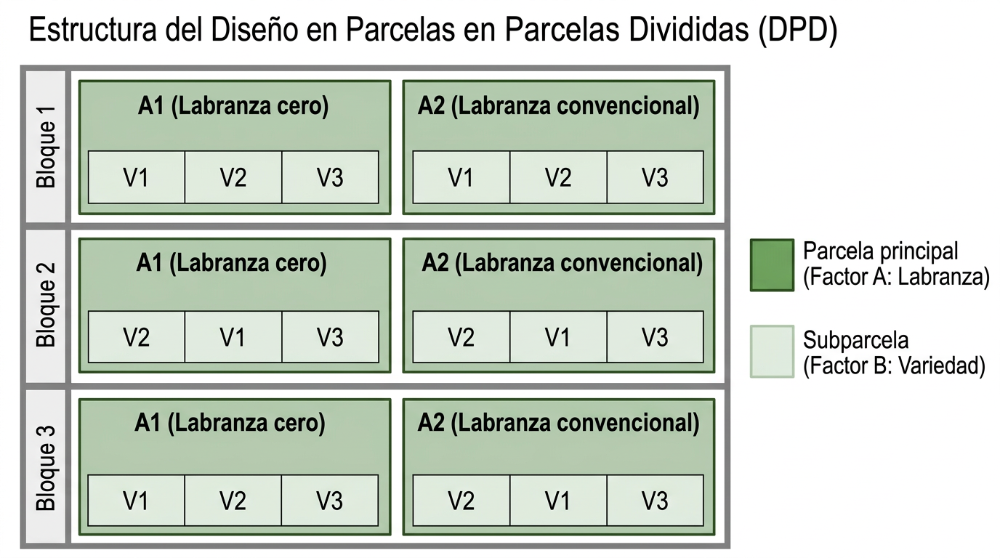

```{r paquetes, echo=FALSE, message=FALSE, warning=FALSE}
library(knitr)
library(tidyverse)
library(agricolae)
library(jtools)
library(writexl)
library(readxl)
library(DescTools)
library(cowplot)
library(formatdown)
```



# Diseño de experimentos {#doe}

## Objetivos del capítulo

Al finalizar este capítulo, el estudiante será capaz de:

1. Explicar la importancia del diseño experimental en la investigación agrícola y su papel en el control de la variabilidad.
2. Identificar y diferenciar los conceptos de unidad experimental, tratamiento, repetición, unidad de muestreo y error experimental.
3. Describir los principios fundamentales del diseño experimental: aleatorización, repetición y bloqueo.
4. Reconocer y comparar las características del diseño completamente al azar (DCA), el diseño de bloques completos al azar (DBCA), el cuadrado latino (CL) y el diseño en parcelas divididas (DPD).
5. Aplicar el análisis de varianza (ANOVA) en R para evaluar diferencias entre tratamientos en los diseños mencionados.
6. Verificar los supuestos del ANOVA y aplicar transformaciones o pruebas no paramétricas cuando corresponda.
7. Interpretar y comparar los resultados de las principales pruebas de comparaciones múltiples de medias.
8. Implementar diseños factoriales y en parcelas divididas en R usando `aov()` y el paquete `agricolae`.

---

## Introducción

En investigación agrícola, las diferencias observadas entre tratamientos no siempre se deben exclusivamente al tratamiento que se desea evaluar. En un experimento de campo, variables como la fertilidad del suelo, la humedad, la sombra, la presencia de malezas, la presión de plagas o pequeñas variaciones en el manejo agronómico pueden influir sobre la respuesta observada. Por esta razón, para obtener conclusiones válidas no basta con aplicar tratamientos y comparar resultados: es necesario planificar cuidadosamente cómo se asignarán los tratamientos a las unidades experimentales y cómo se controlará la variabilidad natural del ambiente.

Supongamos que se desea comparar dos variedades de maíz: una variedad estándar ya conocida, a la que llamaremos V1, y una variedad nueva, a la que llamaremos V2. Una posibilidad aparentemente sencilla sería sembrar la mitad de un campo con V1 y la otra mitad con V2, manejar ambas zonas de la misma manera durante todo el ciclo y, al final, comparar el rendimiento obtenido. Si la variedad nueva produce un 20 % más que la variedad estándar, podría pensarse que V2 es superior. Sin embargo, esta conclusión no sería necesariamente correcta. La diferencia observada podría deberse, total o parcialmente, a otras causas:

- V2 pudo haberse sembrado en la parte del terreno con mejor fertilidad.
- Un extremo del campo pudo haber retenido más humedad que el otro.
- Las diferencias de textura del suelo pudieron afectar la disponibilidad de agua.
- Una parte del terreno pudo recibir sombra en ciertas horas del día.
- La presencia de malezas pudo haber sido mayor en una mitad del campo.
- La cercanía a bosques o áreas silvestres pudo favorecer una mayor incidencia de plagas o enfermedades en uno de los extremos.

En este caso, el experimento no fue preparado para controlar la variabilidad del campo, por lo que no es posible saber con certeza si la diferencia en rendimiento se debe realmente a la variedad o a diferencias en las condiciones de cultivo. Además, al no existir repeticiones adecuadas, tampoco sería posible estimar el error experimental ni aplicar correctamente una prueba estadística.

El diseño de experimentos surge precisamente para resolver este problema. Su propósito es organizar los tratamientos y las unidades experimentales de tal manera que sea posible separar el efecto real de los tratamientos de la variabilidad natural del ambiente. Con un diseño experimental y un análisis estadístico adecuados, el investigador puede reducir el sesgo, mejorar la precisión de sus resultados y determinar si las diferencias observadas entre tratamientos son estadísticamente significativas.

Aunque el diseño de experimentos tuvo su desarrollo formal en la agricultura, especialmente a partir del trabajo de Ronald A. Fisher en las décadas de 1920 y 1930 en la Estación Experimental de Rothamsted, sus principios se aplican hoy en muchas otras áreas. Fisher mostró que era posible obtener conclusiones válidas aun en presencia de fluctuaciones naturales como la temperatura, las condiciones del suelo o la lluvia, sentando así las bases de la experimentación moderna.

En la @sec-tipest se presentaron los tipos de estudio. En este capítulo se desarrollan los principios básicos del diseño experimental y los principales diseños utilizados en agricultura, así como su relación con el análisis de varianza y la comparación de tratamientos.

---

## Conceptos básicos

Antes de estudiar los distintos diseños experimentales, es necesario definir algunos conceptos fundamentales que aparecen con frecuencia en la planificación y análisis de experimentos agrícolas.

**1. Unidad experimental**

La unidad experimental es el objeto o espacio al cual se aplica un tratamiento de manera independiente y sobre el cual se evalúa la respuesta del experimento. Dependiendo del tipo de estudio, la unidad experimental puede ser un animal, un árbol, una planta individual o una parcela de terreno. En experimentos de campo es común que la unidad experimental sea una parcela.

::: {.callout-note}
### Efecto borde

El efecto borde se refiere a las diferencias en crecimiento o producción que pueden presentar las plantas ubicadas en los bordes de una parcela en comparación con las plantas ubicadas en el interior. Este fenómeno puede ocurrir por:

- Menor competencia por luz, agua o nutrientes en los bordes de la parcela.
- Influencia de parcelas vecinas con tratamientos distintos.
- Influencia de áreas no cultivadas adyacentes.

Para reducir este efecto, es común excluir las plantas del perímetro al momento de realizar las mediciones o definir áreas útiles dentro de la parcela.
:::

**2. Factor**

Un factor es una variable controlada o de interés en un experimento cuyos niveles se comparan para evaluar su efecto sobre una variable respuesta. Los niveles de un factor determinan los tratamientos cuando se considera un solo factor.

- Si el factor es "Fertilizante", sus niveles podrían ser: 0, 50 y 100 kg/ha.
- Si el factor es "Variedad", sus niveles podrían ser: A, B y C.

**3. Tratamiento**

Un tratamiento es la condición o intervención cuyo efecto se desea evaluar en un experimento. Cuando un experimento incluye varios factores, un tratamiento corresponde a una combinación específica de niveles de esos factores. Ejemplos: variedades de cultivos, dosis de fertilizante, programas de riego, diferentes herbicidas o fungicidas.

**4. Unidad de muestreo**

La unidad de muestreo es la entidad específica sobre la cual se realiza la medición de la variable de interés. En algunos casos coincide con la unidad experimental, pero en otros corresponde a una fracción de esta.

Por ejemplo: si el tratamiento se aplica a una parcela, pero la medición se realiza en 10 plantas dentro de la parcela, la parcela es la unidad experimental y cada planta medida es una unidad de muestreo.

::: {.callout-warning}
### Pseudorreplicación

La pseudorreplicación ocurre cuando varias mediciones tomadas dentro de una misma unidad experimental se analizan como si fueran repeticiones independientes del tratamiento. Esto puede inflar artificialmente el tamaño de muestra y conducir a conclusiones incorrectas.
:::

**5. Variable respuesta**

La variable respuesta es la medición observada en cada unidad experimental y representa el resultado que se desea explicar o predecir a partir de los factores estudiados. Puede ser cuantitativa (rendimiento, altura, peso) o cualitativa (sí/no, presencia/ausencia, categoría).

**6. Error experimental**

El error experimental es la variabilidad observada entre unidades experimentales que reciben el mismo tratamiento. Representa la variabilidad de la variable respuesta que no puede ser explicada por los tratamientos incluidos en el experimento.

::: {.callout-tip}
### Fuentes de la variación
- Variabilidad inherente del material experimental, como diferencias genéticas entre plantas o animales.
- Variación ambiental, como cambios en suelo, temperatura, humedad o radiación.
- Variación en la ejecución del experimento, como pequeñas diferencias en la aplicación de tratamientos o en las mediciones realizadas.
:::

**7. Repeticiones**

Las repeticiones (o replicaciones) corresponden al número de unidades experimentales que reciben el mismo tratamiento dentro de un experimento.

::: {.callout-tip}
### Funciones de las repeticiones
- Permitir la estimación del error experimental.
- Mejorar la precisión de las estimaciones de las medias de tratamiento.
- Aumentar la capacidad para detectar diferencias reales entre tratamientos.
- Ampliar el alcance de la inferencia cuando las unidades experimentales representan una población más amplia.
:::

En muchos experimentos agrícolas se utilizan al menos tres o cuatro repeticiones por tratamiento, aunque en algunos casos pueden requerirse más.

---

## Principios básicos del diseño experimental {#sec-principios}

En el diseño de experimentos, el **control del error experimental** consiste en reducir, en la mayor medida posible, la variabilidad de la respuesta que no se debe a los tratamientos estudiados. Para lograrlo, el diseño experimental se apoya en tres principios fundamentales: **aleatorización, repetición y bloqueo**.

### Aleatorización

La aleatorización consiste en asignar los tratamientos al azar a las unidades experimentales. Su propósito principal es evitar sesgos sistemáticos y distribuir, de la forma más equilibrada posible, las fuentes desconocidas de variación entre los tratamientos.

En R, una asignación aleatoria simple puede realizarse con la función `sample()`:

```{r}
#| echo: true
tratamientos <- c("A", "B", "C")
sample(tratamientos)
```

::: {.callout-tip}
#### ¿Por qué es importante la aleatorización?
- Reduce el sesgo en la asignación de tratamientos.
- Ayuda a balancear fuentes desconocidas de variación.
- Justifica el uso de pruebas estadísticas basadas en el azar.
:::

**Ejemplo:** si se comparan tres fertilizantes en un lote, no conviene asignarlos siempre en el mismo orden espacial, porque una parte del terreno podría tener mejores condiciones que otra.

### Repetición

La repetición consiste en aplicar cada tratamiento a varias unidades experimentales independientes. Gracias a la repetición es posible estimar el error experimental y aumentar la precisión de las comparaciones entre tratamientos.

::: {.callout-tip}
#### ¿Por qué es importante la repetición?
- Permite estimar el error experimental.
- Mejora la precisión de las medias de tratamiento.
- Aumenta la capacidad para detectar diferencias reales.
- Hace más robustas las conclusiones del experimento.
:::

**Ejemplo:** si se desea comparar cuatro variedades de maíz, no es suficiente sembrar una sola parcela por variedad. Se necesitan varias parcelas para cada variedad.

### Bloqueo

El bloqueo o control local consiste en agrupar unidades experimentales similares en bloques y asignar los tratamientos dentro de cada bloque. Su objetivo es controlar fuentes **conocidas** de variación que podrían afectar la respuesta del experimento.

::: {.callout-tip}
#### ¿Por qué es importante el bloqueo?
- Controla fuentes conocidas de variación.
- Reduce el error experimental.
- Mejora la precisión de las comparaciones.
- Hace más eficiente el experimento cuando el material no es completamente homogéneo.
:::

**Ejemplo:** si un lote presenta un gradiente de fertilidad de un extremo al otro, puede dividirse en bloques perpendiculares a ese gradiente. Luego, dentro de cada bloque, se asignan aleatoriamente los tratamientos.

---

## Diseño completamente al azar (DCA) {#sec-dca}

El diseño completamente al azar (DCA) es el diseño experimental más simple. En este diseño, los tratamientos se asignan aleatoriamente a las unidades experimentales, de manera que cada unidad tenga la misma probabilidad de recibir cualquiera de los tratamientos.

El DCA funciona mejor cuando las unidades experimentales son relativamente homogéneas. Por esta razón, suele utilizarse en condiciones muy controladas: ensayos en invernadero, cámaras de crecimiento, laboratorios, o experimentos de campo realizados en áreas muy uniformes.

### Ventajas y limitaciones

| Aspecto | Descripción |
|---------|-------------|
| ✅ Ventaja | Es el diseño más sencillo de implementar |
| ✅ Ventaja | Permite gran flexibilidad en el número de tratamientos y repeticiones |
| ✅ Ventaja | Su análisis estadístico es relativamente simple |
| ❌ Limitación | No controla fuentes conocidas de variación |
| ❌ Limitación | Puede ser poco eficiente en experimentos de campo heterogéneos |

### Modelo matemático

El modelo matemático del DCA es:

$$
y_{ij} = \mu + \alpha_i + \epsilon_{ij}
$$ {#eq-dca}

donde:

- $y_{ij}$ es la respuesta observada en la $j$-ésima repetición del tratamiento $i$,
- $\mu$ es la media general,
- $\alpha_i$ es el efecto del tratamiento $i$,
- $\epsilon_{ij}$ es el error aleatorio, con $\epsilon_{ij} \sim N(0, \sigma^2)$.

### Generación del diseño en R con `agricolae`

```{r}
library(agricolae)

tratamientos <- c("T1", "T2", "T3", "T4")

dca <- design.crd(
  trt = tratamientos,
  r = 3,
  seed = 123,
  serie = 2
)

dca$book
```

```{webr}
library(agricolae)
tratamientos <- c("T1", "T2", "T3", "T4")
dca <- design.crd(trt = tratamientos, r = 3, seed = 123, serie = 2)
dca$book
```

La tabla generada muestra la distribución aleatoria de los tratamientos en las unidades experimentales. En este ejemplo hay 4 tratamientos × 3 repeticiones = 12 unidades experimentales en total.

---

## Análisis de Varianza (ANOVA, ANDEVA) {#sec-anova}

El **An**álisis **De** **Va**rianza o prueba ANOVA es una técnica utilizada para comparar las medias de más de dos grupos o tratamientos. Su lógica consiste en descomponer la variabilidad total observada en los datos en componentes atribuibles a distintas fuentes:

- la variabilidad **entre tratamientos**, y
- la variabilidad **dentro de tratamientos** o **error experimental**.

Las hipótesis del ANOVA son:

$$
\begin{cases}
H_0: \mu_1 = \mu_2 = \ldots = \mu_k \\
H_1: \exists \; i, \; j \; \text{tal que} \; \mu_i \neq \mu_j
\end{cases}
$$

El ANOVA no indica directamente entre cuáles tratamientos existen diferencias, sino únicamente si hay evidencia estadística de que al menos una media es distinta.

### Modelos para el análisis de varianza

Los datos de un experimento de un factor único con $k$ tratamientos y $r$ repeticiones se representan como en la @tbl-datosanova:

| Trat.-Nivel | Rep. 1 | Rep. 2 | $\ldots$ | Rep. $r$ |
|------------:|-------:|-------:|---------:|---------:|
| 1 | $y_{11}$ | $y_{12}$ | $\ldots$ | $y_{1r}$ |
| 2 | $y_{21}$ | $y_{22}$ | $\ldots$ | $y_{2r}$ |
| $\vdots$ | $\vdots$ | $\vdots$ | $\ldots$ | $\vdots$ |
| $k$ | $y_{k1}$ | $y_{k2}$ | $\ldots$ | $y_{kr}$ |

: Datos de un experimento de un factor único {#tbl-datosanova}

El **modelo de efectos** es:

$$
y_{ij} = \mu + \alpha_i + \epsilon_{ij} \quad \forall \; i,j
$$ {#eq-modeff}

donde $\mu$ es la media general y $\alpha_i$ es el efecto del tratamiento $i$.

::: {.callout-important}
### ¿Efectos fijos o aleatorios?

- **Modelo de efectos fijos**: los $k$ tratamientos fueron elegidos deliberadamente por el investigador. Las conclusiones aplican solo a esos tratamientos.
- **Modelo de efectos aleatorios**: los $k$ tratamientos son una muestra aleatoria de una población más amplia. Las conclusiones se pueden generalizar a todos los posibles tratamientos.
:::

### Tabla ANOVA

La variabilidad total se descompone como:

$$
SCT = SCTr + SCE
$$ {#eq-sct3}

donde $SCTr$ es la suma de cuadrados de tratamientos y $SCE$ es la suma de cuadrados del error.

El estadístico de prueba es:

$$
F = \frac{MCTr}{MCE} = \frac{SCTr / (k-1)}{SCE / (n-k)}
$$ {#eq-fstat}

La @tbl-anova resume el procedimiento:

| Fuente | GL | SC | MC | $F$ |
|--------|----|----|-----|-----|
| Tratamientos | $k-1$ | $SCTr = \sum_i n_i (\bar{y}_i - \bar{y})^2$ | $MCTr = SCTr/(k-1)$ | $F = MCTr/MCE$ |
| Error | $n-k$ | $SCE = \sum_i\sum_j (y_{ij}-\bar{y}_i)^2$ | $MCE = SCE/(n-k)$ | |
| Total | $n-1$ | $SCT$ | | |

: Tabla del Análisis de Varianza para un factor único {#tbl-anova}

### Supuestos del ANOVA {#sec-supuestos-anova}

Para que las conclusiones del ANOVA sean válidas, deben cumplirse los siguientes supuestos sobre los errores $\epsilon_{ij}$:

1. **Independencia**: las observaciones son independientes entre sí.
2. **Normalidad**: los errores siguen una distribución normal.
3. **Homocedasticidad**: las varianzas son iguales en todos los grupos.

En R, estos supuestos pueden verificarse con los gráficos de diagnóstico del modelo:

```{r}
#| eval: false
par(mfrow = c(2, 2))
plot(mod)   # donde mod es el objeto aov()
```

::: {.callout-tip}
### Verificación de supuestos en R

| Supuesto | Función en R | Prueba |
|----------|-------------|--------|
| Normalidad de residuos | `shapiro.test(residuals(mod))` | Shapiro-Wilk |
| Homocedasticidad | `bartlett.test(y ~ trt, data)` | Bartlett |
| Homocedasticidad (alternativa) | `leveneTest(y ~ trt, data)` del paquete `car` | Levene |
| Homocedasticidad (robusta) | `fligner.test(y ~ trt, data)` | Fligner-Killeen |

La prueba de Levene es más robusta que Bartlett cuando los datos se desvían de la normalidad. Maxwell, Delaney y Kelley (2018) recomiendan usar una prueba alternativa cuando se cumple:

$$\frac{n_{max}}{n_{min}} \times \frac{s^2_{min}}{s^2_{max}} > 4$$
:::

### Robustez del ANOVA

La prueba ANOVA es bastante robusta a la violación del supuesto de normalidad cuando los tamaños de los grupos son idénticos y los grados de libertad del error son mayores a 20. Sin embargo, la heterogeneidad de varianzas es un problema importante cuando los tamaños de los grupos son distintos y los grupos son pequeños.

### Transformaciones de datos {#sec-transf}

Cuando los supuestos no se cumplen, una alternativa previa a las pruebas no paramétricas es transformar los datos. La @tbl-transf resume las transformaciones más utilizadas.

| Transformación | Fórmula | Uso recomendado |
|----------------|---------|-----------------|
| Logarítmica | $\log(y)$ o $\log(y + C)$ | Sesgo marcado; desviaciones proporcionales a las medias; efecto multiplicativo de los factores |
| Raíz cuadrada | $\sqrt{y}$ o $\sqrt{y + C}$ | Varianzas proporcionales a las medias; conteos |
| Inversa | $1/y$ o $1/(y + C)$ | Elevada variabilidad; varianzas proporcionales a la media elevada a 4 |
| Arcoseno | $\arcsin(\sqrt{p})$ | Proporciones y porcentajes |

: Transformaciones recomendadas según el tipo de datos {#tbl-transf}

::: {.callout-tip}
En todos los casos donde se usan constantes $C$, se agregan cuando los datos contienen ceros o valores muy pequeños. En R las transformaciones se aplican directamente en la fórmula: `aov(log(y) ~ trt, data)` o `aov(sqrt(y) ~ trt, data)`.
:::

---

## Ejemplo de DCA desarrollado en R

A modo de ejemplo vamos a analizar los datos correspondientes a la última medición del proyecto de Alfredo Aguilar y José C. Flores para verificar la existencia de diferencias significativas en la altura entre los tratamientos.

```{r}
library(tidyverse)
library(readxl)

datos24004 <- read_excel("datos/datos24004.xlsx", sheet = "datos")

datos24004 <- datos24004 |>
  mutate(
    DDS = as.numeric(Fecha - Siembra)
  )

dds56 <- datos24004 |>
  filter(DDS == 56)
```

```{r}
mod1 <- aov(Altura ~ Tratamiento, data = dds56)
summary(mod1)
```

```{r}
#| echo: false
#| warning: false
#| message: false

tbl_anova1 <- anova(mod1)
valp_anova1 <- tbl_anova1[1, 5]
```

Se observa que $SCTr < SCE$, lo que sugiere que **la mayor parte de la variabilidad en la altura no se explica por los tratamientos**. El valor $p$ de la prueba ANOVA es `r round(valp_anova1, 4)`, mayor a $\alpha = 0.05$.

::: {.callout-important}
Comparamos el valor $p$ contra $\alpha = 0.05$ por convención y porque funciona muy bien como equilibrio entre los errores tipo I y tipo II. Como dato histórico, Ronald Fisher propuso este umbral práctico. Siempre es recomendable preguntarse:

**¿Qué es más grave en este contexto: rechazar una hipótesis verdadera o no detectar una diferencia real?**
:::

Ahora trabajamos con los datos del rendimiento en toneladas por hectárea:

```{r}
rend24004 <- read_excel("datos/rend_24004.xlsx", sheet = "rendimiento_ha")

resu_rend <- rend24004 |>
  group_by(Tratamiento) |>
  summarise(
    Media = mean(Rendimiento_ha),
    Desv = sd(Rendimiento_ha)
  )
```

```{r}
#| echo: false
#| warning: false
#| message: false
#| tbl-cap: Estadística descriptiva del rendimiento
#| label: tbl-rendaj

knitr::kable(resu_rend)
```

```{r}
#| echo: false
#| warning: false
#| message: false
#| fig-cap: Rendimiento por tratamiento
#| label: fig-rendaj

ggplot(rend24004, aes(x = Tratamiento, y = Rendimiento_ha)) +
  geom_boxplot(fill = "#cedcd8", color = "#01696f") +
  jtools::theme_apa() +
  labs(y = "Rendimiento (t/ha)")
```

```{r}
mod2 <- aov(Rendimiento_ha ~ Tratamiento, data = rend24004)
summary(mod2)
```

El valor $p$ es muy bajo, inclusive menor que $0.001$. Hay suficiente evidencia estadística para rechazar $H_0$. Se concluye que los tratamientos tienen un efecto significativo sobre el rendimiento: al menos uno de los tratamientos presenta una media significativamente distinta respecto a los demás.

---

## Pruebas de comparaciones múltiples de medias {#sec-pcm}

Cuando la prueba ANOVA es estadísticamente significativa, el paso posterior consiste en buscar entre qué grupos existen diferencias. En algunos casos el investigador podría tener comparaciones planificadas (**contrastes _a priori_**); en otros podría no tener hipótesis predefinidas (**contrastes _a posteriori_**).

### Contrastes _a priori_

Los **contrastes planificados** se definen antes de observar los datos, con base en hipótesis sustentadas teóricamente.

#### Comparaciones con un control (Dunnett)

Cuando se desea comparar un conjunto de medias, una a una, contra un único tratamiento control, se utiliza el **test de Dunnett**. Es la prueba más potente para este propósito específico. El valor crítico se establece para que la tasa de error experimental sea $\alpha$:

$$
C = d_{(\alpha_e, \, a-1, \, \gamma)} \times S_{\bar{D}}
$$

donde $S_{\bar{D}}$ es el error estándar de la diferencia entre dos medias, $d$ es el estadístico de Dunnett con $\gamma$ grados de libertad del error y $a$ medias.

#### Comparaciones con el mejor (Hsu)

El test de Hsu se usa cuando, en lugar de comparar con la media del control, se busca el mejor tratamiento (mayor o menor media). Es un método conservador, pero al reducir el número de comparaciones, aumenta la protección contra el error tipo II.

#### Contrastes ortogonales

Dos contrastes $C_1$ y $C_2$ con coeficientes $c_{1i}$ y $c_{2i}$ son **ortogonales** (independientes) si:

$$
\sum_{i=1}^k c_{1i} \cdot c_{2i} = 0
$$

**Reglas para definir contrastes ortogonales:**

1. Los coeficientes de cada contraste deben sumar cero: $\sum c_i = 0$.
2. Los productos cruzados entre pares de contrastes deben sumar cero.
3. Se pueden definir máximo $k-1$ contrastes ortogonales si hay $k$ grupos.

#### Contrastes polinomiales

Los **contrastes polinomiales** se utilizan cuando los niveles del factor están ordenados cuantitativamente (por ejemplo, dosis de un fertilizante). Sirven para detectar tendencias lineales, cuadráticas o cúbicas.

- **Lineal**: verifica si hay un aumento o disminución constante.
- **Cuadrático**: detecta curvaturas o puntos de inflexión.
- **Cúbico**: detecta cambios más complejos en la pendiente.

En R los contrastes polinomiales pueden obtenerse con `contr.poly(k)`:

```{r}
# Contrastes polinomiales para 4 niveles (dosis: 0, 50, 100, 150 kg/ha)
contr.poly(4)
```

```{webr}
# Prueba aquí los contrastes polinomiales para distintos valores de k
contr.poly(4)
contr.poly(5)
```

### Contrastes _a posteriori_

Los contrastes _a posteriori_ (también llamados *post hoc*) son comparaciones que se realizan después del ANOVA, cuando no se tenían hipótesis predefinidas. Se pueden clasificar en dos grandes categorías:

- **Liberales**: mayor protección contra errores de tipo II (mayor potencia), menor protección contra errores de tipo I. Ejemplos: Fisher LSD, Walker-Duncan-Bayes.
- **Conservadores**: mayor protección contra errores de tipo I, menor potencia. Ejemplos: Tukey, Bonferroni, Scheffé, Sidak.

El orden de protección frente al error de tipo I, de menor a mayor, es:

$$\text{LSD} \leq \text{BLSD} < \text{Duncan} < \text{SNK} < \text{Tukey} < \text{Sidak} < \text{Bonferroni} < \text{Scheffé}$$

#### Estrategia general

Para todos los métodos _a posteriori_:

1. Se establece un valor crítico $C$.
2. Si $|\bar{X}_i - \bar{X}_j| > C$ se declara que las medias difieren significativamente.
3. El nivel de significancia del valor crítico es generalmente $\alpha = 0.05$.
4. Los intervalos de confianza se calculan como $\bar{X}_1 - \bar{X}_2 \pm C$.

#### Mínima Diferencia Significativa de Fisher (LSD)

Es el valor crítico más bajo; el método menos conservador. Se calcula como:

$$
\text{MDS} = t_{(\alpha, \, \gamma)} \sqrt{MCE \left(\frac{1}{r_1} + \frac{1}{r_2}\right)} = t\sqrt{\frac{2 \cdot MCE}{r}}
$$

donde $t$ es el valor de la distribución $t$ de Student con nivel de significancia $\alpha$ y $\gamma$ grados de libertad del error, $MCE$ es la media cuadrática del error, y $r$ es el número de repeticiones (cuando $r_1 = r_2$).

::: {.callout-warning}
### Limitaciones del LSD
El error de tipo I aumenta a medida que aumenta el número de comparaciones. Se recomienda usarlo principalmente en contrastes *a priori* o cuando el número de comparaciones es pequeño.
:::

#### Tukey HSD (Honestly Significant Difference)

Hace uso del estadístico $q$ (rango estudentizado):

$$
Q = \frac{\bar{X}_i - \bar{X}_k}{\sqrt{MCE / n}}
$$

El valor crítico se calcula tomando en cuenta el número de tratamientos, lo que lo hace más conservador que el LSD. Es aplicable a comparaciones por pares de medias y puede dar diferencias significativas aunque el valor $F$ en el ANOVA no sea significativo. Requiere el mismo número de observaciones en las medias; la variante **Tukey-Kramer** resuelve el caso de muestras desiguales.

#### Bonferroni y Sidak

Estos métodos penalizan el valor de significancia $p$ para controlar el error de tipo I por comparaciones múltiples:

- **Bonferroni**: $p^* = \dfrac{\alpha}{m}$, donde $m$ es el número de comparaciones.
- **Sidak**: $p^* = 1 - (1-\alpha)^{1/m}$

Bonferroni es más conservador que Sidak. Ambos son útiles para un número bajo de comparaciones. El valor crítico se calcula como en el LSD, pero usando $p^*$: $t_{(p^*, \gamma)} \sqrt{\dfrac{2 \cdot MCE}{n}}$.

#### Procedimiento de Scheffé

Es el método más conservador (valor crítico más elevado). Depende del valor $F$ de la ANOVA:

$$
C = \sqrt{(k-1) \cdot F_{0.05}} \cdot \sqrt{\left(\frac{1}{n_1}+\frac{1}{n_2}\right) MCE}
$$

Se recomienda cuando:
- Cometer un error de tipo I tiene consecuencias graves.
- Se desea comparar contrastes sugeridos por los datos.
- El número de comparaciones es grande.

#### Resumen comparativo de métodos

La @tbl-mcm resume las principales características de cada método:

| Método | Datos normales | Fortaleza principal | Con control | En parejas | Nivel de confianza |
|--------|:-:|---|:-:|:-:|:-:|
| **Fisher LSD** | Sí | Mayor potencia; sin protección simultánea | No | Sí | Individual |
| **Tukey HSD** | Sí | El más potente para comparaciones en parejas únicamente | No | Sí | Simultáneo |
| **Dunnett** | Sí | El más potente cuando se compara con un control | Sí | No | Simultáneo |
| **Hsu MCB** | Sí | El más potente para comparar con el mejor | No | Sí | Simultáneo |
| **Bonferroni** | Sí | El más conservador; pocas comparaciones | Ambos | Ambos | Simultáneo |
| **Sidak** | Sí | Similar a Bonferroni; levemente menos conservador | Ambos | Ambos | Simultáneo |
| **Scheffé** | Sí | Cualquier contraste; el más conservador | Ambos | Ambos | Simultáneo |
| **Duncan** | Sí | Menos conservador que Tukey | No | Sí | Individual |
| **Scott-Knott** | Sí | Agrupa sin solapamiento; basado en clúster | No | Sí | Simultáneo |

: Resumen de los principales métodos de comparaciones múltiples {#tbl-mcm}

::: {.callout-tip}
### ¿Cuál método escoger?

No existe un método único. La elección depende del experimento:

- Si se planifican las comparaciones **antes del experimento**: usar contrastes ortogonales, Dunnett (si hay control) o Hsu (si se busca el mejor).
- Si no se puede planificar _a priori_ y el número de comparaciones es **pequeño**: Bonferroni o Sidak.
- Si se desea realizar **todas las comparaciones por pares**: Tukey HSD es la opción más recomendada en experimentos agrícolas estándar.
- Si se quiere **máxima potencia** con conocimiento previo de que el ANOVA es significativo: Fisher LSD (con cautela).
- Si se requiere **máxima protección** contra error tipo I: Scheffé.
:::

### Comparaciones múltiples en R con `agricolae`

Las pruebas de comparaciones múltiples en R se pueden realizar con las funciones del paquete `agricolae`:

| Función | Prueba |
|---------|--------|
| `LSD.test(mod, "trt")` | Fisher LSD |
| `HSD.test(mod, "trt")` | Tukey HSD |
| `scheffe.test(mod, "trt")` | Scheffé |
| `duncan.test(mod, "trt")` | Duncan |
| `SNK.test(mod, "trt")` | Student-Newman-Keuls |

A continuación se muestra cómo aplicar la prueba de Tukey al modelo de rendimiento:

```{r}
comp_tukey <- HSD.test(mod2, "Tratamiento", group = TRUE)
comp_tukey$groups
```

```{r}
#| fig-cap: "Comparación de medias por prueba de Tukey — Rendimiento (t/ha)"
#| label: fig-tukey

grupos <- comp_tukey$groups |>
  rownames_to_column("Tratamiento")

ggplot(grupos, aes(x = reorder(Tratamiento, Rendimiento_ha),
                    y = Rendimiento_ha,
                    fill = groups)) +
  geom_col(show.legend = FALSE) +
  geom_text(aes(label = groups), vjust = -0.5, size = 4) +
  scale_fill_brewer(palette = "Set2") +
  jtools::theme_apa() +
  labs(x = "Tratamiento", y = "Rendimiento promedio (t/ha)",
       title = "Comparación de medias — Prueba de Tukey")
```

```{webr}
# Compara los resultados entre diferentes pruebas
# library(agricolae)
# comp_lsd    <- LSD.test(mod2, "Tratamiento", group = TRUE)
# comp_tukey  <- HSD.test(mod2, "Tratamiento", group = TRUE)
# comp_duncan <- duncan.test(mod2, "Tratamiento", group = TRUE)
# comp_lsd$groups
# comp_tukey$groups
# comp_duncan$groups
```

### Coeficiente de variación (CV)

El coeficiente de variación es una medida de precisión del experimento. Se calcula como:

$$
CV = \frac{\sqrt{MCE}}{\bar{y}_{..}} \times 100
$$

donde $MCE$ es la media cuadrática del error y $\bar{y}_{..}$ es la media general del experimento. El paquete `agricolae` lo reporta automáticamente en las funciones de comparaciones múltiples.

::: {.callout-tip}
### ¿Qué indica el CV?

Un CV alto indica que el error experimental es grande en relación con la media. Como referencia orientativa en experimentos agrícolas de campo:

- CV < 10%: excelente precisión.
- CV entre 10% y 20%: buena precisión, aceptable.
- CV entre 20% y 30%: precisión moderada.
- CV > 30%: baja precisión; conviene revisar el diseño o el manejo del experimento.
:::

---

## Diseño de bloques completos al azar (DBCA) {#sec-dbca}

El diseño de bloques completos al azar (DBCA) incorpora el principio de **bloqueo** para controlar una fuente de variación conocida. Este diseño es el más utilizado en experimentación agrícola de campo cuando existe heterogeneidad en el terreno.

### ¿Cuándo usar el DBCA?

Se usa el DBCA cuando:

- Existe un **gradiente** de fertilidad, humedad, pendiente o sombra en el terreno.
- Las unidades experimentales tienen **características heterogéneas** (por ejemplo, diferente tamaño inicial de plantas).
- Se desea controlar el efecto de una variable que no es de interés (el bloque).

### Estructura del diseño

En el DBCA, el campo experimental se divide en **bloques** lo más homogéneos posible. Dentro de cada bloque, todos los tratamientos aparecen exactamente una vez, asignados de manera **aleatoria**.

```
Bloque 1: [T3] [T1] [T4] [T2]
Bloque 2: [T2] [T4] [T1] [T3]
Bloque 3: [T1] [T3] [T2] [T4]
Bloque 4: [T4] [T2] [T3] [T1]
```

### Modelo matemático

$$
y_{ij} = \mu + \alpha_i + \beta_j + \epsilon_{ij}
$$ {#eq-dbca}

donde:

- $y_{ij}$ es la respuesta del tratamiento $i$ en el bloque $j$,
- $\mu$ es la media general,
- $\alpha_i$ es el efecto del tratamiento $i$,
- $\beta_j$ es el efecto del bloque $j$,
- $\epsilon_{ij}$ es el error aleatorio.

### Tabla ANOVA para el DBCA

| Fuente | GL | SC | MC | $F$ |
|--------|----|----|-----|-----|
| Bloques | $b-1$ | $SCB = I\sum_{j=1}^b(\bar{y}_{.j}-\bar{y}_{..})^2$ | $MCB$ | $MCB/MCE$ |
| Tratamientos | $k-1$ | $SCTr = b\sum_{i=1}^k(\bar{y}_{i.}-\bar{y}_{..})^2$ | $MCTr$ | $MCTr/MCE$ |
| Error | $(b-1)(k-1)$ | $SCE$ | $MCE$ | |
| Total | $bk-1$ | $SCT$ | | |

: Tabla ANOVA para el DBCA {#tbl-anova-dbca}

donde $b$ es el número de bloques y $k$ el número de tratamientos.

### Eficiencia relativa del DBCA respecto al DCA

Cuando se aplica un DBCA, es útil calcular la **eficiencia relativa** (ER) para cuantificar cuánto más preciso es el DBCA respecto al DCA. Si la ER > 1, el bloqueo fue beneficioso.

$$
ER = \frac{(b-1) \cdot MCB + b(k-1) \cdot MCE}{(bk-1) \cdot MCE_{DCA}}
$$

donde $MCE_{DCA}$ es la media cuadrática del error estimada como si el experimento hubiera sido un DCA:

$$
MCE_{DCA} = \frac{(b-1) \cdot MCB + b(k-1) \cdot MCE}{bk - 1}
$$

La función `summary()` del paquete `agricolae` al aplicar diseños con bloques reporta esta eficiencia.

::: {.callout-tip}
Un $ER = 1.40$ significa que se necesitarían un 40% más de repeticiones en el DCA para lograr la misma precisión que con el DBCA. Esto justifica el uso del bloqueo cuando existe heterogeneidad conocida en el material experimental.
:::

### Generación del diseño y análisis en R

```{r}
library(agricolae)

tratamientos <- c("T1", "T2", "T3", "T4")

dbca <- design.rcbd(
  trt = tratamientos,
  r = 4,          # número de bloques
  seed = 456,
  serie = 2
)

dbca$book
```

```{webr}
library(agricolae)
tratamientos <- c("T1", "T2", "T3", "T4")
dbca <- design.rcbd(trt = tratamientos, r = 4, seed = 456, serie = 2)
dbca$book
```

Para el análisis estadístico con `aov()`, el bloque se incluye como factor adicional en la fórmula:

```{r}
#| eval: false
# Estructura del modelo para DBCA
mod_dbca <- aov(Rendimiento ~ Tratamiento + Bloque, data = datos_dbca)
summary(mod_dbca)
```

::: {.callout-important}
### DCA vs. DBCA: ¿cuál elegir?

| Situación | Diseño recomendado |
|-----------|-------------------|
| Material experimental muy uniforme (laboratorio, invernadero) | DCA |
| Existe un gradiente o fuente de variación conocida en el campo | DBCA |
| Se desea aumentar la precisión controlando la heterogeneidad | DBCA |
| La variación ambiental es impredecible o pequeña | DCA |

En general, **el DBCA es más eficiente que el DCA en condiciones de campo**, ya que separa la variabilidad debida a los bloques del error experimental, reduciendo el error residual.
:::

### Ejemplo: análisis de rendimiento con bloques

Supongamos un experimento con 4 variedades de arroz evaluadas en 3 bloques definidos por la disponibilidad de agua en el lote:

```{r}
#| eval: false
datos_arroz <- read_excel("datos/arroz_dbca.xlsx")

mod_arroz <- aov(Rendimiento ~ Variedad + Bloque, data = datos_arroz)
summary(mod_arroz)

# Comparaciones múltiples (Tukey)
comp_arroz <- HSD.test(mod_arroz, "Variedad", group = TRUE)
comp_arroz$groups
```

```{webr}
# Simula un DBCA con datos de ejemplo
set.seed(42)
datos_sim <- data.frame(
  Variedad = rep(paste0("V", 1:4), times = 3),
  Bloque   = rep(paste0("B", 1:3), each = 4),
  Rend     = c(4.2, 5.1, 3.8, 4.9,
               4.5, 5.3, 4.0, 5.1,
               4.1, 4.8, 3.6, 4.7)
)

mod_sim <- aov(Rend ~ Variedad + Bloque, data = datos_sim)
summary(mod_sim)
```

---

## Diseño de cuadrado latino (CL) {#sec-cl}

El diseño de cuadrado latino permite controlar simultáneamente **dos fuentes de variación conocidas**, organizadas en filas y columnas. Es especialmente útil cuando existen dos gradientes perpendiculares en el terreno (por ejemplo, fertilidad en dirección norte-sur y humedad en dirección este-oeste).

### Estructura del diseño

En un cuadrado latino con $k$ tratamientos:

- Hay $k$ filas y $k$ columnas.
- Cada tratamiento aparece exactamente **una vez** en cada fila y **una vez** en cada columna.
- El número de tratamientos es igual al número de filas y columnas.

**Ejemplo: cuadrado latino 4×4**

```
       Col 1  Col 2  Col 3  Col 4
Fila 1   A      B      C      D
Fila 2   B      C      D      A
Fila 3   C      D      A      B
Fila 4   D      A      B      C
```

### Modelo matemático

$$
y_{ijk} = \mu + \alpha_i + \beta_j + \gamma_k + \epsilon_{ijk}
$$ {#eq-cl}

donde $\alpha_i$ es el efecto del tratamiento $i$, $\beta_j$ es el efecto de la fila $j$, $\gamma_k$ es el efecto de la columna $k$.

### Tabla ANOVA para el cuadrado latino

| Fuente | GL | SC | MC | $F$ |
|--------|----|----|-----|-----|
| Filas | $k-1$ | $SCF = k\sum_{i=1}^k(\bar{y}_{i.}-\bar{y}_{..})^2$ | $MCF$ | $MCF/MCE$ |
| Columnas | $k-1$ | $SCC = k\sum_{j=1}^k(\bar{y}_{.j}-\bar{y}_{..})^2$ | $MCC$ | $MCC/MCE$ |
| Tratamientos | $k-1$ | $SCTr = k\sum_{l=1}^k(\bar{y}_l-\bar{y}_{..})^2$ | $MCTr$ | $MCTr/MCE$ |
| Error | $(k-1)(k-2)$ | $SCE$ | $MCE$ | |
| Total | $k^2-1$ | $SCT$ | | |

### Generación en R con `agricolae`

```{r}
cl <- design.lsd(
  trt = c("A", "B", "C", "D"),
  seed = 789,
  serie = 2
)

cl$book
```

```{webr}
library(agricolae)
cl <- design.lsd(trt = c("A", "B", "C", "D"), seed = 789, serie = 2)
cl$book
```

::: {.callout-warning}
### Limitaciones del cuadrado latino
- Solo es aplicable cuando el número de tratamientos es igual al número de filas y columnas.
- Para más de 8-10 tratamientos, el diseño se vuelve impráctico.
- Si los efectos de fila y columna son pequeños, el DBCA puede ser más eficiente.
:::

---

## Diseño factorial {#sec-factorial}

El diseño factorial evalúa simultáneamente el efecto de **dos o más factores** y, lo que es más importante, permite estudiar la **interacción** entre ellos. La interacción ocurre cuando el efecto de un factor depende del nivel del otro factor.

### Notación y estructura

Un diseño factorial $a \times b$ tiene:

- Factor A con $a$ niveles,
- Factor B con $b$ niveles,
- $a \times b$ combinaciones de tratamientos,
- $r$ repeticiones por combinación.

**Ejemplo**: un experimento factorial $3 \times 2$ con el factor Variedad (V1, V2, V3) y el factor Riego (R0, R1) produce $3 \times 2 = 6$ combinaciones de tratamientos.

### Modelo matemático

$$
y_{ijk} = \mu + \alpha_i + \beta_j + (\alpha\beta)_{ij} + \epsilon_{ijk}
$$ {#eq-factorial}

donde $(\alpha\beta)_{ij}$ es el término de interacción entre los factores A y B.

Para **tres factores** (A, B, C), el modelo se extiende a:

$$
y_{ijlk} = \mu + \alpha_i + \beta_j + \tau_l + (\alpha\beta)_{ij} + (\alpha\tau)_{il} + (\beta\tau)_{jl} + (\alpha\beta\tau)_{ijl} + \epsilon_{ijlk}
$$ {#eq-factorial3}

donde se incluyen todas las posibles interacciones de dos y tres factores.

### Tabla ANOVA para el factorial

| Fuente | GL |
|--------|-----|
| Factor A | $a - 1$ |
| Factor B | $b - 1$ |
| Interacción A×B | $(a-1)(b-1)$ |
| Error | $ab(r-1)$ |
| Total | $abr - 1$ |

### Análisis factorial en R

En R, el diseño factorial se especifica con el operador `*` (efectos principales + interacción) o `:` (solo interacción):

```{r}
#| eval: false
# Factorial: efectos principales de Variedad y Riego + su interacción
mod_fact <- aov(Rendimiento ~ Variedad * Riego, data = datos)

# Equivalente explícito:
mod_fact <- aov(Rendimiento ~ Variedad + Riego + Variedad:Riego, data = datos)

summary(mod_fact)
```

```{r}
# Ejemplo con datos simulados de un factorial 3x2
set.seed(101)
datos_fact <- expand.grid(
  Variedad = c("V1", "V2", "V3"),
  Riego    = c("R0", "R1"),
  Rep      = 1:4
)
datos_fact$Rendimiento <- c(
  rnorm(4, 3.5, 0.3), rnorm(4, 4.2, 0.3), rnorm(4, 3.8, 0.3),
  rnorm(4, 4.8, 0.3), rnorm(4, 5.5, 0.3), rnorm(4, 4.2, 0.3)
)

mod_fact <- aov(Rendimiento ~ Variedad * Riego, data = datos_fact)
summary(mod_fact)
```

```{webr}
set.seed(101)
datos_fact <- expand.grid(
  Variedad = c("V1", "V2", "V3"),
  Riego    = c("R0", "R1"),
  Rep      = 1:4
)
datos_fact$Rendimiento <- c(
  rnorm(4, 3.5, 0.3), rnorm(4, 4.2, 0.3), rnorm(4, 3.8, 0.3),
  rnorm(4, 4.8, 0.3), rnorm(4, 5.5, 0.3), rnorm(4, 4.2, 0.3)
)
mod_fact <- aov(Rendimiento ~ Variedad * Riego, data = datos_fact)
summary(mod_fact)
```

### Gráfico de interacción

El gráfico de interacción es fundamental para interpretar el efecto conjunto de dos factores:

```{r}
#| fig-cap: "Gráfico de interacción Variedad × Riego"
#| label: fig-interact

medias_fact <- datos_fact |>
  group_by(Variedad, Riego) |>
  summarise(Media = mean(Rendimiento), .groups = "drop")

ggplot(medias_fact, aes(x = Variedad, y = Media,
                         color = Riego, group = Riego)) +
  geom_line(linewidth = 1.1) +
  geom_point(size = 3) +
  scale_color_manual(values = c("#01696f", "#964219")) +
  jtools::theme_apa() +
  labs(y = "Rendimiento promedio (t/ha)",
       title = "Interacción Variedad × Riego")
```

::: {.callout-tip}
### ¿Cómo interpretar el gráfico de interacción?

- Si las líneas son **paralelas**: no hay interacción. El efecto de un factor es el mismo en todos los niveles del otro.
- Si las líneas se **cruzan** o **divergen**: existe interacción. El efecto de un factor depende del nivel del otro.

Cuando la interacción es significativa, las comparaciones de los efectos principales deben interpretarse con cautela.
:::

```{webr}
# Modifica los valores para ver cómo cambia el gráfico de interacción
medias <- data.frame(
  Variedad = rep(c("V1","V2","V3"), 2),
  Riego    = rep(c("R0","R1"), each = 3),
  Media    = c(3.5, 4.2, 3.8,   # Sin riego
               4.8, 4.4, 5.2)   # Con riego (cambia estos valores)
)

library(ggplot2)
ggplot(medias, aes(x = Variedad, y = Media, color = Riego, group = Riego)) +
  geom_line(linewidth = 1.1) +
  geom_point(size = 3) +
  labs(y = "Rendimiento (t/ha)")
```

---

## Diseño en parcelas divididas (DPD) {#sec-dpd}

El diseño en parcelas divididas (DPD), conocido en inglés como *Split-Plot Design*, es uno de los diseños más utilizados en investigación agrícola cuando uno de los factores es difícil de aleatorizar a nivel de unidad experimental pequeña, o cuando las unidades experimentales para los dos factores tienen tamaños distintos.

### Motivación: ¿por qué parcelas divididas?

Considere un experimento con dos factores:

- **Factor A**: Sistema de labranza (labranza cero vs. labranza convencional). Este factor requiere maquinaria pesada y es difícil de aplicar en parcelas pequeñas.
- **Factor B**: Variedad de maíz (V1, V2, V3). Este factor puede aplicarse fácilmente en parcelas pequeñas.

En este caso, resulta práctico asignar los niveles del **Factor A** a parcelas grandes (parcelas principales), y dentro de cada parcela principal subdividirla para asignar los niveles del **Factor B** a parcelas más pequeñas (subparcelas). Esto es exactamente la lógica del DPD.

::: {.callout-note}
{#fig-popsample fig-align="center"}

Los niveles del **Factor A** se asignan aleatoriamente a las parcelas principales dentro de cada bloque. Los niveles del **Factor B** se asignan aleatoriamente dentro de cada parcela principal (subparcelas).
:::

### Terminología del DPD

| Término | Significado |
|---------|-------------|
| **Parcela principal** | Unidad experimental grande; recibe los niveles del Factor A |
| **Subparcela** | Unidad experimental pequeña dentro de la parcela principal; recibe los niveles del Factor B |
| **Error (a)** | Error de las parcelas principales (variabilidad entre parcelas grandes) |
| **Error (b)** | Error de las subparcelas (variabilidad dentro de las parcelas grandes) |

### Modelo matemático

$$
y_{ijk} = \mu + \rho_k + \alpha_i + \delta_{ik} + \beta_j + (\alpha\beta)_{ij} + \epsilon_{ijk}
$$ {#eq-dpd}

donde:

- $\mu$ es la media general,
- $\rho_k$ es el efecto del bloque $k$,
- $\alpha_i$ es el efecto del Factor A (parcela principal),
- $\delta_{ik}$ es el error de parcela principal (Error a),
- $\beta_j$ es el efecto del Factor B (subparcela),
- $(\alpha\beta)_{ij}$ es la interacción A×B,
- $\epsilon_{ijk}$ es el error de subparcela (Error b).

### Tabla ANOVA para el DPD

| Fuente | GL |
|--------|-----|
| Bloques | $r - 1$ |
| **Parcelas principales (Factor A)** | $a - 1$ |
| Error (a) | $(r-1)(a-1)$ |
| **Subparcelas (Factor B)** | $b - 1$ |
| **Interacción A×B** | $(a-1)(b-1)$ |
| Error (b) | $a(r-1)(b-1)$ |
| **Total** | $rab - 1$ |

: Tabla ANOVA para el diseño en parcelas divididas {#tbl-anova-dpd}

::: {.callout-important}
### Dos errores distintos

Una característica fundamental del DPD es que tiene **dos errores experimentales**:

- **Error (a)**: error de las parcelas principales, generalmente más grande. Se usa para probar el Factor A.
- **Error (b)**: error de las subparcelas, generalmente más pequeño y con más grados de libertad. Se usa para probar el Factor B y la interacción A×B.

Consecuencia: **el Factor B y la interacción A×B se prueban con mayor precisión que el Factor A**. Por eso se suele asignar al Factor B el factor que más nos interesa comparar con precisión.
:::

### Generación del diseño con `agricolae`

```{r}
library(agricolae)

# Factor A: sistema de labranza (parcela principal)
factorA <- c("Cero", "Convencional")

# Factor B: variedad (subparcela)
factorB <- c("V1", "V2", "V3")

dpd <- design.split(
  trt1 = factorA,
  trt2 = factorB,
  r = 3,           # número de bloques/repeticiones
  seed = 333,
  serie = 2,
  design = "rcbd"  # DPD con bloques completos al azar
)

dpd$book
```

```{webr}
library(agricolae)
factorA <- c("Cero", "Convencional")
factorB <- c("V1", "V2", "V3")
dpd <- design.split(
  trt1 = factorA,
  trt2 = factorB,
  r = 3,
  seed = 333,
  serie = 2,
  design = "rcbd"
)
dpd$book
```

### Análisis del DPD en R

El análisis del DPD en R se puede realizar con la función `sp.plot()` de `agricolae`, que produce directamente la tabla ANOVA correcta con los dos errores separados:

```{r}
# Ejemplo con datos simulados de un DPD
set.seed(202)

# Crear estructura del experimento
n_bloques   <- 3
niveles_A   <- c("Cero", "Convencional")
niveles_B   <- c("V1", "V2", "V3")

datos_dpd <- expand.grid(
  Bloque   = paste0("B", 1:n_bloques),
  Labranza = niveles_A,
  Variedad = niveles_B
)

efecto_A <- c(Cero = 0, Convencional = 0.8)
efecto_B <- c(V1 = 0, V2 = 1.2, V3 = 0.5)
interacc  <- matrix(c(0, 0.3, -0.2, 0, -0.2, 0.4), nrow = 2,
                     dimnames = list(niveles_A, niveles_B))

datos_dpd <- datos_dpd |>
  mutate(
    Rendimiento = 4.0 +
      efecto_A[Labranza] +
      efecto_B[Variedad] +
      interacc[cbind(Labranza, Variedad)] +
      rnorm(n(), 0, 0.25)
  )

head(datos_dpd, 10)
```

```{r}
# Análisis con sp.plot() de agricolae
with(datos_dpd,
  sp.plot(
    block     = Bloque,
    pplot     = Labranza,
    splot     = Variedad,
    Y         = Rendimiento
  )
)
```

```{webr}
library(agricolae)
set.seed(202)
datos_dpd <- expand.grid(
  Bloque   = paste0("B", 1:3),
  Labranza = c("Cero", "Convencional"),
  Variedad = c("V1", "V2", "V3")
)
datos_dpd$Rendimiento <- c(
  rnorm(3, 4.0, 0.25), rnorm(3, 4.5, 0.25), rnorm(3, 4.2, 0.25),
  rnorm(3, 4.8, 0.25), rnorm(3, 6.3, 0.25), rnorm(3, 4.9, 0.25)
)
with(datos_dpd,
  sp.plot(block = Bloque, pplot = Labranza, splot = Variedad, Y = Rendimiento)
)
```

### Interpretación de la tabla ANOVA del DPD

Al ejecutar `sp.plot()`, la salida muestra tres bloques de pruebas F:

1. **Prueba para el Factor A** (Labranza): usa el Error (a). Si $p < 0.05$, los sistemas de labranza difieren en promedio.
2. **Prueba para el Factor B** (Variedad): usa el Error (b). Si $p < 0.05$, las variedades difieren en promedio.
3. **Prueba para la interacción A×B**: usa el Error (b). Si $p < 0.05$, el efecto de la variedad **depende** del sistema de labranza.

::: {.callout-important}
### Regla de interpretación del DPD

- Si la interacción **es significativa**: analice el efecto de B dentro de cada nivel de A por separado. No interprete los efectos principales de forma aislada.
- Si la interacción **no es significativa**: interprete los efectos principales normalmente.
:::

### Comparaciones múltiples en el DPD

```{r}
#| eval: false

# Ajuste alternativo con aov() para mayor flexibilidad
mod_dpd <- aov(
  Rendimiento ~ Labranza * Variedad + Error(Bloque/Labranza),
  data = datos_dpd
)

summary(mod_dpd)

# Comparaciones de Variedad dentro de cada nivel de Labranza
library(emmeans)
emm <- emmeans(mod_dpd, ~ Variedad | Labranza)
pairs(emm, adjust = "tukey")
```

```{webr}
# Usando aov() con el término de error correcto
mod_dpd2 <- aov(
  Rendimiento ~ Labranza * Variedad + Error(Bloque/Labranza),
  data = datos_dpd
)
summary(mod_dpd2)
```

### Visualización del DPD

```{r}
#| fig-cap: "Rendimiento por sistema de labranza y variedad (DPD)"
#| label: fig-dpd

medias_dpd <- datos_dpd |>
  group_by(Labranza, Variedad) |>
  summarise(
    Media = mean(Rendimiento),
    SE    = sd(Rendimiento) / sqrt(n()),
    .groups = "drop"
  )

ggplot(medias_dpd,
       aes(x = Variedad, y = Media, fill = Labranza)) +
  geom_col(position = position_dodge(0.7), width = 0.6) +
  geom_errorbar(
    aes(ymin = Media - SE, ymax = Media + SE),
    position = position_dodge(0.7), width = 0.2
  ) +
  scale_fill_manual(values = c("#01696f", "#964219")) +
  jtools::theme_apa() +
  labs(
    x     = "Variedad",
    y     = "Rendimiento promedio (t/ha)",
    fill  = "Labranza",
    title = "DPD: Labranza (parcela principal) × Variedad (subparcela)"
  )
```

### Ventajas y limitaciones del DPD

| Aspecto | Descripción |
|---------|-------------|
| ✅ Ventaja | Permite estudiar factores difíciles de aleatorizar (labranza, riego por gravedad) |
| ✅ Ventaja | Mayor precisión para el Factor B y la interacción |
| ✅ Ventaja | Reduce el número de parcelas grandes necesarias |
| ❌ Limitación | El análisis es más complejo que el DBCA o el factorial simple |
| ❌ Limitación | El Factor A se estima con menor precisión (Error a más grande) |
| ❌ Limitación | Si se pierde una parcela principal, se pierde toda su información |

---

## Supuestos del ANOVA: verificación y alternativas {#sec-verificacion}

Antes de interpretar los resultados del ANOVA, es necesario verificar que los supuestos se cumplen. Este flujo de trabajo resume el proceso recomendado:

```
1. Ajustar el modelo con aov()
2. Verificar normalidad de residuos: shapiro.test(residuals(mod))
3. Verificar homocedasticidad: bartlett.test() o leveneTest()
4. Si los supuestos se cumplen → interpretar ANOVA normalmente
5. Si los supuestos NO se cumplen:
   a. Intentar transformar los datos (log, sqrt, arcsen)
   b. Si la transformación no resuelve → usar pruebas no paramétricas
```

```{r}
#| eval: false

# Flujo de verificación de supuestos
mod <- aov(Rendimiento ~ Tratamiento, data = datos)

# 1. Normalidad de residuos
shapiro.test(residuals(mod))

# 2. Homocedasticidad
bartlett.test(Rendimiento ~ Tratamiento, data = datos)

# 3. Gráficos de diagnóstico
par(mfrow = c(2, 2))
plot(mod)
```

```{webr}
# Simula datos y verifica los supuestos
set.seed(7)
datos_ex <- data.frame(
  Tratamiento = rep(paste0("T", 1:4), each = 5),
  Respuesta   = c(rnorm(5, 10, 2), rnorm(5, 12, 2),
                  rnorm(5, 9,  2), rnorm(5, 14, 2))
)

mod_ex <- aov(Respuesta ~ Tratamiento, data = datos_ex)
shapiro.test(residuals(mod_ex))
bartlett.test(Respuesta ~ Tratamiento, data = datos_ex)
```

---

## Pruebas no paramétricas equivalentes al ANOVA {#sec-nonpar}

Cuando los supuestos del ANOVA (normalidad y homocedasticidad) no se cumplen y las transformaciones no resultan suficientes, se utilizan pruebas no paramétricas. Estas pruebas se basan en rangos y no requieren supuestos distribucionales estrictos.

### ¿Cuándo usar pruebas no paramétricas?

::: {.callout-tip}
Se recomienda optar por pruebas no paramétricas cuando:

- $n$ es pequeño (menos de 5-6 observaciones por grupo) y los datos presentan asimetría marcada.
- La prueba de Shapiro-Wilk rechaza la normalidad y la transformación de datos no resuelve el problema.
- Existen valores atípicos influyentes que no pueden eliminarse.

**Importante**: las pruebas no paramétricas son menos potentes que las paramétricas cuando los supuestos del ANOVA sí se cumplen.
:::

### Equivalencias paramétricas y no paramétricas

| Diseño | Prueba paramétrica | Alternativa no paramétrica | Función en R |
|--------|-------------------|---------------------------|-------------|
| DCA (1 factor) | ANOVA | Kruskal-Wallis | `kruskal.test()` |
| DBCA (bloques) | ANOVA con bloques | Friedman | `friedman.test()` |

### Prueba de Kruskal-Wallis

La prueba de Kruskal-Wallis es el equivalente no paramétrico del ANOVA de una vía. Se aplica cuando existen $k$ muestras independientes y el supuesto de normalidad no se cumple. La prueba se basa en la asignación de rangos a todos los datos conjuntamente y se calcula el estadístico:

$$
H = \frac{12}{n(n+1)} \sum_{i=1}^{k} \frac{R_i^2}{n_i} - 3(n+1)
$$ {#eq-kw}

donde:

- $n_i$ es el número de observaciones del $i$-ésimo tratamiento,
- $n = \sum n_i$ es el total de observaciones,
- $R_i$ es la suma de rangos del $i$-ésimo tratamiento.

Bajo $H_0$, el estadístico $H$ sigue una distribución $\chi^2_{k-1}$.

**Corrección por empates:** cuando existen muchos datos coincidentes (empates), se corrige $H$ dividiendo por:

$$
1 - \frac{\sum (T^3 - T)}{n^3 - n}
$$

donde $T$ es el número de empates en cada grupo de observaciones coincidentes.

```{r}
#| eval: false
# Kruskal-Wallis: alternativa no paramétrica al ANOVA del DCA
kruskal.test(Rendimiento ~ Tratamiento, data = datos)
```

```{webr}
# Ejemplo con datos no normales
set.seed(42)
datos_np <- data.frame(
  Tratamiento = rep(paste0("T", 1:4), each = 5),
  Respuesta   = c(rexp(5, 0.3), rexp(5, 0.2),
                  rexp(5, 0.4), rexp(5, 0.15))
)

# Prueba de Kruskal-Wallis
kruskal.test(Respuesta ~ Tratamiento, data = datos_np)
```

### Prueba de Friedman

La prueba de Friedman es el equivalente no paramétrico del ANOVA de dos vías con bloques (DBCA). Se basa en asignar rangos a los datos dentro de cada bloque:

$$
\chi^2_R = \frac{12}{bt(t+1)} \sum_{i=1}^{t} R_{i.}^2 - 3b(t+1)
$$ {#eq-friedman}

donde:

- $t$ es el número de tratamientos,
- $b$ es el número de bloques,
- $R_{i.}$ es la suma de rangos para el $i$-ésimo tratamiento.

**Corrección por empates:** si hay empates dentro de los bloques, se divide $\chi^2_R$ por:

$$
1 - \frac{\sum_{i=1}^b T_i}{bt(t^2-1)}
$$

donde $T_i = \sum_h (t_{ih}^3 - t_{ih})$ y $t_{ih}$ es el número de observaciones coincidentes en la categoría $h$ del bloque $i$.

```{r}
#| eval: false
# Friedman: alternativa no paramétrica al ANOVA del DBCA
friedman.test(Rendimiento ~ Tratamiento | Bloque, data = datos)
```

```{webr}
# Ejemplo con estructura de bloques
set.seed(99)
datos_fried <- data.frame(
  Tratamiento = rep(paste0("T", 1:4), times = 3),
  Bloque      = rep(paste0("B", 1:3), each  = 4),
  Respuesta   = c(8, 11, 6, 14,
                  9, 12, 7, 15,
                  7, 10, 5, 13)
)

friedman.test(Respuesta ~ Tratamiento | Bloque, data = datos_fried)
```

### Pruebas post hoc no paramétricas {#sec-posthoc-np}

Si la prueba de Kruskal-Wallis resulta significativa, el paso siguiente es determinar entre qué grupos existen diferencias. Las opciones más comunes son:

| Prueba | Descripción | Función en R |
|--------|-------------|-------------|
| Wilcoxon por parejas | Comparaciones de a dos grupos; equivalente al test de Mann-Whitney | `pairwise.wilcox.test()` |
| Dunn | Basada en rangos del Kruskal-Wallis; varios ajustes de p disponibles | `dunnTest()` (paquete `FSA`) |
| Conover-Iman | Mayor potencia que Dunn; recomendada en la mayoría de casos | `conover.test()` (paquete `conover.test`) |
| Anderson-Darling | Basada en la distancia entre distribuciones empíricas | Paquete `kSamples` |
| Baumgartner-Weiß-Schindler | Alternativa sensible a diferencias en la forma y escala | Paquete `BWStest` |

#### Prueba de Dunn

La prueba de Dunn es la más utilizada como post hoc al Kruskal-Wallis. Permite ajustar el valor $p$ por múltiples comparaciones usando los métodos de Bonferroni, Holm, Benjamini-Hochberg, entre otros.

```{r}
#| eval: false
library(FSA)
dunnTest(Rendimiento ~ Tratamiento, data = datos, method = "bonferroni")
# method puede ser: "bonferroni", "holm", "bh" (Benjamini-Hochberg)
```

```{webr}
# Si tiene el paquete FSA disponible:
# library(FSA)
# dunnTest(Respuesta ~ Tratamiento, data = datos_np, method = "bonferroni")

# Alternativa con pairwise.wilcox.test (base R):
pairwise.wilcox.test(
  datos_np$Respuesta,
  datos_np$Tratamiento,
  p.adjust.method = "bonferroni"
)
```

::: {.callout-tip}
### ¿Cuál prueba post hoc no paramétrica usar?

- **Dunn con Bonferroni o Holm**: la opción más conservadora y ampliamente citada en publicaciones agrícolas.
- **Conover-Iman**: mayor potencia que Dunn; preferida cuando se desea detectar más diferencias.
- **Wilcoxon por parejas**: fácil de implementar con R base; disponible sin paquetes adicionales.

Para la prueba de Friedman, el equivalente post hoc es el **test de Wilcoxon por pares con corrección de Bonferroni** aplicado dentro de los bloques.
:::

---

## Resumen comparativo de diseños {#sec-resumen-doe}

La @tbl-resumen-doe resume las características principales de los diseños vistos en este capítulo.

| Diseño | Control de variación | Factores | Cuándo usarlo |
|--------|---------------------|----------|---------------|
| **DCA** | Ninguno | 1 | Material homogéneo, laboratorio |
| **DBCA** | 1 fuente (bloques) | 1 | 1 gradiente en el campo |
| **CL** | 2 fuentes (filas y columnas) | 1 | 2 gradientes perpendiculares |
| **Factorial** | Según diseño base | 2 o más | Estudiar interacciones entre factores |
| **DPD** | Bloques + jerarquía | 2 | Un factor difícil de aleatorizar |

: Comparación de los principales diseños experimentales {#tbl-resumen-doe}

El flujo de decisión para el análisis estadístico se resume en:

```
¿ANOVA significativo?
  ├── Sí → Verificar supuestos
  │         ├── Supuestos OK → Pruebas de comparaciones múltiples (LSD, Tukey, Bonferroni...)
  │         └── Supuestos NO → Transformar datos
  │                              ├── Transformación OK → ANOVA + comparaciones múltiples
  │                              └── Transformación NO → Kruskal-Wallis (DCA) o Friedman (DBCA)
  │                                                         └── Significativo → Post hoc no paramétrico
  │                                                                (Dunn, Conover-Iman, Wilcoxon por pares)
  └── No → No hay evidencia de diferencias entre tratamientos
```

---

## Ejercicios {.unnumbered}

::: {#exr-doe1}
Con los datos y el proyecto del @exr-seis. Resuelva las siguientes cuestiones.
:::
a. ¿Existen diferencias significativas para la altura por variedad en la primera medición?
b. ¿Existen diferencias significativas para la altura por variedad en la segunda medición?
c. ¿Existen diferencias significativas para el diámetro por variedad en la tercera medición?
d. ¿Existen diferencias significativas para el diámetro por variedad en la cosecha?
e. Crear un conjunto llamado _basetotal_ que contenga los datos previos a la cosecha y de la cosecha. Para lograr esto siga los siguientes pasos.

- Cree el conjunto _datosmaiz2_ a partir de _datosmaiz_, en este conjunto debe renombrar las variables _Medicion_ y _Diametro_ como _Medición_ y _Diámetro_ respectivamente. Además debe crear la variable _DDS_ que sea 15 cuando _Medición_ sea igual a 1, 30 cuando _Medición_ sea igual a 2 y 45 cuando _Medición_ sea igual a 3. Por último remueva la variable _Fecha_.
- Cree el conjunto _cosecha2_ a partir de _cosecha_. En este conjunto cree la variable _Medición_ que tomará el valor de 4 y la variable _DDS_ que tomará el valor de 91.
- Finalmente una _datosmaiz2_ y _cosecha2_ para crear el conjunto _basetotal_.

f. Verifique la existencia de diferencias significativas en las alturas por variedad. Realice esta verificación para todas las mediciones y guarde los resultados en la tabla _valorespalt_.
g. Verifique la existencia de diferencias significativas en los diámetros por variedad. Realice esta verificación para todas las mediciones y guarde los resultados en la tabla _valorespdiam_.
h. Guarde las tablas _valorespalt_ y _valorespdiam_ en un libro llamado *anova_alt_diam.xlsx*. Las hojas de este libro se deben llamar _altura_ y _diametro_ respectivamente.

::: {#exr-doe2}
Con los datos y el proyecto del @exr-quin3, resolver las siguientes cuestiones.
:::
a. Crear un archivo llamado _reporte_GAGS.qmd_, puede continuar trabajando con el script creado en el @exr-quin3.
b. Cargar los paquetes _agricolae_, _tidyverse_, _writexl_, _readxl_ y _jtools_.
c. Cargar los datos almacenados en el archivo de Excel, los datos deben ser almacenados en una variable llamada _data23035_.
d. Crear una variable llamada __Diámetro__. Esta variable es el promedio del diámetro horizontal y el diámetro vertical.
e. Seleccione los datos hasta la semana 8.
f. Para evitar el efecto borde, Gabriela únicamente incluyó en su análisis las plantas 6, 7, 10 y 11. Seleccione estas plantas para realizar el análisis. **Nota: Para realizar las dos últimas tareas debe usar la función `filter` y combinarlas con un operador lógico adecuado.**
g. Con un título de nivel 2, crear una sección dentro del reporte llamada **_Análisis de la variable Altura_**.
h. Con un título de nivel 3, crear una sección dentro del reporte llamada **_Análisis descriptivo_**.
i. Crear una tabla llamada _stats_alt_ que resuma la altura por semana y por tratamiento:

  - La media y la desviación de la altura.
  - El valor crítico de la distribución $t$ para el número de observaciones calculado con un $95\%$ de confianza.
  - El error estándar de la media de la altura.
  - Los extremos del intervalo del $95\%$ de confianza para la media de la altura.
  - Esta tabla no debe ser mostrada en el reporte.

j. Con ayuda de la tabla _stats_alt_ crear un gráfico de evolución de la altura a lo largo de las semanas, incluya barras de error con los extremos del intervalo de confianza. Separe las líneas por tratamiento. En la carpeta gráficos guardar el gráfico generado con el nombre _evol_alt.png_. Interpretar el gráfico generado.
k. Con un título de nivel 3, crear una sección dentro del reporte llamada **_Análisis inferencial_**.
l. En la primera semana ¿existen diferencias significativas en la altura promedio por tratamiento? Para contestar esta pregunta muestre el resultado de la prueba ANOVA. Verifique los supuestos del modelo.
m. En las 8 semanas ¿existen diferencias significativas en la altura promedio por tratamiento? Para contestar esta pregunta muestre los valores $p$ de las pruebas ANOVA. Se recomienda trabajar con el siguiente flujo de trabajo:

  - Realizar la prueba ANOVA por semana para la comparación de la altura promedio por tratamiento, en una tabla llamada _valsp_aov_alt_ guardar los valores $p$ de cada prueba ANOVA.
  - Modificar la tabla _stats_alt_ para que quede como se muestra en la @tbl-doe2, el resultado guardarlo en una variable llamada _stats_alt2_:

| Semana | T1                            | T2                            | T3                            |
|----------------------------|-------------------------------|-------------------------------|-------------------------------|
| 1                          | $\bar{x}_{T1-1} \pm s_{T1-1}$ | $\bar{x}_{T2-1} \pm s_{T2-1}$ | $\bar{x}_{T3-1} \pm s_{T3-1}$ |
| 2                          | $\bar{x}_{T1-2} \pm s_{T1-2}$ | $\bar{x}_{T2-2} \pm s_{T2-2}$ | $\bar{x}_{T3-2} \pm s_{T3-2}$ |
| $\vdots$                   | $\vdots$                       | $\vdots$                       | $\vdots$                       |
| 8                          | $\bar{x}_{T1-8} \pm s_{T1-8}$ | $\bar{x}_{T2-8} \pm s_{T2-8}$ | $\bar{x}_{T3-8} \pm s_{T3-8}$ |

: Formato de la tabla de resumen {#tbl-doe2}

n. Cuando el ANOVA sea significativo, realice una prueba de comparaciones múltiples de Tukey y agregue las letras de agrupación en la tabla _stats_alt2_. Guarde la tabla final en un archivo Excel llamado *analisis_altura.xlsx*.
o. Repita los pasos g-n pero para la variable **Diámetro**. Cree la sección y los subtítulos correspondientes.
