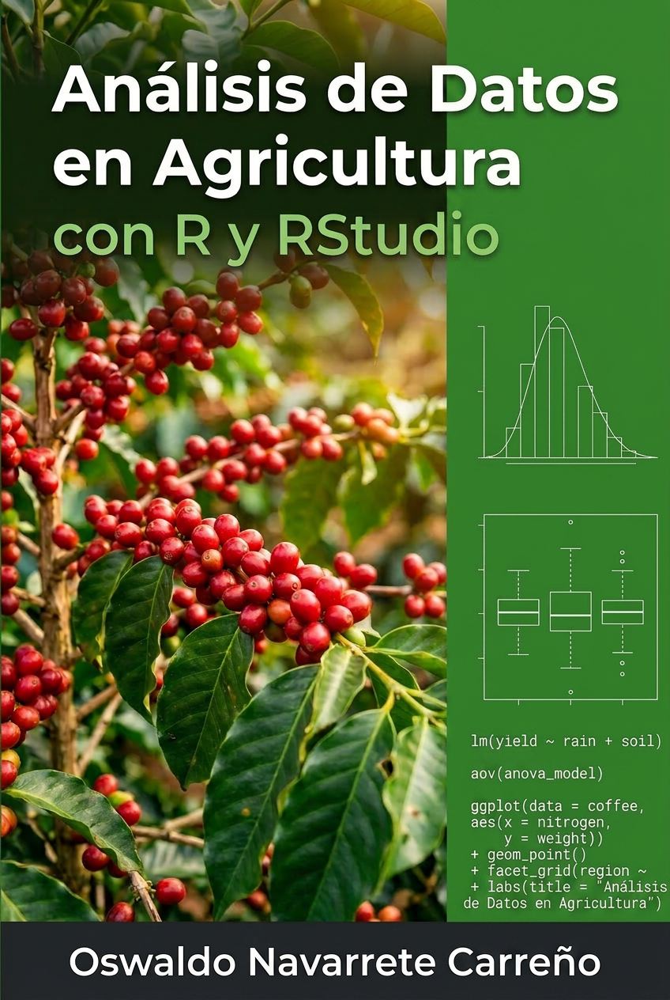
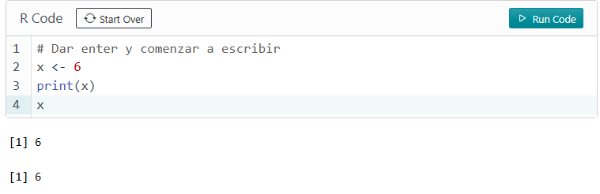

"La perfección no se alcanza cuando no hay nada más que añadir, sino cuando no hay nada más que quitar." *Antoine de Saint-Exupéry*

"Ningún libro está terminado. Mientras trabajamos en él aprendemos lo justo para encontrarlo inmaduro en el momento en que nos alejamos de él." *Karl Popper, La sociedad abierta y sus enemigos*.

{fig-align="center"}

# A modo de introducción {.unnumbered}

En la actualidad es díficil pensar en una ciencia que evolucione sin el soporte de la estadística, las ciencias agrícolas no son la excepción. La investigación y el desarrollo en la agricultura usan métodos y procedimientos estadísticos necesarios para resolver diferentes aspectos y problemas que forman parte de algunas ramas de la actividad agrícola (@kibuuka).

La evolución de las técnicas y las metodologías estadísticas se debe en gran medida a la rapidez con la que han evolucionado las computadoras y su capacidad de procesar grandes volúmenes de datos. En la actualidad aprender estadística sin el soporte de algún programa o lenguaje de programación orientado a la estadística, puede limitar tanto la posibilidad de abstraer conceptos importantes como la oportunidad de saber como aplicar el análisis estadístico en contextos reales.

Uno de los objetivos de este libro es que el futuro profesional de agronomía adquiera conocimientos importantes de estadística y construya una base sólida desde el punto de vista teórico y práctico que le permita desarrollar de forma autónoma análisis estadísticos a datos provenientes de fuentes diversas y relacionadas con sus áreas de desempeño.

Aunque con este libro se busca que el usuario aprenda a usar R y RStudio, en algunas secciones se ha incluido un script de R donde se puede escribir y ejecutar código, para obtener los resultados se debe presionar el botón **Run Code** o con las combinaciones de teclas que se explican en las  @fig-ejewindows y @fig-ejemac. 

{fig-align="center" width="120%"}
{fig-align="center" width="120%"}
{fig-align="center" width="120%"}

Los conjuntos de datos utilizados en el libro se pueden encontrar en el [enlace](https://earthac-my.sharepoint.com/:f:/g/personal/onavarrete_earth_ac_cr/EpZzv3WpVMpGuJ7LQ6vUbLsBZwrvxV9Hqd2erMl80hduRQ?e=25fZ7a)
