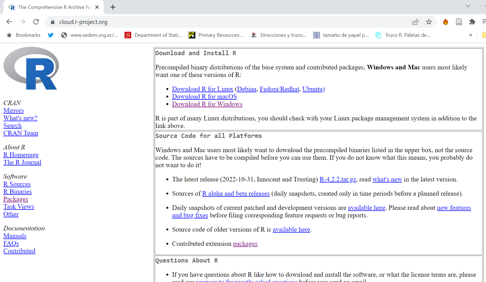
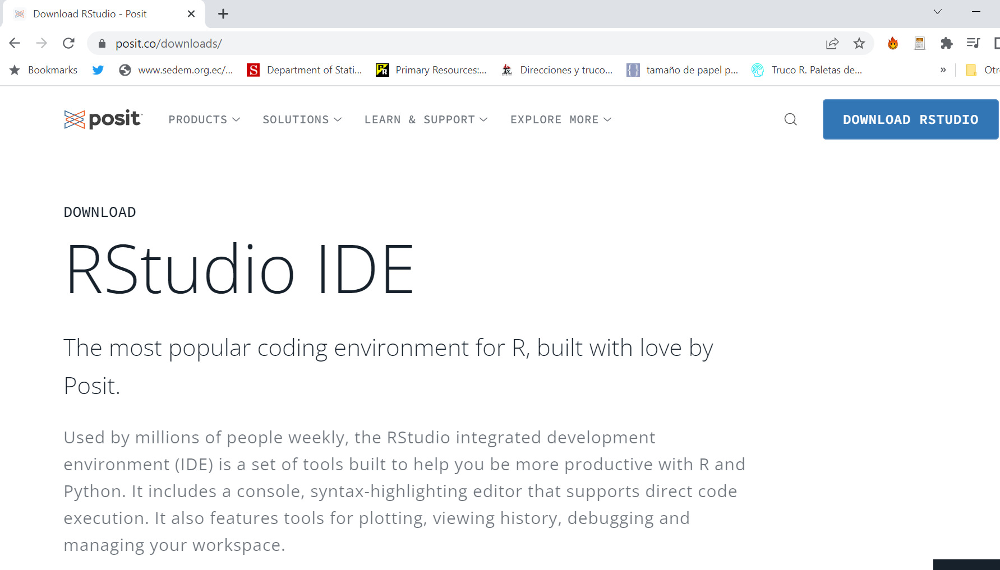
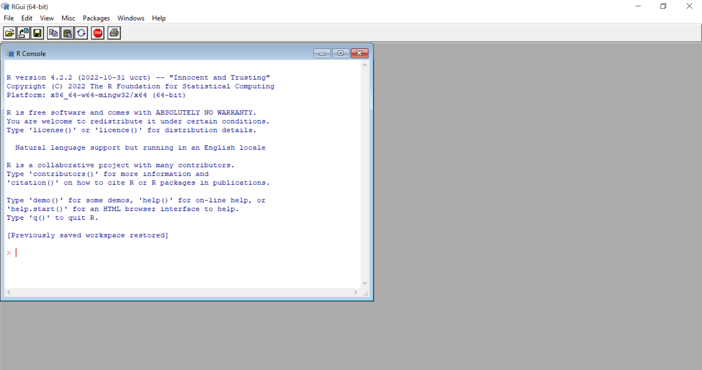
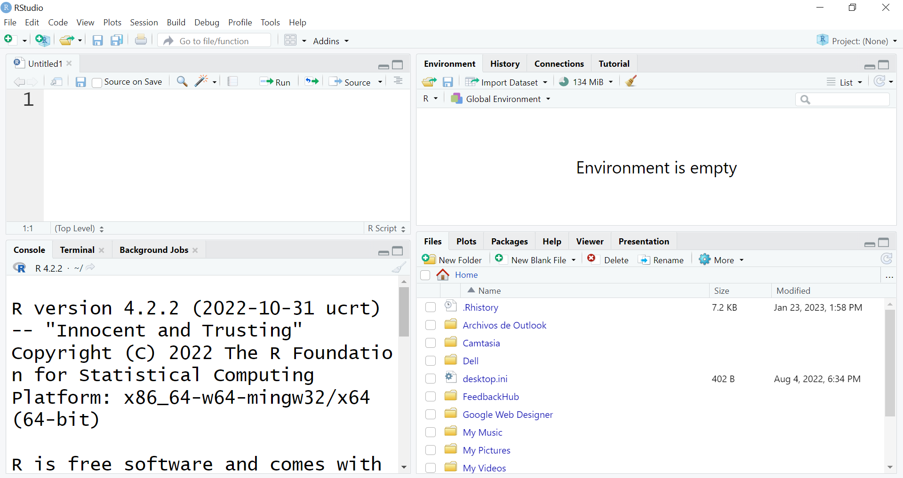
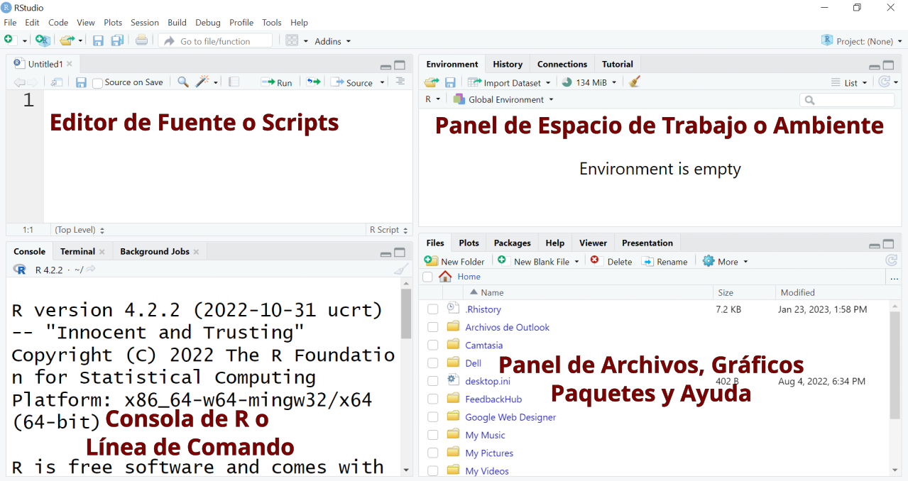
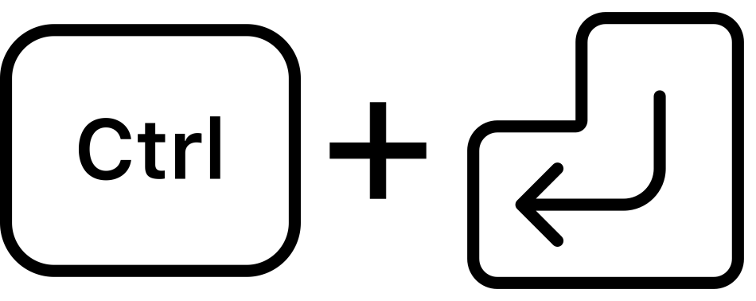
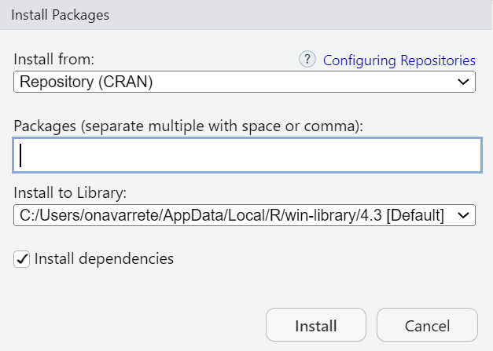
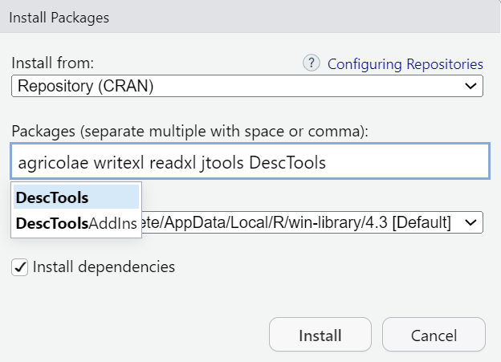

```{r paquetes, echo=FALSE, message=FALSE}
library(knitr)
library(tidyverse)
library(agricolae)
library(jtools)
library(writexl)
library(readxl)
library(DescTools)
library(cowplot)
library(docxtools)
library(formatdown)
```

# R y RStudio

## ¿Qué es R y por qué lo vamos a usar?

R es un lenguaje de programación que tiene más de 30 años de historia, mientras que RStudio es uno de los tantos entornos de desarrollo integrados que existen para trabajar con R. Es común escuchar las preguntas *¿por qué trabajar con R cuando existen programas mucho más "sencillos" para hacer análisis de datos?*, *¿para qué complicar a los estudiantes enseñándoles a programar si además deben aprender estadística?*. Existen muchas respuestas a esas preguntas, sin embargo, a continuación se presenta una lista de razones que fortalecen la idea de porqué usar R, algunas de estas ideas son expuestas en @tucker_teaching_2022 y @agwu_using_2018.

1.  R es un programa libre, gratuito y de desarrollo independiente disponible para la mayoría de sistemas operativos lo que reduce las barreras de acceso.
2.  Es flexible y poderoso tanto para simulación como para el análisis de datos.
3.  El hecho de que involucre escribir código permite reproducir los análisis hechos por cualquier persona sin ninguna condición o limitante.

Escribir código en R ayuda a que el pensamiento estadístico y los procesos de análisis estadístico sean más visibles y reproducibles; es decir que usar R, podría ofrecer una herramienta adicional de representación que permite construir el entendimiento de los conceptos (@tucker_teaching_2022).

Cuando se instala R por defecto vienen incorporados *paquetes* que permiten importar datos, ajustar y evaluar modelos, realizar gráficos. Mas, es posible añadir funcionalidades a R instalando y cargando nuevos *paquetes*, un *paquete* es una colección de funciones de R, datos y código compilado en un formato bien definido, creado para agregar alguna funcionalidad específica (@contributors_packages_2020). En la actualidad existen más de 19000 paquetes (y creciendo) para todo tipo de análisis estadístico, gran parte de los nuevos resultados o metodologías estadísticas publicadas en revistas de investigación generalmente son desarrolladas en paquetes de R lo que hace fácil acceder a las últimas técnicas estadísticas.

## RStudio.

La interfaz de R es muy básica y para personas interesadas (u obligadas) a aprender este lenguaje de programación que no están familiarizados con algún otro lenguaje, usar esta interfaz puede resultar frustrante al punto de querer desistir de aprender R. Rstudio es un entorno de desarrollo integrado (IDE) gratuito y de código abierto para R. Incluye una consola, un editor de resaltado de sintaxis que admite la ejecución directa de código, así como herramientas para la graficación, revisar el historial, gestionar conexiones, la depuración del código y la gestión del espacio o directorio de trabajo (@navar2019).

En @mcconville_statistical se hace una analogía interesante en la que se menciona que R se puede entender como el motor de un vehículo, mientras que Rstudio es el tablero del vehículo que permite tener a la mano todas las funcionalidades del mismo.

## Poniendo todo a punto para empezar

### Instalación de R y RStudio

Un flujo de trabajo recomendado es, primero descargar e instalar R. El programa puede ser descargado de la página <https://cloud.r-project.org/>. En la @fig-instR se muestra la pantalla de la página. Una vez descargado el programa, se procede a instalarlo.

{#fig-instR}

A continuación se procede a descargar RStudio de la página <https://posit.co/downloads/>. En la @fig-instRs se muestra la pantalla de la página. Una vez descargado el programa se procede a instalarlo.

{#fig-instRs}

En la @fig-consolas se muestran las interfaces de R y RStudio respectivamente, a lo largo de este libro aprenderemos el lenguaje de programación R utilizando RStudio por lo que en la siguiente sección exploraremos la interfaz del segundo programa.

::: {#fig-consolas layout-ncol="2"}
{#fig-rcons}

{#fig-rscons}

Interfaces de R y RStudio
:::

### Conociendo la interfaz de RStudio

Cuando se abre RStudio por primera vez se observan 3 paneles. Sin embargo, cuando se comienza a usar el programa con frecuencia veremos 4 paneles. Por defecto en la parte superior izquierda aparece el *panel de fuente o scripts*, en la parte superior derecha el *panel de espacio de trabajo o ambiente*, en la parte inferior izquierda aparece la *consola* y en la parte inferior derecha aparece el *panel de archivos, gráficos, paquetes y ayuda*. En la @fig-panes se presenta la ubicación de estos cuatro paneles. A continuación una descripción de cada uno de estos paneles.

{#fig-panes}

1.  La consola de R, ubicada en la parte inferior izquierda, es donde se envían los comandos para ser ejecutados.

2.  El panel de fuente o scripts, ubicado en la parte superior izquierda, es desde donde la mayoría de las veces se enviará el código a la consola donde R lo ejecutará. Para crear un script hay dos opciones. La primera es en la barra de herramientas principal escoger `File | New File | R Script`, la segunda opción es escribir la combinación de teclas (en Windows) `Ctrl + Shift + N` o `Cmd + Shift + N` (en Mac)

3.  El panel de espacio de trabajo o ambiente, ubicado en la parte superior derecha, además del ambiente tiene pestañas para el historial, las conexiones y tutoriales. Sin embargo, solo detallaremos del ambiente y el historial. En el ambiente se van mostrando las variables, los objetos y los valores que se van creando o calculando. En el historial se muestran los comandos que se han enviado a R en la sesión de trabajo.

4.  El panel de archivos, gráficos, paquetes y ayuda, ubicado en la parte inferior derecha, muestra los archivos que se encuentran en el directorio de trabajo, los gráficos que se van generando en la sesión y que no se almacenan como variables, los paquetes instalados tanto en la librería del sistema como del usuario y la ayuda para estos paquetes.

## Instalar paquetes {#sec-packs}

A lo largo de este libro usaremos algunos paquetes. En esta sección aprenderemos a instalar paquetes. Existen 2 formas para instalar un paquete.

1.  Desde la consola o un script
2.  Desde la pestaña de paquetes o desde la barra de menú.

Antes de instalar los paquetes vamos a describir brevemente algunos de los paquetes que vamos a usar en este curso:

1.  ***tidyverse***: El paquete **tidyverse** es considerado un metapaquete porque es un paquete que carga paquetes. Los paquetes que se cargan con el paquete **tidyverse** son:
    a.  ***dplyr***: implementa una gramática para la manipulación de datos.
    b.  ***forcats***: ofrece herramientas para trabajar con variables categóricas.
    c.  ***ggplot2***: crea visualizaciones de datos elegantes utilizando una gramática de gráficos.
    d.  ***lubridate***: permite trabajar con fechas de una forma sencilla.
    e.  ***purrr***: herramientas de programación funcional.
    f.  ***readr***: ayuda a leer datos de texto rectangulares.
    g.  ***stringr***: ofrece funciones para manejo de cadenas de carácteres.
    h.  ***tibble***: provee una versión de *data frame* que facilita el trabajo con *tidyverse*.
    i.  ***tidyr***: herramientas para crear datos ordenados (*tidy data*)
2.  ***agricolae***: procedimientos agrícolas para investigación agrícola.
3.  ***readxl***: leer archivos de Excel.
4.  ***writexl***: guardar conjuntos de datos y tablas en archivos de Excel.
5.  ***jtools***: análisis y presentación de datos sociales y científicos.
6.  ***DescTools***: herramientas para estadística descriptiva.
7.  ***cowplot***: provee varias características que ayudan a la creación de figuras de alta calidad con ***ggplot2***.

### Desde la consola o un script {#sec-inspac}

Para instalar paquetes desde la consola o desde un script se debe utilizar la función `ìnstall.packages("nombrepaquete")` así si se quiere instalar el paquete **tidyverse** se escribe en la consola o en un script `ìnstall.packages("tidyverse")`, cuando se escribe en un script se debe ejecutar el comando con la combinación de teclas `Ctrl + Enter` si está trabajando en Windows o `Cmd + Enter` si está trabajando en Mac. En la @sec-pprs se darán más detalles de como crear un script y ejecutar códigos desde un script, por lo pronto puede instalar paquetes desde la consola.  

{#fig-ejewindows width="50%"}

{#fig-ejemac width="50%"}


### Desde la pestaña de paquetes o desde la barra de menú

En el panel de archivos, gráficos, paquetes y ayuda se escoge la pestaña `Packages` y luego se da clic en la opción `Ìnstall`, aparece una ventana como la que se muestra en la @fig-packages. En caja de texto titulada `Packages (separate multiple with space or comma)` se deben escribir el nombre del o de los paquetes que se van a instalar separados por coma o por un espacio como se muestra en la @fig-packagesinst. A medida que se escribe el nombre del paquete aparecen posibles paquetes a ser instalados. Otra forma de acceder a esta venta es en la barra de menú `Tools -> Install Packages...`.

{#fig-packages}

{#fig-packagesinst}

## Los básicos del lenguaje R {#sec-basicsR}

### Sintaxis de R

En la consola de R podemos escribir las siguientes expresiones

`> x <- 6 # Crear la variable x con un valor igual a 6`

`> print(x) # Impresión explicita`

`[1] 6`

`> x # Auto-impresión`

`[1] 6`

El símbolo `#` sirve para poner comentarios a nuestro código. Todo lo que se escriba a la derecha del numeral (incluido el símbolo) no se toma en cuenta. En R no se pueden poner comentarios multilíneas.

Cuando se escribe un comando en el **prompt**, se evalúa el comando y se obtiene el resultado del comando evaluado.

El resultado se puede **auto-imprimir** que es lo que ocurre cuando se escribe el nombre del objeto. El `[1]` indica que `x` es un vector y el `6` es el primer elemento. De manera general la **impresión explícita** con la función `print()` no se usa con frecuencia. Esta es una práctica que a veces es necesaria cuando se escriben scripts, funciones o programas largos.

Cuando se presenta un vector en R podremos ver que un índice del vector se imprime en corchetes `[]` en el lado izquierdo. En el siguiente ejemplo podemos fijarnos en esto. Los números que se muestran en los corchetes no son parte del vector, únicamente son parte del resultado impreso.

```{r}
x <- seq(20,200, by = 5)
x
```

### Objetos de R

R tiene cinco clases de objetos básicos, algunos autores también los llaman objetos atómicos.

1.  Caracter. (character, chr)
2.  Numérico. (numeric, num)
3.  Entero. (integer, int)
4.  Complejo. (complex, cplx)
5.  Lógico. (logical, logi)

El objeto más básico de R es el **vector**. Para crear vectores vacíos se utiliza la función `vector()`. La regla única para crear vectores es: *Un vector debe tener solamente objetos de la misma clase*, la excepción de la regla son las listas que son un tipo especial de vectores que pueden contener elementos de diferentes clases. Las listas son un importante tipo de datos en R. La creación de una lista se lo hace con la función `list()`.

### Vectores

Para crear vectores se utiliza la función `c()` que concatena o une los elementos.

```{r}
v1 <- c(3, 5, 2.3) # Numérico
v2 <- c(TRUE, FALSE, FALSE, TRUE, TRUE) # Lógico
v3 <- c(T, F, F, T, T) # Lógico
v4 <- c(3+4i, 7-2i, 3i) # Complejo
v5 <- c(3, 2, 7) # Entero
```

Las letras `T` y `F` son abreviaturas para especificar `TRUE` (verdadero) o `FALSE` (falso). Con la función `vector()` se pueden inicializar vectores.

```{r}
y <- vector("complex", length = 5)
y
```

### Coerción implícita y explícita

Cuando en un vector se mezclan objetos de distintas clases, ocurre la *coerción implícita* de tal forma que todos los elementos en el vector se convierten a elementos de la misma clase. Para verificar la clase de un vector usamos la función `class()`.

```{r}
v6 <- c(3.14, "x")
class(v6)
v7 <- c(T, 4, F)
class(v7)
v8 <- c(F,"x")
class(v8)
```

Por su parte la *coerción explicita* ocurre cuando se utiliza la función `as.*`, el `*` puede ser reemplazado por `numeric`, `character`, `logical`, `integer` y `complex`.

```{r}
p <- seq(0, 14, 1.4)
class(p)
as.integer(p)
as.logical(p)
as.character(p)
as.complex(p)
```

En ciertas ocasiones no es posible para R coercionar un objeto en la clase que se desea y esto resulta en que se produzcan `NAs`.

```{r}
q <- c("R","S","T")
class(q)
as.numeric(q)
as.complex(q)
as.integer(q)
as.logical(q)
```

### Listas

Las listas son un tipo especial de vectores que pueden contener elementos de distintas clases. Las listas se pueden crear con la función `list( )`. Con la función `vector( )` se puede crear una lista vacia.

```{r}
r <- list(2.71, 2, "m", 3+2i, F)
r
s <- vector("list", length = 5)
s
```

### Matrices

Las matrices son vectores que tienen un atributo de dimensión, este atributo es en si mismo un vector entero de longitud 2 (número de filas y columnas).

```{r}
m <- matrix(nrow = 3, ncol = 4)
m
dim(m)
attributes(m)
```

Las matrices son construidas por columna, de tal forma que los elementos de la matriz pueden comenzar a ser llenados desde la esquina superior izquierda recorriendo las columnas.

```{r}
m <- matrix(1:12, nrow = 3, ncol = 4)
m
```

Otra forma de crear matrices es a partir de vectores añadiéndole los atributos de dimensión.

```{r}
m <- 1:12
m
dim(m) <- c(3,4)
m
```

Una forma común de crear matrices es uniendo filas o columnas con las funciones `rbind` o `cbind`.

```{r}
s1 <- 4:8
s2 <- 16:20
cbind(s1, s2) # unión por columnas
rbind(s1, s2) # unión por filas

```

### Data frames

Los *data frames* (marcos de datos, cuadros de datos) son usados para guardar datos tabulares en R. Son un tipo importante de objetos en R y son usados en muchas situaciones de modelación y análisis de datos. Los *data frames* a diferencia de las matrices pueden guardar diferentes clases de objetos en cada columna. Las matrices tienen un atributo de nombres de columnas (`colnames`) los *data frames* tienen además un atributo de nombres de filas (`row.names`).

Los *data frames* pueden ser leídos con funciones como `read.csv()` o `read.table()`. También pueden ser creados con la función `data.frame()`, el metapaquete `tidyverse` tiene funciones que permiten trabajar de forma más eficiente con conjuntos de datos. El equivalente de `data.frame()` en el paquete `dplyr` de `tidyverse` es `tibble()`. Con la función `str()` se puede conocer la estructura de un *data frame*, la función de *dplyr* equivalente a *str()* es *glimpse( )*

```{r}
df1 <- data.frame(
  Variable = c("Var1","Var2","Var3","Var4"),
  Valor = c(12, 14, 13, 16)
 )
df1
str(df1)
glimpse(df1)
nrow(df1)
ncol(df1)
df2 <- tibble(
  Variable = c("Var1","Var2","Var3","Var4"),
  Valor = c(12, 14, 13, 16)
 )
df2
str(df2)
glimpse(df2)
nrow(df2)
ncol(df2)
```
