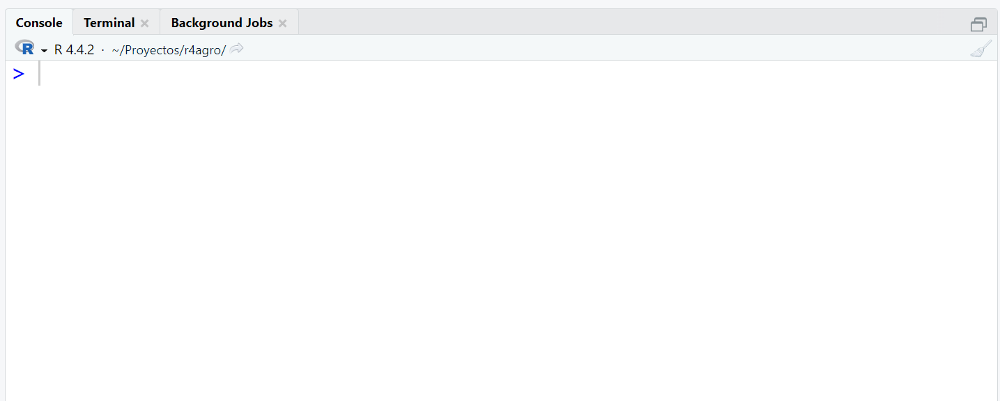
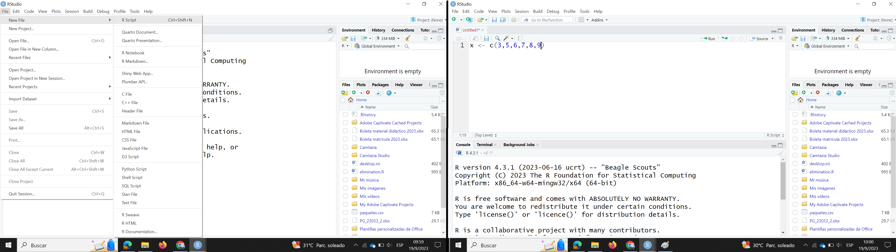
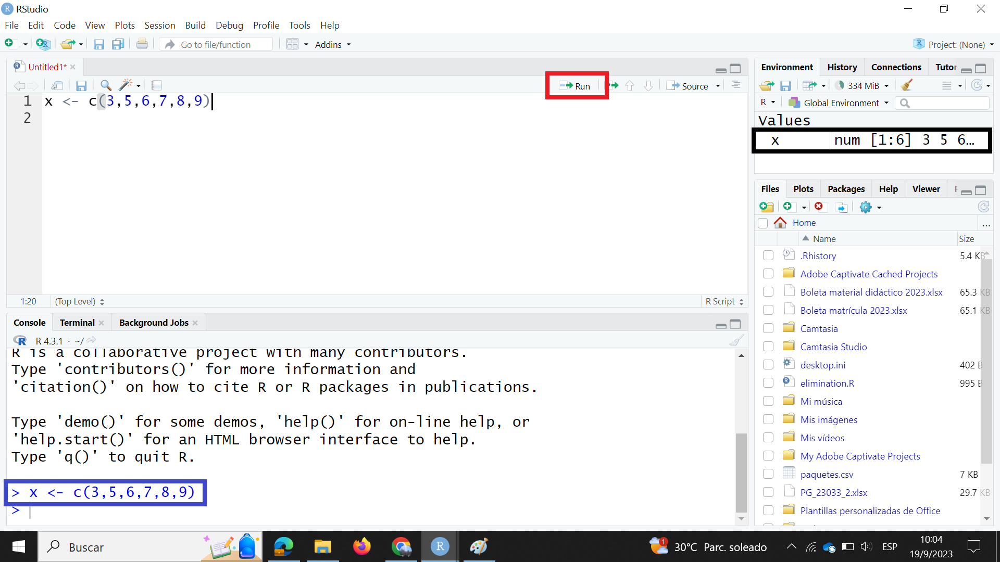

```{r paquetes, echo=FALSE, message=FALSE}
library(knitr)
library(tidyverse)
library(agricolae)
library(jtools)
library(writexl)
library(readxl)
library(DescTools)
library(cowplot)
library(docxtools)
library(formatdown)
library(webexercises)
```



# R y RStudio

## Objetivos del capítulo

Al finalizar este capítulo, el lector será capaz de:

- Comprender qué es **R** y para qué se utiliza en el análisis de datos
- Diferenciar claramente entre **R** y **RStudio**
- Utilizar la interfaz básica de **RStudio**
- Instalar paquetes en R (desde consola, scripts y la interfaz)
- Comprender la sintaxis básica del lenguaje R
- Reconocer y crear los principales tipos de objetos en R (vectores, listas, matrices y *data frames*)
- Aplicar operadores aritméticos, relacionales y lógicos en R
- Manejar valores especiales (`NA`, `NULL`, `NaN`, `Inf`)
- Importar datos desde archivos CSV y Excel
- Utilizar el operador pipe (`|>`) para encadenar operaciones

---

## ¿Qué es R y por qué lo vamos a usar?

R es un lenguaje de programación que tiene más de 30 años de historia, mientras que RStudio es uno de los tantos entornos de desarrollo integrados que existen para trabajar con R. Es común escuchar las preguntas *¿por qué trabajar con R cuando existen programas mucho más "sencillos" para hacer análisis de datos?*, *¿para qué complicar a los estudiantes enseñándoles a programar si además deben aprender estadística?*. Existen muchas respuestas a esas preguntas; a continuación se presenta una lista de razones que fortalecen la idea de por qué usar R, algunas de estas ideas son expuestas en @tucker_teaching_2022 y @agwu_using_2018.

1.  R es un programa libre, gratuito y de desarrollo independiente disponible para la mayoría de sistemas operativos lo que reduce las barreras de acceso.
2.  Es flexible y poderoso tanto para simulación como para el análisis de datos.
3.  El hecho de que involucre escribir código permite reproducir los análisis hechos por cualquier persona sin ninguna condición o limitante.

Escribir código en R ayuda a que el pensamiento estadístico y los procesos de análisis estadístico sean más visibles y reproducibles; es decir que usar R podría ofrecer una herramienta adicional de representación que permite construir el entendimiento de los conceptos (@tucker_teaching_2022).

Cuando se instala R por defecto vienen incorporados *paquetes* que permiten importar datos, ajustar y evaluar modelos, realizar gráficos. Mas, es posible añadir funcionalidades a R instalando y cargando nuevos *paquetes*. Un *paquete* es una colección de funciones de R, datos y código compilado en un formato bien definido, creado para agregar alguna funcionalidad específica (@contributors_packages_2020). En la actualidad existen más de 20000 paquetes (y creciendo) para todo tipo de análisis estadístico; gran parte de los nuevos resultados o metodologías estadísticas publicadas en revistas de investigación generalmente son desarrolladas en paquetes de R, lo que facilita el acceso a técnicas estadísticas recientes.

### Una breve historia de R {#sec-histR}

R tiene sus raíces en el lenguaje **S**, desarrollado en los Laboratorios Bell (AT&T) por **John Chambers** y colegas a partir de 1976, para facilitar el análisis estadístico. En 1992, **Ross Ihaka** y **Robert Gentleman** de la Universidad de Auckland (Nueva Zelanda) comenzaron a desarrollar R como una implementación libre y abierta de S. El nombre "R" hace referencia, en parte, a las iniciales de sus creadores.

| Año  | Hito                                                    |
|------|---------------------------------------------------------|
| 1976 | Desarrollo del lenguaje S en los Laboratorios Bell      |
| 1992 | Ihaka y Gentleman inician el desarrollo de R            |
| 1995 | Primera versión pública de R (licencia GPL)             |
| 1997 | Fundación del **R Core Team** y de **CRAN**             |
| 2000 | Lanzamiento de R 1.0.0                                  |
| 2011 | Primera versión de RStudio (IDE)                        |
| 2020 | Introducción del operador nativo pipe `\|>` en R 4.1    |
| 2024 | Más de 20 000 paquetes en CRAN                          |

::: callout-tip
CRAN (*Comprehensive R Archive Network*) es el repositorio oficial donde se publican y distribuyen los paquetes de R. Al instalar un paquete con `install.packages()`, por defecto R lo descarga de CRAN.
:::

## RStudio

La interfaz de R es muy básica y para personas interesadas (u obligadas) a aprender este lenguaje de programación que no están familiarizados con algún otro lenguaje, usar esta interfaz puede resultar frustrante al punto de querer desistir de aprender R. RStudio es un entorno de desarrollo integrado (IDE) gratuito y de código abierto para R. Incluye una consola, un editor de resaltado de sintaxis que admite la ejecución directa de código, así como herramientas para la graficación, revisar el historial, gestionar conexiones, la depuración del código y la gestión del espacio o directorio de trabajo (@navar2019).

En @mcconville_statistical se hace una analogía interesante en la que se menciona que R se puede entender como el motor de un vehículo, mientras que RStudio es el tablero del vehículo que permite tener a la mano todas las funcionalidades del mismo.

::: callout-tip
**Posit y el futuro de RStudio**: en 2022, la empresa detrás de RStudio cambió su nombre a **Posit**, reflejando un enfoque más amplio hacia Python y otros lenguajes de ciencia de datos, sin abandonar R. Posit también desarrolla **Quarto**, el sucesor de R Markdown, que es el sistema de publicación reproducible usado en este libro.
:::

## Poniendo todo a punto para empezar

### Instalación de R y RStudio

Un flujo de trabajo recomendado es, primero descargar e instalar R. El programa puede ser descargado de la página <https://cloud.r-project.org/>. En la @fig-instR se muestra la pantalla de la página. Una vez descargado el programa, se procede a instalarlo.

{#fig-instR width="90%"}

A continuación se procede a descargar RStudio de la página <https://posit.co/downloads/>. En la @fig-instRs se muestra la pantalla de la página. Una vez descargado el programa se procede a instalarlo.

{#fig-instRs width="90%"}

En la @fig-consolas se muestran las interfaces de R y RStudio respectivamente. A lo largo de este libro aprenderemos el lenguaje de programación R utilizando RStudio, por lo que en la siguiente sección exploraremos la interfaz del segundo programa.

::: {#fig-consolas layout-ncol=2}

{#fig-rcons width="60%"}

{#fig-rscons width="60%"}

Interfaces de R y RStudio

:::



### Conociendo la interfaz de RStudio

Cuando se abre RStudio por primera vez se observan 3 paneles. Sin embargo, cuando se comienza a usar el programa con frecuencia veremos 4 paneles. Por defecto en la parte superior izquierda aparece el *panel de fuente o scripts*, en la parte superior derecha el *panel de espacio de trabajo o ambiente*, en la parte inferior izquierda aparece la *consola* y en la parte inferior derecha aparece el *panel de archivos, gráficos, paquetes y ayuda*. En la @fig-panes se presenta la ubicación de estos cuatro paneles. A continuación una descripción de cada uno de estos paneles.

{#fig-panes}

1.  La consola de R, ubicada en la parte inferior izquierda, es donde se envían los comandos para ser ejecutados.

2.  El panel de fuente o scripts, ubicado en la parte superior izquierda, es desde donde la mayoría de las veces se enviará el código a la consola donde R lo ejecutará. Para crear un script hay dos opciones. La primera es en la barra de herramientas principal escoger `File | New File | R Script`, la segunda opción es escribir la combinación de teclas (en Windows) `Ctrl + Shift + N` o `Cmd + Shift + N` (en Mac).

3.  El panel de espacio de trabajo o ambiente, ubicado en la parte superior derecha, además del ambiente tiene pestañas para el historial, las conexiones y tutoriales. Sin embargo, solo detallaremos del ambiente y el historial. En el ambiente se van mostrando las variables, los objetos y los valores que se van creando o calculando. En el historial se muestran los comandos que se han enviado a R en la sesión de trabajo.

4.  El panel de archivos, gráficos, paquetes y ayuda, ubicado en la parte inferior derecha, muestra los archivos que se encuentran en el directorio de trabajo, los gráficos que se van generando en la sesión y que no se almacenan como variables, los paquetes instalados tanto en la librería del sistema como del usuario y la ayuda para estos paquetes.

## Instalar paquetes {#sec-packs}

A lo largo de este libro usaremos algunos paquetes. En esta sección aprenderemos a instalar paquetes. Existen 2 formas para instalar un paquete.

1.  Desde la consola o un script
2.  Desde la pestaña de paquetes o desde la barra de menú.

Antes de instalar los paquetes vamos a describir brevemente algunos de los paquetes que vamos a usar en este curso:

1.  ***tidyverse***: El paquete **tidyverse** es considerado un metapaquete porque es un paquete que carga paquetes. Los paquetes que se cargan con el paquete **tidyverse** son:
    a.  ***dplyr***: implementa una gramática para la manipulación de datos.
    b.  ***forcats***: ofrece herramientas para trabajar con variables categóricas.
    c.  ***ggplot2***: crea visualizaciones de datos elegantes utilizando una gramática de gráficos.
    d.  ***lubridate***: permite trabajar con fechas de una forma sencilla.
    e.  ***purrr***: herramientas de programación funcional.
    f.  ***readr***: ayuda a leer datos de texto rectangulares.
    g.  ***stringr***: ofrece funciones para manejo de cadenas de carácteres.
    h.  ***tibble***: provee una versión de *data frame* que facilita el trabajo con *tidyverse*.
    i.  ***tidyr***: herramientas para crear datos ordenados (*tidy data*)
2.  ***agricolae***: procedimientos agrícolas para investigación agrícola.
3.  ***readxl***: leer archivos de Excel.
4.  ***writexl***: guardar conjuntos de datos y tablas en archivos de Excel.
5.  ***jtools***: análisis y presentación de datos sociales y científicos.
6.  ***DescTools***: herramientas para estadística descriptiva.
7.  ***cowplot***: provee varias características que ayudan a la creación de figuras de alta calidad con ***ggplot2***.

### Desde la consola o un script {#sec-inspac}

Para instalar paquetes desde la consola o desde un script se debe utilizar la función `install.packages("nombrepaquete")`. Por ejemplo, si se quiere instalar el paquete **tidyverse** se escribe en la consola o en un script:

`install.packages("tidyverse")`

Para escribir código en la consola de R, debemos identificar el **prompt** (`>`); este nos indica que R está esperando instrucciones para ser ejecutadas.

{#fig-consola width="75%"}

Un script es un archivo de texto que contiene los mismos comandos que ingresaría en la línea de comandos de R. Una vez abierto RStudio, para crear un script hay dos opciones. La primera es en la barra de herramientas principal escoger `File | New File | R Script`, la segunda opción es escribir la combinación de teclas (en Windows) `Ctrl + Shift + N` o `Cmd + Shift + N` (en Mac).

Cuando el script está creado se puede escribir código como se visualiza a la derecha de la @fig-script. Para ejecutar el código se puede ubicar en cualquier parte de la línea y presionar la combinación de teclas `Ctrl + Enter` o `Cmd + Enter`. Otra opción es dar clic en el botón `Run` ubicado en la parte superior derecha del script (encerrada en rectángulo rojo de la @fig-script2). Si solo es una línea de código no es necesario seleccionarla para poder ejecutarla. Al momento de ejecutar el código, el código se ejecuta en la consola (rectángulo azul de la @fig-script2) y además se visualiza el objeto en el ambiente (rectángulo negro de la @fig-script2).

{#fig-script width="75%"}

{#fig-script2 width="50%"}

{#fig-ejewindows width="50%"}

{#fig-ejemac width="50%"}

### Desde la pestaña de paquetes o desde la barra de menú

En el panel de archivos, gráficos, paquetes y ayuda se escoge la pestaña `Packages` y luego se da clic en la opción `Install`, aparece una ventana como la que se muestra en la @fig-packages. En la caja de texto titulada `Packages (separate multiple with space or comma)` se deben escribir el nombre del o de los paquetes que se van a instalar separados por coma o por un espacio como se muestra en la @fig-packagesinst. A medida que se escribe el nombre del paquete aparecen posibles paquetes a ser instalados. Otra forma de acceder a esta ventana es en la barra de menú `Tools -> Install Packages...`.

{#fig-packages}

{#fig-packagesinst}



---

## Los básicos del lenguaje R {#sec-basicsR}

### Sintaxis de R

En la consola de R podemos escribir las siguientes expresiones:

`> x <- 6 # Crear la variable x con un valor igual a 6`

`> print(x) # Impresión explícita`

`[1] 6`

`> x # Auto-impresión`

`[1] 6`

::: callout-important
El símbolo `<-` recibe el nombre de *operador asignación*.
:::

```{webr}
# Dar enter y comenzar a escribir
```

El símbolo `#` sirve para poner comentarios a nuestro código. Todo lo que se escriba a la derecha del numeral (incluido el símbolo) no se toma en cuenta. En R no se pueden poner comentarios multilíneas.

Cuando se escribe un comando en el **prompt**, se evalúa el comando y se obtiene el resultado del comando evaluado.

El resultado se puede **auto-imprimir**, que es lo que ocurre cuando se escribe el nombre del objeto. El `[1]` indica que `x` es un vector y el `6` es el primer elemento. De manera general la **impresión explícita** con la función `print()` no se usa con frecuencia. Esta es una práctica que a veces es necesaria cuando se escriben scripts, funciones o programas largos.

Cuando se presenta un vector en R podremos ver que un índice del vector se imprime en corchetes `[]` en el lado izquierdo. En el siguiente ejemplo podemos fijarnos en esto. Los números que se muestran en los corchetes no son parte del vector; únicamente son parte del resultado impreso.

```{r}
x <- seq(20,200, by = 5)
x
```

```{webr}
# Dar enter y comenzar a escribir
```

### Operadores en R {#sec-operadores}

R tiene tres tipos principales de operadores: **aritméticos**, **relacionales** y **lógicos**.

#### Operadores aritméticos

| Operador | Operación                    | Ejemplo          | Resultado |
|:--------:|------------------------------|:----------------:|:---------:|
| `+`      | Suma                         | `3 + 2`          | `5`       |
| `-`      | Resta                        | `10 - 4`         | `6`       |
| `*`      | Multiplicación               | `3 * 4`          | `12`      |
| `/`      | División                     | `15 / 4`         | `3.75`    |
| `^`      | Potencia                     | `2^3`            | `8`       |
| `%%`     | Módulo (residuo)             | `17 %% 5`        | `2`       |
| `%/%`    | División entera              | `17 %/% 5`       | `3`       |

```{r}
# Ejemplo agrícola: rendimiento por hectárea
area_ha    <- 3.5
produccion_kg <- 12250
rendimiento   <- produccion_kg / area_ha
rendimiento
```

```{webr}
# Prueba los operadores aritméticos
15 / 4
17 %% 5
2^8
```

#### Operadores relacionales

Los operadores relacionales devuelven valores lógicos (`TRUE` o `FALSE`).

| Operador | Significado             | Ejemplo        | Resultado |
|:--------:|-------------------------|:--------------:|:---------:|
| `==`     | Igual a                 | `5 == 5`       | `TRUE`    |
| `!=`     | Diferente de            | `5 != 3`       | `TRUE`    |
| `>`      | Mayor que               | `7 > 3`        | `TRUE`    |
| `<`      | Menor que               | `2 < 1`        | `FALSE`   |
| `>=`     | Mayor o igual que       | `5 >= 5`       | `TRUE`    |
| `<=`     | Menor o igual que       | `3 <= 2`       | `FALSE`   |

```{r}
# Ejemplo: filtrar plantas con altura mayor a 120 cm
alturas <- c(115, 130, 98, 145, 121, 89, 133)
alturas > 120
alturas[alturas > 120]   # extrae solo las que cumplen la condición
```

```{webr}
alturas <- c(115, 130, 98, 145, 121, 89, 133)
alturas[alturas > 120]
```

#### Operadores lógicos

| Operador | Significado             | Ejemplo                   | Resultado |
|:--------:|-------------------------|:-------------------------:|:---------:|
| `&`      | Y (AND), elemento a elemento | `TRUE & FALSE`       | `FALSE`   |
| `\|`     | O (OR), elemento a elemento  | `TRUE \| FALSE`      | `TRUE`    |
| `!`      | NO (NOT)                | `!TRUE`                   | `FALSE`   |
| `&&`     | Y escalar (cortocircuito)    | `TRUE && FALSE`      | `FALSE`   |
| `\|\|`   | O escalar (cortocircuito)    | `FALSE \|\| TRUE`    | `TRUE`    |

::: callout-tip
Prefiere `&` y `|` cuando trabajas con vectores (operación elemento a elemento). Usa `&&` y `||` únicamente en condiciones de control de flujo (`if`), donde solo se evalúa el primer elemento.
:::

```{r}
# Plantas con altura entre 100 y 130 cm
alturas <- c(115, 130, 98, 145, 121, 89, 133)
alturas[alturas >= 100 & alturas <= 130]
```

```{webr}
alturas <- c(115, 130, 98, 145, 121, 89, 133)
alturas[alturas >= 100 & alturas <= 130]
```

### Objetos de R

R tiene cinco clases de objetos básicos, algunos autores también los llaman objetos atómicos.

1.  Caracter. (character, chr)
2.  Numérico. (numeric, num)
3.  Entero. (integer, int)
4.  Complejo. (complex, cplx)
5.  Lógico. (logical, logi)

El objeto más básico de R es el **vector**. Para crear vectores vacíos se utiliza la función `vector()`. La regla única para crear vectores es: *Un vector debe tener solamente objetos de la misma clase*, la excepción de la regla son las listas que son un tipo especial de vectores que pueden contener elementos de diferentes clases.

::: callout-tip
**Nota didáctica:** en estadística, muchas funciones devuelven objetos "complejos" (por ejemplo, modelos ajustados con `lm()` o `aov()`), y estos resultados suelen almacenarse como **listas**. Además, muchas operaciones internas de modelación usan álgebra lineal y se apoyan en **matrices**.
:::

### Valores especiales en R {#sec-especiales}

En R existen cuatro valores especiales que aparecen con frecuencia en el análisis de datos reales:

| Valor   | Significado                                | Función para verificar |
|---------|--------------------------------------------|------------------------|
| `NA`    | Dato faltante (*Not Available*)            | `is.na()`              |
| `NULL`  | Objeto vacío (sin tipo ni longitud)        | `is.null()`            |
| `NaN`   | No es un número (*Not a Number*)           | `is.nan()`             |
| `Inf`   | Infinito (positivo o negativo)             | `is.infinite()`        |

```{r}
# NA: dato faltante
rendimientos <- c(3200, NA, 2800, 3500, NA, 3100)
mean(rendimientos)                   # devuelve NA si hay NA
mean(rendimientos, na.rm = TRUE)     # ignora los NA
is.na(rendimientos)
```

```{r}
# NaN e Inf
0 / 0          # NaN
1 / 0          # Inf
-1 / 0         # -Inf
sqrt(-1)       # NaN con advertencia
```

```{r}
# NULL: útil para inicializar objetos
x <- NULL
is.null(x)
length(x)      # longitud 0
```

::: callout-important
En análisis de datos agronómicos, los `NA` son frecuentes (plantas que murieron, mediciones perdidas, parcelas dañadas). Siempre revisa cuántos `NA` tiene tu conjunto de datos antes de calcular medidas de resumen. Usa `sum(is.na(datos))` para contarlos.
:::

```{webr}
rendimientos <- c(3200, NA, 2800, 3500, NA, 3100)
mean(rendimientos, na.rm = TRUE)
sum(is.na(rendimientos))
```

### Vectores

Para crear vectores se utiliza la función `c()` que concatena o une los elementos.

```{r}
v1 <- c(3, 5, 2.3) # Numérico
v2 <- c(TRUE, FALSE, FALSE, TRUE, TRUE) # Lógico
v3 <- c(T, F, F, T, T) # Lógico
v4 <- c(3+4i, 7-2i, 3i) # Complejo
v5 <- c(3, 2, 7) # Entero
```

```{webr}
# Dar enter y comenzar a escribir
```

Las letras `T` y `F` son abreviaturas para especificar `TRUE` (verdadero) o `FALSE` (falso). Con la función `vector()` se pueden inicializar vectores.

```{r}
y <- vector("complex", length = 5)
y
```

```{webr}
# Dar enter y comenzar a escribir
```

#### Funciones útiles para explorar vectores {#sec-fvect}

Antes de trabajar con un vector en un análisis, es útil conocer sus características básicas:

```{r}
alturas_gir <- c(140, 123, 110, 100, 137, 117, 120, 112, 168, 109,
                  165, 133, 178,  81, 135, 145, 109,  78, 169, 132)

length(alturas_gir)    # número de elementos
sum(alturas_gir)       # suma
mean(alturas_gir)      # media
median(alturas_gir)    # mediana
sd(alturas_gir)        # desviación estándar
range(alturas_gir)     # mínimo y máximo
summary(alturas_gir)   # resumen de 5 números + media
```

```{webr}
alturas_gir <- c(140, 123, 110, 100, 137, 117, 120, 112, 168, 109,
                  165, 133, 178,  81, 135, 145, 109,  78, 169, 132)
summary(alturas_gir)
```

### Coerción implícita y explícita

Cuando en un vector se mezclan objetos de distintas clases, ocurre la *coerción implícita* de tal forma que todos los elementos en el vector se convierten a elementos de la misma clase. Para verificar la clase de un vector usamos la función `class()`.

```{r}
v6 <- c(3.14, "x")
class(v6)
v7 <- c(T, 4, F)
class(v7)
v8 <- c(F,"x")
class(v8)
```

```{webr}
# Dar enter y comenzar a escribir
```

Por su parte la *coerción explícita* ocurre cuando se utiliza la función `as.*`, el `*` puede ser reemplazado por `numeric`, `character`, `logical`, `integer` y `complex`.

```{r}
p <- seq(0, 14, 1.4)
class(p)
as.integer(p)
as.logical(p)
as.character(p)
as.complex(p)
```

```{webr}
# Dar enter y comenzar a escribir
```

En ciertas ocasiones no es posible para R coercionar un objeto en la clase que se desea y esto resulta en que se produzcan `NAs`.

```{r}
q <- c("R","S","T")
class(q)
as.numeric(q)
as.complex(q)
as.integer(q)
as.logical(q)
```

```{webr}
# Dar enter y comenzar a escribir
```

### Listas

Las listas son un tipo especial de vectores que pueden contener elementos de distintas clases. Las listas se pueden crear con la función `list( )`. Con la función `vector( )` se puede crear una lista vacía.

```{r}
r <- list(2.71, 2, "m", 3+2i, F)
r
s <- vector("list", length = 5)
s
```

```{webr}
# Dar enter y comenzar a escribir
```

::: callout-tip
**Sugerencia práctica:** `r[1]` devuelve una *sublista*, mientras que `r[[1]]` devuelve el *elemento*.
::: 

#### Indexación en listas

En listas, la indexación tiene dos formas comunes:

- `r[ ]` devuelve **una sublista** (conserva la estructura de lista).
- `r[[ ]]` devuelve **el elemento** (la "pieza" interna).

```{r}
r[1]      # sublista con el primer elemento
r[[1]]    # primer elemento (valor)
```

Si la lista tiene nombres, también puede accederse por nombre:

```{r}
r2 <- list(media = 10.5, n = 20, cultivo = "banano")
r2
r2[["media"]]
r2$media
```

### Matrices

Las matrices son vectores que tienen un atributo de dimensión, este atributo es en sí mismo un vector entero de longitud 2 (número de filas y columnas).

```{r}
m <- matrix(nrow = 3, ncol = 4)
m
dim(m)
attributes(m)
```

```{webr}
# Dar enter y comenzar a escribir
```

Las matrices son construidas por columna, de tal forma que los elementos de la matriz pueden comenzar a ser llenados desde la esquina superior izquierda recorriendo las columnas.

```{r}
m <- matrix(1:12, nrow = 3, ncol = 4)
m
```

```{webr}
# Dar enter y comenzar a escribir
```

Otra forma de crear matrices es a partir de vectores añadiéndole los atributos de dimensión.

```{r}
m <- 1:12
m
dim(m) <- c(3,4)
m
```

```{webr}
# Dar enter y comenzar a escribir
```

Una forma común de crear matrices es uniendo filas o columnas con las funciones `rbind` o `cbind`.

```{r}
s1 <- 4:8
s2 <- 16:20
cbind(s1, s2) # unión por columnas
rbind(s1, s2) # unión por filas
```

#### Indexación en matrices

La indexación de una matriz usa dos coordenadas: `m[fila, columna]`.

```{r}
m <- matrix(1:12, nrow = 3, ncol = 4)
m
m[1, 2]   # fila 1, columna 2
m[, 1]    # primera columna completa
m[2, ]    # segunda fila completa
m[1:2, 3:4]  # submatriz (filas 1-2, columnas 3-4)
```

::: callout-tip
**Nota:** Esta forma de indexación será clave cuando trabajemos con **matrices de diseño** en regresión y ANOVA.
:::


```{webr}
# Dar enter y comenzar a escribir
```

### Data frames

Los *data frames* (marcos de datos, cuadros de datos) son usados para guardar datos tabulares en R. Son un tipo importante de objetos en R y son usados en muchas situaciones de modelación y análisis de datos. Los *data frames* a diferencia de las matrices pueden guardar diferentes clases de objetos en cada columna. Las matrices tienen un atributo de nombres de columnas (`colnames`) los *data frames* tienen además un atributo de nombres de filas (`row.names`).

Los *data frames* pueden ser leídos con funciones como `read.csv()` o `read.table()`. También pueden ser creados con la función `data.frame()`, el metapaquete `tidyverse` tiene funciones que permiten trabajar de forma más eficiente con conjuntos de datos. El equivalente de `data.frame()` en el paquete `dplyr` de `tidyverse` es `tibble()`. Con la función `str()` se puede conocer la estructura de un *data frame*, la función de *dplyr* equivalente a *str()* es *glimpse( )*.

```{r}
library(dplyr)

df1 <- data.frame(
  Variable = c("Var1","Var2","Var3","Var4"),
  Valor = c(12, 14, 13, 16)
 )
df1
str(df1)
glimpse(df1)
nrow(df1)
ncol(df1)
df2 <- tibble(
  Variable = c("Var1","Var2","Var3","Var4"),
  Valor = c(12, 14, 13, 16)
 )
df2
str(df2)
glimpse(df2)
nrow(df2)
ncol(df2)
```

```{webr}
# Dar enter y comenzar a escribir
```

### Indexación en data frames

Los *data frames* se pueden indexar de forma similar a las matrices (filas y columnas), pero con la ventaja de que cada columna puede tener una clase distinta.

#### Acceso por posición (filas y columnas)

```{r}
df1[1, 2]     # fila 1, columna 2
df1[, 1]      # primera columna completa
df1[2, ]      # segunda fila completa
df1[1:2, ]    # filas 1 a 2, todas las columnas
```

#### Acceso por nombre de columna

Existen varias formas equivalentes:

```{r}
df1$Valor
df1[["Valor"]]
df1[, "Valor"]
```

::: callout-tip
**Recomendación:** para programación y para evitar sorpresas, `df[["col"]]` suele ser más robusto que `$`.
:::

---

## R base vs tidyverse

A lo largo de este libro utilizaremos principalmente el **tidyverse**. Sin embargo, es útil entender qué se considera *R base* y cómo se compara con el enfoque tidyverse, porque en la práctica ambos conviven.

### Dos estilos, un mismo lenguaje

- **R base**: funciones incluidas con R (y paquetes recomendados). Suele usar funciones como `read.csv()`, `subset()`, `aggregate()`, `plot()`, etc.
- **tidyverse**: conjunto de paquetes con una filosofía consistente para trabajar con datos (principalmente *tibbles* y *pipes*), usando verbos como `filter()`, `select()`, `mutate()`, `summarise()` y `ggplot()`.

::: callout-tip
No es una competencia "uno vs otro": el tidyverse está construido *sobre* R y se integra con R base. El objetivo del libro es que puedas trabajar de manera **más clara, legible y reproducible**.
:::

### El operador pipe `|>` {#sec-pipe}

El operador **pipe** (`|>`, introducido en R 4.1) permite encadenar operaciones de forma legible, pasando el resultado de una expresión como primer argumento de la siguiente. Es equivalente a decir "y luego...".

**Sin pipe:**

```{r}
datos_finca <- data.frame(
  cultivo     = c("banano","cacao","banano","cacao","banano"),
  rendimiento = c(32.5, 18.2, 28.0, 20.1, 35.4)
)

round(mean(subset(datos_finca, cultivo == "banano")$rendimiento), 1)
```

**Con pipe:**

```{r}
library(dplyr)

datos_finca |>
  filter(cultivo == "banano") |>
  summarise(media_rend = mean(rendimiento)) |>
  round(1)
```

::: callout-tip
El operador pipe `|>` (R nativo desde 4.1) y el pipe `%>%` del paquete **magrittr** (que carga automáticamente `tidyverse`) son funcionalmente equivalentes en la mayoría de los casos. En este libro usaremos siempre `|>`.
:::

### Lectura de datos

**R base**

```{r}
# datos <- read.csv("archivo.csv")
```

**tidyverse (readr)**

```{r}
# library(readr)
# datos <- read_csv("archivo.csv")
```

### Crear y ver datos tabulares

**R base**

```{r}
df_base <- data.frame(
  Variable = c("Var1","Var2","Var3","Var4"),
  Valor = c(12, 14, 13, 16)
)
df_base
str(df_base)
```

**tidyverse (tibble + glimpse)**

```{r}
# library(tibble)
df_tidy <- tibble(
  Variable = c("Var1","Var2","Var3","Var4"),
  Valor = c(12, 14, 13, 16)
)
df_tidy
glimpse(df_tidy)
```

### Transformación de datos: ejemplo comparativo

Usaremos el mismo conjunto de datos para filtrar filas, seleccionar columnas y crear una nueva variable.

```{r}
df_demo <- tibble(
  cultivo = c("banano", "banano", "cacao", "cacao"),
  parcela = c(1, 2, 1, 2),
  rendimiento = c(32.5, 28.0, 18.2, 20.1)
)
df_demo
```

**R base (indexación + transformaciones manuales)**

```{r}
# Filtrar: cultivo == "banano"
df_banano_base <- df_demo[df_demo$cultivo == "banano", ]

# Seleccionar columnas
df_banano_base <- df_banano_base[, c("parcela", "rendimiento")]

# Crear nueva variable
df_banano_base$rend_kg_ha <- df_banano_base$rendimiento * 1000
df_banano_base
```

**tidyverse (dplyr + pipe)**

```{r}
library(dplyr)

df_banano_tidy <- df_demo |>
  filter(cultivo == "banano") |>
  select(parcela, rendimiento) |>
  mutate(rend_kg_ha = rendimiento * 1000)

df_banano_tidy
```

### Resúmenes (estadística descriptiva)

**R base**

```{r}
mean(df_demo$rendimiento)
tapply(df_demo$rendimiento, df_demo$cultivo, mean)
```

**tidyverse (group_by + summarise)**

```{r}
df_demo |>
  group_by(cultivo) |>
  summarise(
    media = mean(rendimiento),
    sd = sd(rendimiento),
    n = n()
  )
```

### Gráficos

**R base** (rápido, útil para exploración)

```{r}
# plot(df_demo$parcela, df_demo$rendimiento)
```

**tidyverse (ggplot2)** (más control y consistencia)

```{r}
# library(ggplot2)
# ggplot(df_demo, aes(x = factor(parcela), y = rendimiento, fill = cultivo)) +
#   geom_col(position = "dodge")
```

---

## Importar datos {#sec-importar}

En la práctica, los datos rara vez se ingresan directamente en R. Lo más común es importarlos desde archivos externos. En esta sección se presentan los formatos más usados en agronomía.

### Importar desde CSV

El formato CSV (*Comma-Separated Values*) es el más portable. En R existen dos funciones principales:

| Función        | Paquete    | Separador | Decimal | Resultado      |
|----------------|------------|:---------:|:-------:|----------------|
| `read.csv()`   | R base     | `,`       | `.`     | `data.frame`   |
| `read.csv2()`  | R base     | `;`       | `,`     | `data.frame`   |
| `read_csv()`   | readr      | `,`       | `.`     | `tibble`       |
| `read_csv2()`  | readr      | `;`       | `,`     | `tibble`       |

```{r}
#| eval: false
library(readr)

# Archivo con coma como separador
datos1 <- read_csv("datos/rendimientos.csv")

# Archivo con punto y coma como separador (común en español)
datos2 <- read_csv2("datos/rendimientos.csv")

# Inspección inicial obligatoria
glimpse(datos1)
head(datos1)
summary(datos1)
```

::: callout-important
**Buenas prácticas al importar datos:**

1. Siempre inspecciona los datos inmediatamente con `glimpse()` o `str()`.
2. Verifica que las columnas numéricas no hayan sido importadas como texto.
3. Convierte las variables categóricas a `factor` con `mutate(var = factor(var))`.
4. Revisa cuántos `NA` hay con `colSums(is.na(datos))`.
:::

### Importar desde Excel {#sec-importexcel}

El paquete `readxl` permite leer archivos `.xlsx` y `.xls` directamente desde R.

```{r}
#| eval: false
library(readxl)

# Leer la primera hoja
datos_excel <- read_excel("datos/experimento.xlsx")

# Leer una hoja específica por nombre
datos_trat  <- read_excel("datos/experimento.xlsx", sheet = "Tratamientos")

# Especificar el rango de celdas
datos_rango <- read_excel("datos/experimento.xlsx", sheet = 1, range = "A1:E50")

glimpse(datos_excel)
```

::: callout-tip
Si el archivo de Excel tiene encabezados en la primera fila (lo más común), `read_excel()` los reconoce automáticamente. Si no hay encabezados, usa `col_names = FALSE`.
:::

---

## Preparación para modelos estadísticos

En capítulos posteriores ajustaremos modelos (por ejemplo, regresión y ANOVA). En R, los resultados de un modelo suelen almacenarse como un **objeto** con mucha información interna (coeficientes, residuos, valores ajustados, etc.). Muy frecuentemente, estos objetos se comportan como **listas** (o contienen componentes tipo lista).

### Fórmulas en R

En R, muchos modelos se especifican con una **fórmula** del tipo:

- `y ~ x` (respuesta `y` explicada por `x`)
- `y ~ x1 + x2` (dos predictores)
- `y ~ x1 * x2` (incluye efectos principales e interacción)
- `y ~ x1:x2` (solo interacción)

Estas fórmulas aparecerán con frecuencia en regresión y ANOVA.

### Un ejemplo mínimo con regresión lineal

Ajustaremos un modelo sencillo usando datos simulados (para mantener el ejemplo reproducible).

```{r}
set.seed(123)
datos <- data.frame(
  x = 1:10,
  y = 5 + 2*(1:10) + rnorm(10, sd = 1)
)

modelo <- lm(y ~ x, data = datos)
modelo
```

### ¿Qué contiene un modelo?

Podemos explorar su estructura con `str()` y ver los nombres de sus componentes con `names()`.

```{r}
str(modelo)
names(modelo)
```

### Extraer resultados comunes

Algunos elementos típicos que usaremos con frecuencia:

```{r}
coef(modelo)         # coeficientes (intercepto y pendiente)
fitted(modelo)[1:5]  # valores ajustados (primeros 5)
residuals(modelo)[1:5] # residuos (primeros 5)
```

También es común usar `summary()` para ver un reporte estándar (incluye R², pruebas t, etc.).

```{r}
summary(modelo)
```

::: callout-important
En R, gran parte del trabajo práctico consiste en **ajustar modelos** y luego **extraer e interpretar** sus componentes (coeficientes, residuos, diagnósticos). Por eso es tan importante entender **listas**, **matrices** e **indexación** desde el inicio.
:::

---

## Ejercicios {.unnumbered}

::: {#exr-basicos}

**Operaciones básicas y operadores**

::: {.webex-check .webex-box}

```{r}
#| echo: false
#| results: asis

q1 <- "¿Cuál operador en R devuelve el residuo de una división entera?"
q1c <- c("`/`", "`%/%`", answer = "`%%`", "`^`")

q2 <- "Evalúa: `17 %/% 5`. ¿Cuál es el resultado?"
q2c <- c("2", answer = "3", "17", "5")

q3 <- "¿Cuál expresión filtra solo los valores mayores a 100 de un vector `x`?"
q3c <- c("`x[x == 100]`", answer = "`x[x > 100]`", "`x(x > 100)`", "`filter(x, > 100)`")

q4 <- "¿Cuál valor especial se produce al ejecutar `0 / 0`?"
q4c <- c("`NA`", "`NULL`", "`Inf`", answer = "`NaN`")

q5 <- "¿Cuál función permite calcular la media ignorando los valores `NA`?"
q5c <- c("`mean(x)`", "`mean(x, rm.na = TRUE)`", answer = "`mean(x, na.rm = TRUE)`", "`mean(na.rm(x))`")

cat(
  q1, longmcq(q1c), "\n\n",
  q2, longmcq(q2c), "\n\n",
  q3, longmcq(q3c), "\n\n",
  q4, longmcq(q4c), "\n\n",
  q5, longmcq(q5c)
)
```

:::
:::

::: {#exr-pipe}

**El operador pipe**

::: {.webex-check .webex-box}

```{r}
#| echo: false
#| results: asis

q6 <- "¿Qué hace el operador `|>` en R?"
q6c <- c(
  "Realiza una división entera",
  answer = "Pasa el resultado de una expresión como primer argumento de la siguiente función",
  "Verifica si un objeto es `NULL`",
  "Crea un vector lógico"
)

q7 <- "La expresión `x |> mean()` es equivalente a:"
q7c <- c("`mean |> x()`", "`x$mean()`", answer = "`mean(x)`", "`x == mean`")

cat(
  q6, longmcq(q6c), "\n\n",
  q7, longmcq(q7c)
)
```

:::
:::

::: {#exr-objetos}

**Tipos de objetos en R**

::: {.webex-check .webex-box}

```{r}
#| echo: false
#| results: asis

q8 <- "¿Cuál es la clase del vector `c(3.14, 'x')`?"
q8c <- c("`numeric`", "`complex`", answer = "`character`", "`logical`")

q9 <- "¿Cuál es la diferencia principal entre una matriz y un data frame en R?"
q9c <- c(
  "Las matrices son más lentas que los data frames",
  "Los data frames siempre tienen más filas que las matrices",
  answer = "Los data frames pueden tener columnas de diferentes clases; las matrices solo una clase",
  "Las matrices no pueden ser indexadas por posición"
)

q10 <- "¿Cuál función permite conocer la estructura interna de un objeto en R base?"
q10c <- c("`glimpse()`", "`head()`", answer = "`str()`", "`summary()`")

cat(
  q8, longmcq(q8c), "\n\n",
  q9, longmcq(q9c), "\n\n",
  q10, longmcq(q10c)
)
```

:::
:::

**Ejercicios prácticos:**

1. Realice una suma y una resta en R desde la consola.
2. Cree un objeto llamado `edad` con su edad y verifique su clase con `class()`.
3. Genere un vector con cinco números y calcule su promedio.
4. Cree una matriz de 3 filas y 4 columnas usando `matrix()` y luego usando `dim(m) <- ...`.
5. Cree una lista con elementos de diferentes clases y extraiga el primer elemento usando `[[ ]]`.
6. Cree un *data frame* con dos columnas: nombre y rendimiento.
7. Dado el vector `temp_c <- c(28.5, 30.1, 27.8, 32.0, 29.4)` que representa temperaturas en °C:
   a. Convierta a Fahrenheit usando la fórmula \(F = C \times 1.8 + 32\) con operadores aritméticos.
   b. Filtre solo las temperaturas mayores a 30°C.
   c. Verifique si alguna temperatura supera 35°C con un operador lógico.
8. Cree el vector `rend <- c(3200, NA, 2800, 3500, NA, 3100)`:
   a. Calcule la media ignorando los `NA`.
   b. Cuente cuántos `NA` hay.
   c. Reemplace los `NA` con la media del vector usando `is.na()`.
9. Importe un archivo CSV con `read_csv()` e inspecciónelo con `glimpse()`.
10. Cree un *tibble* con datos de tres cultivos (nombre, rendimiento, área) y use el pipe `|>` para filtrar solo los cultivos con rendimiento mayor a 3000 kg/ha.
11. Cree un vector de rendimientos de 10 parcelas y calcule: media, mediana, desviación estándar, valor mínimo y máximo usando las funciones apropiadas de R.
